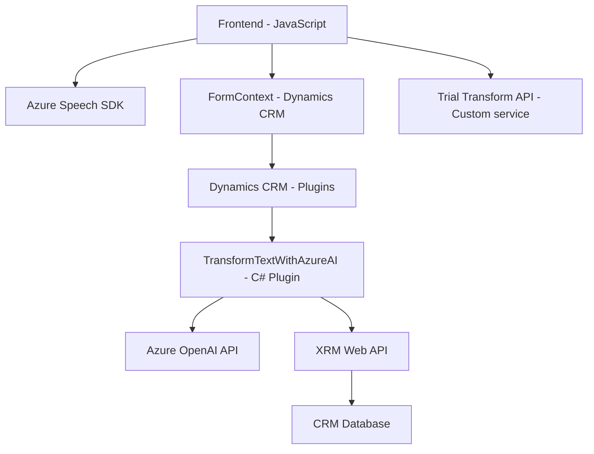

### Breve resumen técnico
Se trata de una **solución integrada en Dynamics CRM** que extiende capacidades mediante** plugins**, scripts frontend en **JavaScript**, y consumo de **APIs externas** como **Azure OpenAI** y **Azure Speech SDK**. El propósito central del sistema es capturar y procesar datos de entrada y salida en un contexto declarativo, facilitando la interacción conversacional para usuarios finales y profesionales.

### Descripción de arquitectura
La solución tiene una arquitectura distribuida que combina una lógica de frontend basada en JavaScript para interacción accesible y procesamiento en tiempo real, con **backend estructurado en Dynamics CRM** mediante **plugins** que utilizan la integración con **Azure AI Services**. Los componentes están diseñados para trabajar de manera modular y separada, con una fuerte dependencia en servicios externos (APIs de Azure). 

Se observa una mezcla entre **arquitectura n-capas** para manejo interno del flujo entre las capas de Dynamics CRM y una aproximación **event-driven** en el frontend. En general, se trata de una solución **monolítica extendida**, porque el procesamiento está acoplado al sistema Dynamics y no utiliza microservicios independientes.

### Tecnologías usadas
- **Frontend**:
  - JavaScript (manipulación DOM, asincronismo mediante callback).
  - Azure Speech SDK (captura de voz y síntesis).
  - Dynamics CRM SDK para formularios (formContext, XRM API).

- **Backend**:
  - C# (implementación de plugins en Dynamics via IPlugin).
  - Azure OpenAI API (integración directa para capacidades de AI).
  - .NET Framework (referencias al SDK dinámico).

- **Servicios externos**:
  - Azure Speech SDK (frontend).
  - Azure OpenAI API (backend).

- **Patrones usados**:
  - **Encapsulación**: Cada función del frontend realiza tareas específicas.
  - **Event-driven**: Procesamiento basado en asincronismo y callbacks.
  - **Facade Pattern**: Aislamiento de lógica interactiva con servicios externos (Azure Speech y APIs personalizadas).
  - **Layered Architecture**: Conexión entre capas de presentación, capa de negocio, y capa de integración externa.

### Dependencias o componentes externos presentes
1. **Azure Speech SDK**: Para captura y síntesis de voz en frontend.
2. **Azure OpenAI API**: Usada por el plugin en C# para procesamiento de texto estructural.
3. **Dynamics CRM SDK**:
   - `IPluginExecutionContext`: Para detección del ciclo de vida del plugin.
   - `IOrganizationService`: Para edición de datos en el CRM.

4. **APIs del navegador** y manipulaciones DOM en frontend.
5. **Enrutamiento de solicitudes HTTP** en backend vía `System.Net.Http`, soportando integración con endpoints de OpenAI.

### Diagrama Mermaid válido para GitHub
A continuación, un diagrama de la solución basada en los archivos analizados:

### Conclusión final
La solución está diseñada para aumentar la interacción y accesibilidad de formularios en Dynamics CRM mediante la potenciación de tecnologías cuadro como Azure Speech SDK y OpenAI. Aunque se observa una aproximación modular en el diseño y un uso efectivo de APIs externas, el sistema depende completamente de Dynamics CRM como núcleo monolítico. Esto limita su escalabilidad y, aunque permite extender capacidades específicas, corresponde más a una arquitectura monolítica de n-capas que a microservicios.

Sin embargo, la organización del código y los patrones usados demuestran que la solución se construyó con extensibilidad en mente. Esto hace que la integración con otros servicios externos, mediante modificaciones, sea viable y sostenible para dar soporte a casos de uso diversos o futuros ampliaciones.