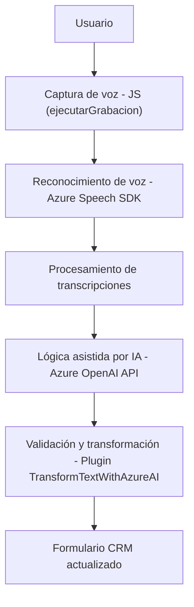

### Breve resumen técnico

El repositorio presenta una solución orientada a la integración de tecnologías de voz y procesamiento inteligente en formularios CRM. Sus funcionalidades giran en torno al uso de **Azure Speech SDK** para entrada y síntesis de voz, combinado con procesamiento de lenguaje natural mediante la API de **Azure OpenAI**. Las funciones implementadas brindan capacidades interactivas en interfaces de usuario del CRM, permitiendo la manipulación dinámica de datos basados en voz.

---

### Descripción de la arquitectura

La solución implementa una arquitectura híbrida con una mezcla de los patrones **Service-Oriented Architecture (SOA)** y **n capas**.  
- La capa de **interfaz** consiste en archivos JavaScript, que interactúan con el usuario y servicios externos.
- La capa de **integración** utiliza SDKs y APIs (Azure Speech SDK y Azure OpenAI API) para proporcionar funcionalidad avanzada.  
- La capa de **negocios** reside en el Plugin de Dynamics CRM que encapsula la lógica de transformación más compleja, utilizando el patrón de **Plugins**.

Las tecnologías y patrones empleados son una muestra de cómo se busca mantener modularidad y extensibilidad en un contexto CRM basado en servicios externos.

---

### Tecnologías usadas

1. **Lenguajes y entornos**:
   - **JavaScript**: Implementación del frontend para interacciones dinámicas con el CRM.
   - **C# (.NET Framework)**: Desarrollo del Dynamics CRM Plugin.

2. **Frameworks y Bibliotecas**:
   - **Azure Speech SDK**: Para síntesis y reconocimiento de voz.  
   - **Azure OpenAI API**: Transformación de texto en JSON estructurado.
   - **Microsoft Dynamics CRM SDK**: Interacción con formularios y datos del CRM.
   - **Newtonsoft.Json**: Manejo avanzado de estructuras JSON en .NET.

3. **Arquitectura y principios de diseño**:
   - **SOA**: Segmentación funcional por servicios (API REST y SDK).
   - **n capas**: Separación de lógica en la interfaz (frontend) y negocio (plugin).
   - **Modularidad**: Funciones desacopladas para facilitar el mantenimiento.
   - **Integración externa**: Dependencia explícita de componentes Microsoft y Azure.

---

### Diagrama Mermaid válido para GitHub

---

### Conclusión final

La solución fusiona tecnologías modernas de Azure para potenciar la interacción en entornos CRM mediante voz e Inteligencia Artificial. Su arquitectura híbrida de **SOA** y **n capas** maximiza la modularidad y escalabilidad. La integración de SDKs y APIs externos garantiza una funcionalidad avanzada sin sobrecargar el sistema local.

Aunque el enfoque es robusto, la solución depende fuertemente de servicios Azure, lo que puede exigir un monitoreo constante y cumplimiento con actualizaciones externas. En general, es un ejemplo sólido de cómo extender capacidades tradicionales de una plataforma empresarial con tecnologías basadas en la nube.