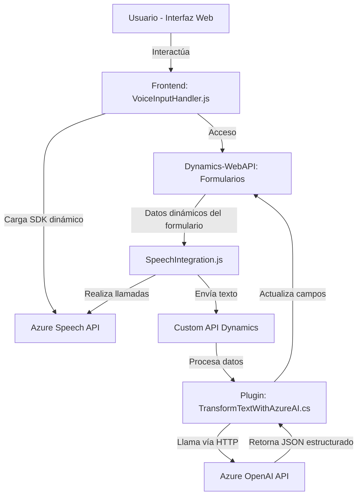

### Breve resumen técnico
El repositorio contiene tres implementaciones principales:
1. Un **frontend en JavaScript** que actúa como intermediario entre el navegador, Azure Speech SDK y un formulario dinámico en **Dynamics 365**.
2. Otro **archivo de frontend** más avanzado que utiliza reconocimiento de voz de Azure para el procesamiento y actualización de formularios en Dynamics 365. Implementa funciones que mapean el idioma hablado a campos específicos de dicho formulario.
3. Un **plugin en C#** utilizado en Dynamics CRM para procesar texto, estructurarlo en JSON y aprovechar las capacidades de Azure OpenAI.

---

### Descripción de arquitectura
El sistema está organizado como una solución **híbrida de tres capas**:
1. **Frontend (cliente)**: Los archivos JavaScript mencionados operan en el navegador, utilizando SDK de Azure Speech y formularios de Dynamics 365.
2. **Backend en Dynamics CRM (plugin)**: Un archivo C# hace de puente entre el frontend y Azure OpenAI, enviando texto para su procesamiento y devolución como un JSON estructurado. Actúa como el backend.
3. **SaaS y APIs externas**: Las áreas del sistema que dependen de Azure Speech SDK y Azure OpenAI se configuran dinámicamente como dependencias externas y servicios SaaS.

La arquitectura no es estrictamente **hexagonal ni de microservicios**, pero muestra elementos de **arquitectura SOA** con integración modular de APIs externas. Por ejemplo, cada parte delega directamente capacidades especializadas (voz, IA) a servicios SaaS.

---

### Tecnologías usadas
1. **Frontend**:
   - **JavaScript ES6**: Diseño modular y programación asincrónica.  
   - **Azure Speech SDK**: Reconocimiento de voz y síntesis de texto.
   - **Dynamics 365 Web API**: Interfaz para interactuar con los formularios dinámicos.
   - **Browser DOM APIs**: Para carga de scripts y manipulación dinámica.

2. **Backend/Plugin**:
   - **Microsoft Dynamics CRM SDK**: Crear y ejecutar plugins en el entorno Dynamics.
   - **Azure OpenAI API**: Procesamiento y transformación de texto.
   - **C#**: Programación orientada a objetos aplicada en el desarrollo del plugin.
   - **HTTPClient**: Integración con APIs externas.
   - **JSON Serialización (Newtonsoft, System.Text.Json)**: Manejo de datos en formato JSON.

---

### Dependencias o componentes externos
1. **Azure Speech SDK**:
   - Servicios de síntesis y reconocimiento de voz.
   - Cargado dinámicamente dentro del navegador.

2. **Azure OpenAI API**:
   - Procesamiento avanzado de texto basado en modelos de IA.

3. **Dynamics 365 SDK**:
   - Acceso directo al contexto del formulario de CRM.

---

### Diagrama Mermaid

---

### Conclusión final
Este repositorio organiza una solución basada en Dynamics 365 con capacidades avanzadas de reconocimiento de voz y procesamiento de texto a través de la integración con Azure Speech SDK y OpenAI. La arquitectura se puede considerar una mezcla híbrida de **modelo SOA y modularidad**, dado el uso estratégico de APIs externas para tareas especializadas.

El diseño está fundamentado en principios de modularidad y separación de responsabilidades: los archivos JS gestionan interacciones en el cliente, mientras que el plugin en C# actúa como intermediario avanzado para tareas de procesamiento.