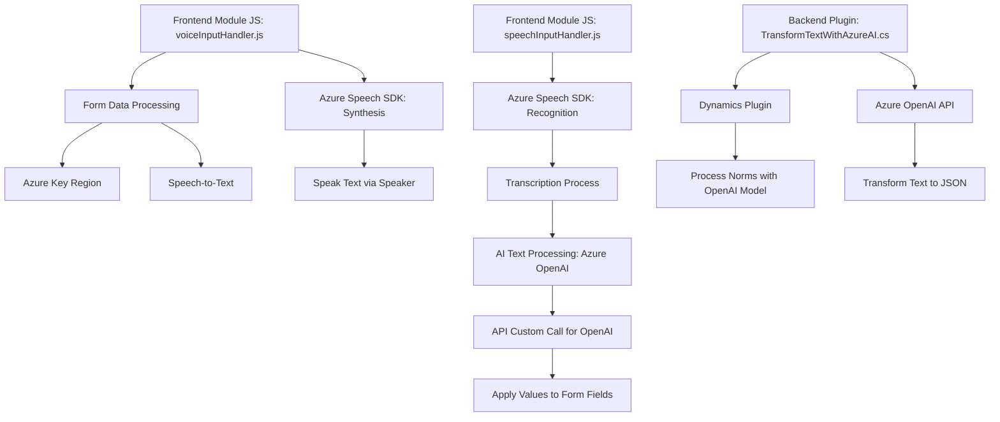

### Breve Resumen Técnico
El repositorio está compuesto por scripts JavaScript para un frontend y un archivo .NET C# que implementa un plugin para Dynamics CRM. La solución está diseñada para interactuar con Azure Speech SDK y Azure OpenAI API para proporcionar capacidades avanzadas de síntesis de voz, reconocimiento de voz y procesamiento de texto.

---

### Descripción de Arquitectura
La solución tiene una arquitectura **modular**, donde cada componente se encarga de una tarea específica y realiza una integración con servicios externos. A nivel de estructura, presenta características de un patrón **n capas**:
- **Frontend:** Scripts de JavaScript utilizan el Azure Speech SDK para funciones de reconocimiento y síntesis de voz. Integran tanto procesamiento manual como asistido por inteligencia artificial.
- **Backend/Plugin:** Implementa una capa de lógica de negocio en Dynamics CRM mediante un plugin en formato server-side con .NET C#.

---

### Tecnologías Usadas
1. **Frontend:** 
   - **JavaScript** para la interacción dinámica.
   - **Azure Speech SDK** para capacidades de síntesis y reconocimiento de voz.
   - **Xrm.WebApi** para manipulación de datos en Dynamics 365.

2. **Backend:** 
   - **C# (.NET Framework)** para la implementación del plugin en Dynamics CRM.
   - **Azure OpenAI API** para el procesamiento avanzado de texto y generación de JSON estructurado.
   - **Newtonsoft.Json** y namespaces estándar de .NET para manejo HTTP/JSON.

3. **Patrones de diseño:**
   - **Modular Design:** Código dividido en funciones/módulos independientes con propósitos específicos.
   - **Pipeline Pattern:** Información fluye por varias etapas, desde entrada de datos hasta el procesamiento y salida.
   - **External Service Integration:** Interacción con APIs de terceros como Azure Speech SDK y Azure OpenAI.
   - **Singleton:** Garantiza una única instancia del SDK y métodos estáticos para la generación de respuestas AI.

---

### Diagrama Mermaid (GitHub Markdown Compatible)

---

### Conclusión Final
El repositorio define una **modular solution** que integra un frontend con capacidades de síntesis y reconocimiento de voz mediante **Azure Speech SDK**, junto con un backend plugin para **Dynamics CRM** que utiliza **Azure OpenAI API** para procesamiento de texto. La arquitectura se divide en capas: una capa de presentación (frontend) que captura datos por voz y aplica valores en la interfaz del formulario, y una capa de lógica de negocio (plugin) que analiza texto y lo devuelve como JSON estructurado. 

Los puntos fuertes de la solución incluyen:
1. **Scalabilidad:** El uso de servicios cloud como Azure permite expandir capacidades sin necesidad de cambiar la implementación del sistema.
2. **Extensibilidad:** La arquitectura modular facilita modificaciones o ampliaciones a la funcionalidad.
3. **Interoperabilidad:** Integración sólida con APIs externas y Dynamics CRM.

Este diseño es adecuado para aplicaciones empresariales que requieren interacciones dinámicas a través de voz y procesamiento avanzado de información.