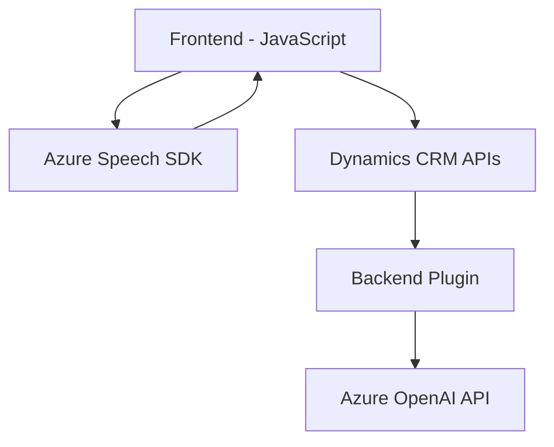

# Análisis Técnico

## Breve Resumen Técnico
El repositorio incluye archivos que implementan funcionalidades relacionadas con reconocimiento y síntesis de voz mediante **Azure Speech SDK**, procesamiento de formularios en **Dynamics 365**, e integración con **Azure OpenAI**. Combina JavaScript para el frontend (procesamiento web) y C# para los plugins del backend, implementados en Dynamics CRM.

---

## Descripción de Arquitectura
### Tipo de Solución:
1. **API**: El plugin en C# integra Dynamics CRM con Azure OpenAI a través de HTTP REST.
2. **Frontend/Form Handler**: Los archivos JavaScript implementan un UI simplificado para interacción mediante formularios y comandos por voz.

### Arquitectura:
La arquitectura utiliza una estructura **modular de varias capas**:
- **Backend**: Plugin basado en Dynamics CRM para integración con Azure OpenAI (proceso server-side).
- **Frontend**: Funcionalidades de voz y manipulación de formularios con patrones como **Facade** y **Dynamic Loader**.
- **Integración de Servicios**: Comunicación directa con Azure APIs (Speech SDK y OpenAI) para voz y procesamiento de texto, haciendo uso de REST APIs.

### Capas Identificadas:
1. **Capa de Presentación**: Archivos JavaScript ejecutados en Dynamics 365 para manipulación del interface y datos del formulario.
2. **Capa de Aplicación**: Procesamiento de comandos de voz, extracción y reconocimiento de valores.
3. **Capa de Integración**: Lógica que interactúa con Azure Speech SDK, Azure OpenAI, y las APIs de Dynamics mediante el plugin.

### Tecnologías Usadas:
1. **Frontend**:
   - **JavaScript**, con manipulación DOM y funciones asincrónicas (`Promise`).
   - **Azure Speech SDK** para reconocimiento y síntesis de voz.
   - **Dynamics 365 Form Context** para integración con el entorno de CRM.
2. **Backend**:
   - **Microsoft Dynamics SDK** para diseño del Plugin en C#.
   - **Azure OpenAI** para transformación y procesamiento de texto.
   - **System.Net.Http**, **System.Text.Json**, y **Newtonsoft.Json.Linq** como librerías de soporte para la integración API y procesamiento de JSON.

### Patrones Arquitectónicos:
1. **Fachada (Facade)**: Simplifica el uso de Azure Speech SDK y la API REST mediante funciones individuales dedicadas.
2. **Cargador Dinámico (Dynamic Loader)**: Integrado en los archivos JavaScript para cargar dependencias como el SDK según sea necesario. Esto optimiza el rendimiento al minimizar la carga inicial de recursos.
3. **Integración con Servicios Externos**: Uso de Azure APIs y Dynamics CRM para ampliar las capacidades de la solución más allá de su entorno local.
4. **Separación de Responsabilidades**: Cada función está diseñada para abordar una tarea específica (e.g., manipulación de campos visibles, llamada API).

---

## Dependencias o Componentes Externos
1. **Azure Speech SDK**:
   - Utilizado para reconocimiento y síntesis de voz.
   - Cargado dinámicamente en el entorno frontend.
2. **Azure OpenAI**:
   - Procesamiento de texto basado en IA con integración mediante un plugin en Dynamics CRM.
3. **Microsoft Dynamics CRM API**:
   - `Xrm.WebApi` y contextos de formulario utilizados para manejar datos internos de CRM y su interacción con la UI desarrollada en JavaScript.
4. **HTTP Client Packages**:
   - `System.Net.Http`, `Newtonsoft.Json` y `System.Text.Json` en el plugin para interactuar con Azure OpenAI APIs y procesar respuestas JSON.
5. **Browser APIs**:
   - Insertando dependencias (e.g., Azure Speech SDK) en la interfaz frontend.

---

## Diagrama Mermaid

---

## Conclusión Final
La solución se basa en una arquitectura modular de varias capas (Presentation, Application, Integration) diseñada para interactuar eficientemente entre el frontend y backend. Su implementación destaca por el uso de **Azure Speech SDK** para voz, **Dynamics CRM Form Context** para manipulación de formularios, y **Azure OpenAI** para procesamiento avanzado de texto. Los patrones de diseño, como **Facade** y **Dynamic Loader**, garantizan una estructura de código limpia y fácil de mantener, mientras que la integración con servicios externos asegura una mejora de las capacidades del sistema. El enfoque utilizado permite flexibilidad y extensibilidad en aplicaciones futuras.