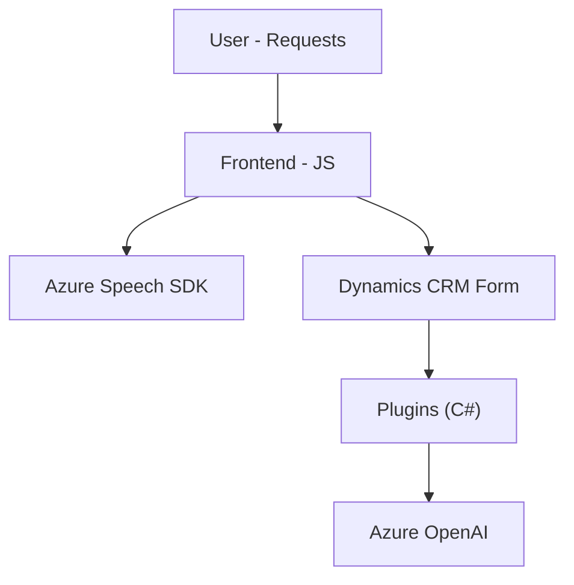

### Breve resumen técnico:
El repositorio analizado define una solución de software que está diseñada para integrar funcionalidades de síntesis y reconocimiento de voz, así como procesamiento de texto en Microsoft Dynamics 365. Utiliza Azure Speech SDK para interactuar con servicios de voz y Azure OpenAI para procesamiento avanzado de texto. Los componentes implementan interacciones entre formularios de Dynamics CRM y los servicios de Azure, creando una experiencia de usuario avanzada basada en comandos de voz.

---

### Descripción de arquitectura:
La solución puede ser clasificada como híbrida. Combina:
- Componentes frontend en JavaScript para manipulación de formularios y realización de síntesis y reconocimiento de voz directamente desde el navegador.
- Complementos backend en forma de plugins (.NET) integrados dentro de Dynamics CRM, que actúan como intermediarios para procesar datos en servicios de Azure OpenAI.

### Arquitectura adoptada:
- **n capas**: Se observa una separación de lógica en capas funcionales:
  - **Presentación**: Implementada con JavaScript en el frontend (SDK de Azure y manipulación de formularios).
  - **Negocio**: Operaciones y procesamiento de comandos en los plugins de Dynamics CRM.
  - **Acceso a datos**: API utilizada para conectar con Dynamics CRM y servicios como Azure Speech SDK y OpenAI.

---

### Tecnologías usadas:
1. **Frontend**:
   - JavaScript para lógica de procesamiento de formularios y voz.
   - Azure Speech SDK.
   - Microsoft Dynamics Form Context API.

2. **Backend (plugins)**:
   - Lenguaje: C#.
   - Framework: .NET para desarrollo de plugins.
   - Dependencias:
     - `Microsoft.Xrm.Sdk`: Para interacción con Dynamics CRM.
     - `Newtonsoft.Json`: Para manejo de JSON.
     - `HttpClient`: Para comunicación con APIs externas (Azure OpenAI).

---

### Diagrama Mermaid válido para GitHub:

---

### Tipo de solución:
- **Híbrida**: Incluye tanto un frontend que interactúa con usuarios para la síntesis y el reconocimiento de voz, como un backend basado en plugins para ejecutar operaciones complejas con servicios externos.

### Componentes externos presentes:
- Azure Speech SDK (sintetizador y reconocimiento de voz).
- Azure OpenAI API (procesamiento de texto).
- Microsoft Dynamics CRM (plataforma base sobre la cual opera la solución).

---

### Conclusión final:
Este repositorio configura una solución bien estructurada para enriquecer la experiencia del usuario al interactuar con formularios en Microsoft Dynamics. La integración de múltiples servicios externos (Azure Speech SDK, Azure OpenAI) y el manejo preciso de datos en Dynamic Forms destacan como implementaciones avanzadas de automatización. El uso de patrones como n capas asegura un diseño modular y escalable, adecuado para entornos empresariales.