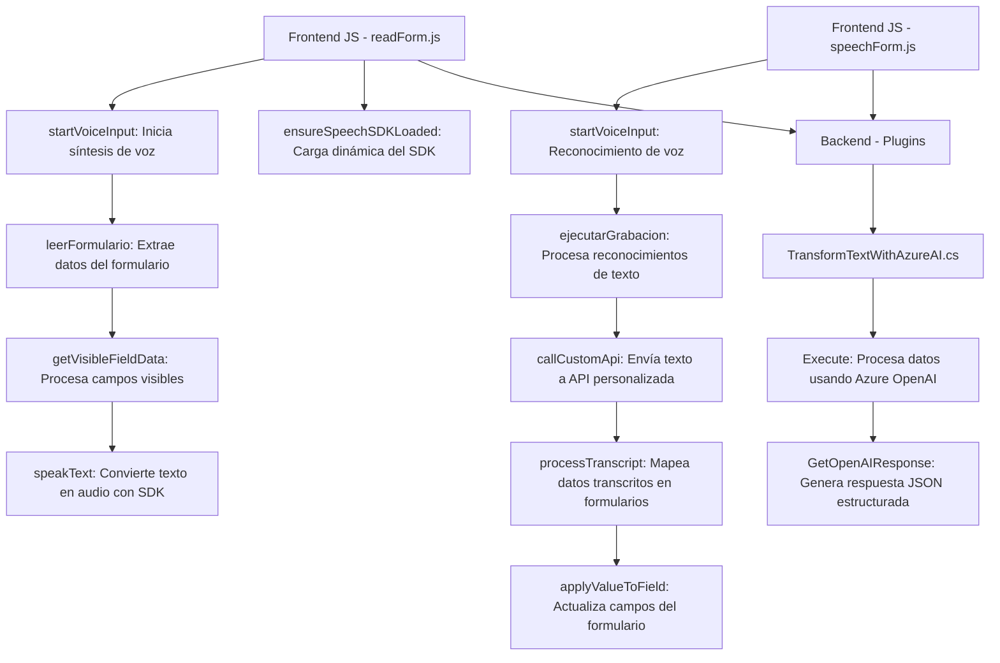

## Resumen técnico

El repositorio muestra una solución orientada a servicios mediante la integración de la tecnología **Azure Speech SDK** para reconocimiento y síntesis de voz, junto con una **Custom API** para manipulación de texto basada en inteligencia artificial mediante el servicio **Azure OpenAI**. Además, contiene un plugin de **Dynamics CRM** desarrollado en **C#** para extender las funcionalidades mediante eventos en los formularios de la plataforma.

## Descripción de arquitectura

La arquitectura general del sistema es **híbrida**, empleando elementos de diferentes patrones. Tiene las siguientes características:

1. **Frontend**
   - Modularidad: Organización en funciones con responsabilidades específicas.
   - Enfoque funcional orientado a la interacción por voz y la integración con formularios dinámicos.
   - Usa elementos de integración con servicios externos (Azure Speech SDK y Dynamics 365 API).
   - Presenta características de **API Wrapper** para simplificar el uso del SDK y acceso al contexto del formulario.
   - El diseño se puede considerar como **n-capas**, separando claramente la presentación del controlador.

2. **Backend (Plugins)**
   - Implementación específica para **Dynamics CRM** con un diseño de **event-driven architecture** al actuar como **plugin** basado en la interfaz `IPlugin`.
   - Interacción con el servicio externo **Azure OpenAI** sigue un estilo similar al **Microservicio**, delegando procesamiento complejo a una solución externa.
   - Patrones adicionales:
     - **Factory Pattern**: Para crear servicios organizacionales (`IOrganizationServiceFactory`).
     - **Strategy Pattern**: Para manejar diferentes tipos de transformaciones en el texto proporcionado.

## Tecnologías usadas

### Tecnologías y frameworks:
- **Azure Speech SDK**: Para síntesis y reconocimiento de voz.
- **Dynamics 365 Web API**: Para manipulación de datos en el contexto del formulario de Dynamics 365.
- **Azure OpenAI Service**: Procesamiento del lenguaje natural e inteligencia artificial.
- **Microsoft.Xrm.Sdk**: Paquete base para desarrollo y plugins en Dynamics CRM.
- **System.Net.Http**: Envío de solicitudes HTTP.
- **Newtonsoft.Json**: Serialización/deserialización de JSON (C#).

### Patrones identificados:
- Modularidad de funciones orientadas a objetivos específicos.
- Integración con servicios externos mediante la técnica Middleware/API Wrapper.
- Event-driven architecture en plugins.
- Singleton para la carga única de SDKs desde el frontend.
- Command Processor al ejecutar comandos basados en el reconocimiento de voz.

## Dependencias y componentes externos

- **Azure Speech SDK**: Para reconocimiento de voz y síntesis.
- **Azure OpenAI Service**: Para la transformación y procesamiento del texto.
- **Dynamics 365 Web API**: Para actualizar atributos en formularios y realizar búsquedas en entidades.
- **Microsoft.Xrm.Sdk**: Para desarrollo de plugins en C#.
- **SDK externas cargadas dinámicamente**: Uso de URLs para cargar scripts (por ejemplo, `https://aka.ms/csspeech/jsbrowserpackageraw`).

## Diagrama Mermaid

## Conclusión final

Este sistema es una solución híbrida con elementos de arquitectura **modular** en el frontend para la síntesis y reconocimiento de voz, conectándose mediante una **API Gateway** con servicios como Azure OpenAI para procesamiento de inteligencia artificial. En el backend, su arquitectura está basada en **event-driven plugins** acoplados a Dynamics CRM.

### Evaluación técnica:
1. La integración con **Azure Speech SDK**, la Web API de Dynamics 365, y Azure OpenAI, garantiza una robusta interacción con tecnologías avanzadas.
2. Uso eficiente de modularidad y separación de responsabilidades en cada archivo.
3. ⚠️ Debe mejorarse la gestión de credenciales para servicios externos, moviéndolas a entornos seguros como **Azure Key Vault**.

En resumen, la solución es adecuada para entornos empresariales con necesidades de automatización del manejo de datos en formularios y procesamiento avanzado del lenguaje natural.