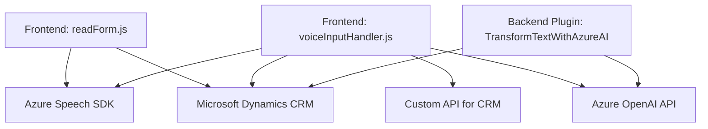

### Breve resumen técnico:
El repositorio analiza tres archivos principales que implementan funcionalidades relacionadas con interfaces dinámicas de formularios en **Microsoft Dynamics CRM**, combinando capacidades de interacción por voz y procesamiento de texto mediante servicios de **Azure Speech SDK** y **Azure OpenAI**. Las funcionalidades están diseñadas para mejorar accesibilidad e interacción de usuarios con formularios, mediante síntesis, reconocimiento de voz y transformación de datos.

---

### Descripción de la arquitectura:
- **Tipo de solución:** La solución podría clasificarse como una combinación de **frontend modular** (archivos JavaScript que interactúan con Dynamics CRM) y una **lógica de negocio en plugins** que amplía las operaciones del sistema backend de Dynamics, creando un **microservicio integrador**.
- **Arquitectura:** Se observa un esquema híbrido:
  - **Capas lógicas separadas por propósito**: Cada archivo tiene un enfoque modular.
  - **Integración con Microservicios**: Invocación de APIs externas (Azure OpenAI y Azure Speech SDK).
  - **Event-driven pattern:** Uso de callbacks y servicios dinámicos (SDK) en JavaScript.

---

### Tecnologías usadas:
1. **Microsoft Dynamics CRM**: El sistema principal al que se conecta la capa de entorno.
2. **Azure Cognitive Services y Speech SDK**: Manejo de síntesis y reconocimiento de voz.
3. **Azure OpenAI API**: Uso de modelos GPT para procesamiento de texto avanzado.
4. **JavaScript**: Ampliamente empleado para la lógica de acceso y visualización en Dynamics.
5. **C# .NET**: Para implementar un plugin dinámico en Dynamics CRM.
6. **Newtonsoft.Json y System.Text.Json**: Manipulación y serialización de datos en formato JSON.
7. **HTTP Client**: Integración con servicios REST en plugins.
8. **DOM API**: Interacción con elementos del navegador para formularios.

---

### Dependencias o componentes externos:
1. **Azure Speech SDK**:
   - Carga dinámica desde el navegador.
2. **Azure OpenAI API**:
   - Procesamiento estructurado de texto a JSON mediante llamadas REST.
3. **Microsoft Dynamics CRM**:
   - Estructura base del entorno, utilizando objetos como `Xrm.WebApi` y `IOrganizationService`.
4. **Newtonsoft.Json**:
   - Procesamiento JSON y manipulación desde el lado del plugin.
5. **Microsoft.Xrm.Sdk**:
   - Integración con el modelo de datos y servicios del CRM.
6. **Navegador**:
   - Manipulación DOM para cargar dependencias y alternar estados UI dinámicamente.

---

### Diagrama Mermaid:

---

### Conclusión final:
La solución integra capacidades modernas de procesamiento de voz y texto en un entorno híbrido compuesto por interacciones frontend (JavaScript) y backend (C# plugins), combinado con servicios en la nube de Azure Speech y OpenAI. Su arquitectura modular con patrones de desacoplamiento y capacidades de extensión sobre Dynamics lo hacen un diseño eficiente para sistemas que necesitan soportar accesibilidad avanzada o procesamiento de lenguaje natural. Sin embargo, la seguridad en la gestión de credenciales debería ser reevaluada para mejorar su robustez.