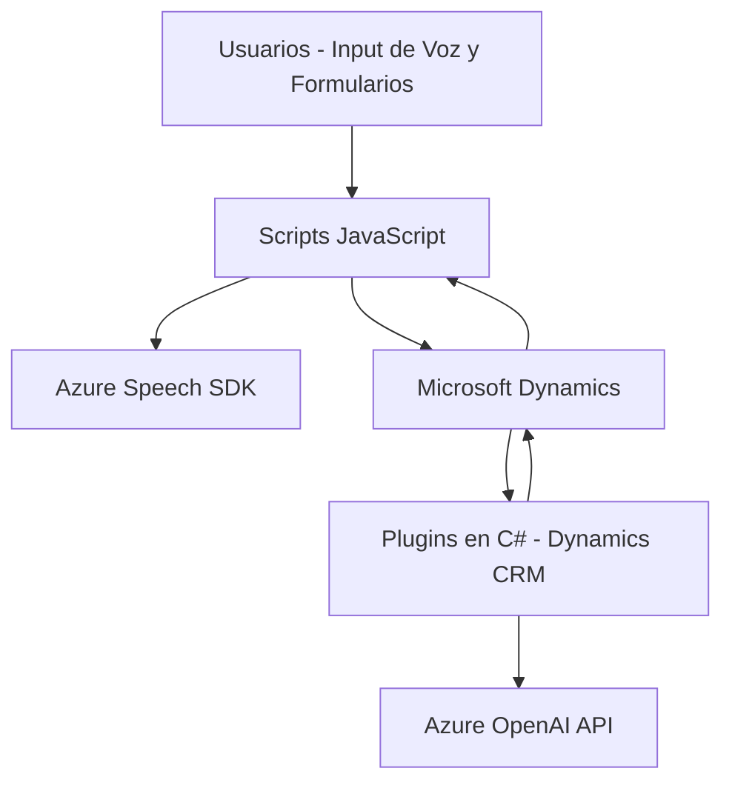

### Breve resumen técnico
El repositorio se construye principalmente para extender funcionalidades en Microsoft Dynamics CRM gracias a plugins y scripts para formularios. Tiene una integración directa con servicios avanzados como Azure Speech SDK para reconocimiento de voz y Azure OpenAI para procesamiento de texto basado en inteligencia artificial. La solución está orientada a la automatización y el enriquecimiento de dinámicas en formularios.

---

### Descripción de arquitectura
La arquitectura es de **n capas**, donde cada componente tiene una responsabilidad específica:
1. **Frontend (scripts JavaScript)**: Procesa datos provenientes de los usuarios y los integra con servicios externos, como Azure Speech SDK.
2. **Backend (plugins para Dynamics CRM)**: Realiza transformaciones de datos mediante extensiones C# y consume APIs de Azure OpenAI. Además, los plugins interactúan con la capa de datos del CRM.
3. **Servicios externos**: Integración con Azure Speech para reconocimiento de voz y Azure OpenAI para procesamiento avanzado de texto.

---

### Tecnologías usadas
1. **Lenguajes**:
   - **JavaScript** para la lógica del cliente y scripts de formularios.
   - **C#** para los plugins en Dynamics CRM.

2. **Frameworks y SDKs**:
   - **Azure Speech SDK** para reconocimiento de voz, conversión texto a voz y manipulación de datos.
   - **Microsoft Dynamics Web API** para manipulación de entidades dentro de CRM.
   - **Azure OpenAI API** con modelos como `gpt-4o` para procesamiento de texto.

3. **Patrones de diseño**:
   - **Event-Driven Architecture** en scripts que responden a interacciones en tiempo real.
   - **Plugin Design Pattern** en extensiones de CRM.
   - **Adaptador HTTP** para consumir servicios en la nube como OpenAI.

---

### Diagrama Mermaid válido para GitHub

---

### Conclusión final
La solución está diseñada como una arquitectura **n capas**, que combina frontend dinámico con scripts que integran servicios de IA y backend con capacidades extensibles. La integración con **Azure Speech SDK** y **Azure OpenAI** expande las posibilidades de interacción y procesamiento de datos, mientras que los plugins en C# garantizan que las reglas del negocio sean aplicadas de manera precisa. Es ideal para escenarios donde la automatización de tareas complejas, especialmente en sistemas CRM, sea un requerimiento clave.