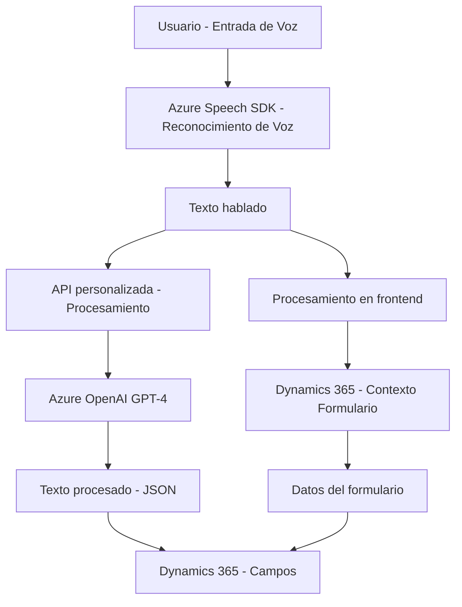

### Breve resumen técnico:

El repositorio parece estar diseñado para una solución que integra **reconocimiento de voz** y **procesamiento de texto hablado** en un contexto de gestión de datos asociado a **formularios de Dynamics 365 CRM**. Usa como principales componentes el **Azure Speech SDK**, para el reconocimiento y síntesis de voz, y la **API Azure OpenAI**, para transformar y estructurar el texto con el modelo GPT-4. Esta solución facilita la interacción natural humana mediante voz, ayudando a mapear información al contexto de formularios y entidades asociadas.

---

### Descripción de arquitectura:

La solución sigue un enfoque **modular** con tres capas funcionales evidentes:

1. **Frontend/JS**: Scripts que permiten la manipulación del formulario en Dynamics 365 CRM y la interacción directa con Azure Speech SDK.
   - Responsabilidad: Procesar la entrada de datos hablados, convertirlos en texto (transcripción) y vincularlos con los campos en el formulario.
   - Uso de patrones como "Facade" para simplificar la interacción del usuario con operaciones complejas.

2. **API personalizada**: Plugin en C# (`TransformTextWithAzureAI.cs`), que interactúa con Dynamics 365 CRM para recibir una entrada de texto y procesarla usando **Azure OpenAI GPT-4**. Devuelve un JSON estructurado con datos procesados.
   - Uso de patrones como "Plugin" y "API Gateway" (integración con OpenAI API).

3. **Arquitectura externa basada en APIs**: Uso de servicios externos como **Azure Speech SDK** y **Azure OpenAI API (GPT-4)** como componentes para responder a solicitudes específicas de reconocimiento de voz y procesamiento de texto, respectivamente.

En términos de arquitectura general, esta solución se asemeja a una **Arquitectura en capas** debido a la claridad en la separación de responsabilidades en el frontend, backend (plugin/API), y el SDK externo. Sin embargo, su fuerte dependencia de servicios y APIs externas también presenta características propias de una arquitectura **orientada a servicios**.

---

### Tecnologías usadas:

1. **Azure Speech SDK**: Para reconocimiento y síntesis de voz.
2. **Azure OpenAI API (GPT-4)**: Para transformar texto hablado en estructuras JSON procesables.
3. **Microsoft Dynamics 365 Xrm SDK**: Framework de CRM para manipular formularios, entidades y datos.
4. **JavaScript (Frontend)**: Para manipulación de formularios y cliente de Azure Speech.
5. **C# (.NET Framework)**: Para desarrollo de plugins personalizados en el backend para Dynamics 365.
6. **APIs REST**: Para integración con Azure OpenAI API y el SDK de Azure Speech.
7. **Newtonsoft.Json** y **System.Text.Json**: Librerías de manipulación y serialización de objetos JSON.

---

### Diagrama Mermaid válido para GitHub:

---

### Conclusión final:

La solución está orientada a mejorar la experiencia de usuario en **Microsoft Dynamics 365 CRM**, adoptando un enfoque **semiautomático** que permite transformar la información hablada en datos estructurados y utilizables en formularios. El diseño refleja una arquitectura **modular en capas** que se apoya en servicios externos avanzados como Azure Speech y Azure OpenAI GPT-4. El código está bien estructurado con funciones específicas para cada tarea, haciendo uso de estándares dominantes (REST API, SDKs). Sin embargo, el éxito del sistema depende de la estabilidad y escalabilidad de los servicios externos de Azure. Si se produjera un fallo o limitación en dichas dependencias, el sistema podría encontrarse con problemas de funcionalidad.