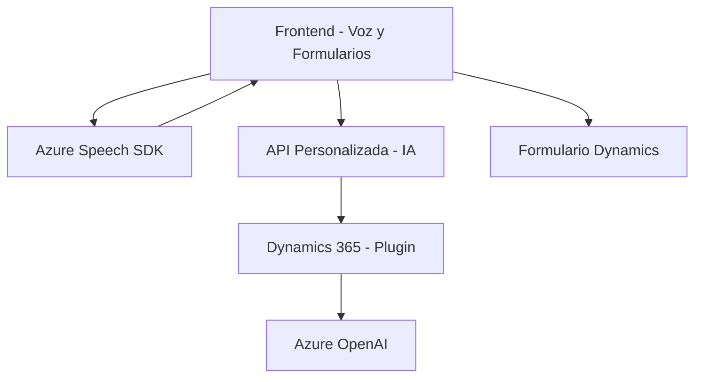

### Breve resumen técnico

El repositorio contiene tres archivos que implementan una solución relacionada con el procesamiento de formularios vía voz y texto, aprovechando servicios como **Azure Speech SDK** y **Azure OpenAI**. Esto mejora la accesibilidad y emplea IA para interpretar y procesar comandos hablados, interaccionando directamente con formularios de **Microsoft Dynamics 365** y APIs personalizadas.

---

### Descripción de arquitectura

La arquitectura es **modular** y sigue una estructura **n capas**, con cada capa manejando aspectos específicos:
1. **Frontend:** Facilita la interacción directa del usuario con formularios. Implementa la captura de datos, síntesis de voz y reconocimiento.
2. **Servicio externo (Dynamics 365):** Integra APIs personalizadas y servicios como **Azure Speech SDK** y **Azure OpenAI** para tareas avanzadas de interpretación y procesamiento.
3. **Plugin (Dynamics 365):** Proporciona funcionalidades extendidas mediante la **interfaz IPlugin**, que transforma datos y aplica reglas específicas vía **Azure AI**.

Implementa patrones como **carga dinámica del SDK**, **callback-oriented programming** y **delegación a servicios externos** como parte del procesamiento de voz, texto y comandos.

---

### Tecnologías usadas

1. **Frontend:**
   - **JavaScript:** Lenguaje base para interactuar con el DOM, Azure SDK y formularios.
   - **Azure Speech SDK:** Para convertir texto en voz y procesar voz en texto.
2. **Backend - Dynamics 365:**
   - **Microsoft Dynamics CRM SDK:** Para extender funcionalidades mediante plugins.
   - **Azure OpenAI API:** Usada en el plugin para transformar texto en comandos estructurados vía IA.
   - **HttpClient y System.Text.Json:** Para realizar solicitudes HTTP desde el plugin y manipular JSON.
3. **Infraestructura:**
   - **Microsoft Xrm Services SDK:** Para manejar datos y procesos dentro de Dynamics 365.

---

### Diagrama Mermaid válido para GitHub

---

### Conclusión final

La solución implementa una **arquitectura modular basada en capas**, en la que cada capa maneja aspectos específicos del ciclo de interacción con formularios y procesamiento por voz. El frontend captura datos y comandos hablados, trabajando estrechamente con SDKs como **Azure Speech**. En el backend, un **plugin de Dynamics 365** con **Azure OpenAI** transforma texto y lo interpreta según reglas predefinidas. Además, el diseño general facilita la integración de tecnologías externas (Azure SDK y OpenAI), mostrando un enfoque flexible y accesible.