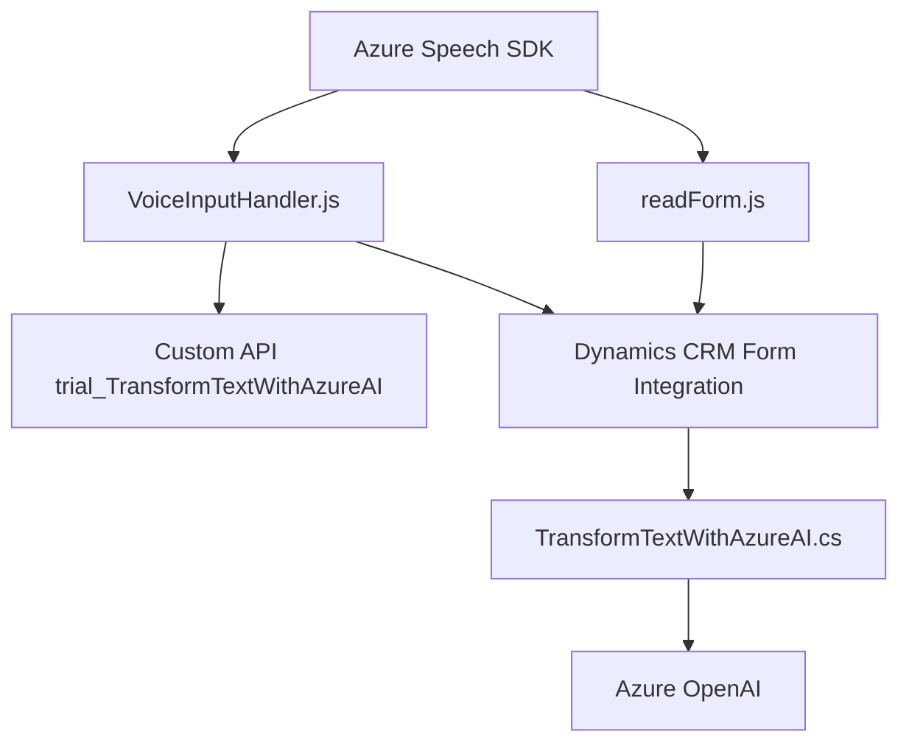

### Breve resumen técnico
El repositorio contiene una solución orientada a integrar capacidades de accesibilidad y reconocimiento de voz mediante Azure Speech SDK, combinando procesamiento de texto y voz con Inteligencia Artificial (Azure OpenAI) dentro del contexto de formularios y sistemas como Microsoft Dynamics CRM. La arquitectura está basada en componentes modulares que interactúan con servicios externos y actualizan formularios alojados en un entorno CRM.

---

### Descripción de arquitectura
El sistema aplica una arquitectura distribuida basada en integración de componentes. En el Frontend, los archivos JavaScript actúan como módulos de procesamiento de formularios, utilizando el Speech SDK y conectándose con APIs externas. En el Backend, el archivo `TransformTextWithAzureAI.cs` implementa un patrón orientado a servicios (SOA) para procesar texto en formato JSON mediante Azure OpenAI. El diseño sigue principios de modularización y desacoplamiento.

#### Componentes principales:
1. **Frontend (JavaScript):**
   - Manejo de entrada de voz (reconocimiento de voz).
   - Lectura de datos visuales en formularios.
   - Carga dinámica del SDK de Azure Speech.
   - Transformación de datos locales y delegación a APIs externas.

2. **Backend (Dynamics Plugin):**
   - Proceso de texto mediante Azure OpenAI.
   - Implementación del patrón Plugin Design Pattern en Dynamics CRM.
   - Estructuración de datos en JSON según normas específicas.

---

### Tecnologías usadas
1. **Frontend:**
   - **JavaScript** para manejar interacciones de usuario y formularios.
   - **Azure Speech SDK** para texto a voz y reconocimiento de voz.
   - **REST API** para integración con el Backend.

2. **Backend:**
   - **C#** para escribir un plugin en Dynamics CRM.
   - **Azure OpenAI** API para procesamiento de texto usando modelos GPT.
   - **Newtonsoft.Json** y **System.Text.Json** para manipular datos JSON.

3. **Infraestructura y Servicios Externos:**
   - **Dynamics 365** como CRM central.
   - CDN de Microsoft para cargar el SDK.
   - API personalizada para integración con servicios Azure.

---

### Diagrama **Mermaid**

---

### Conclusión final
La solución es una implementación de una **multi-capa con componentes distribuidos**. El Frontend gestiona la interacción del usuario (lectura y entrada por voz) y delega el procesamiento avanzado al Backend a través de una **API-first approach**. El Backend utiliza un **SOA** que centraliza servicios externos como Azure OpenAI para elevar las capacidades de procesamiento de datos. Esto facilita **accesibilidad** y **automatización**, integrando la solución profundamente con un CRM como Dynamics 365.