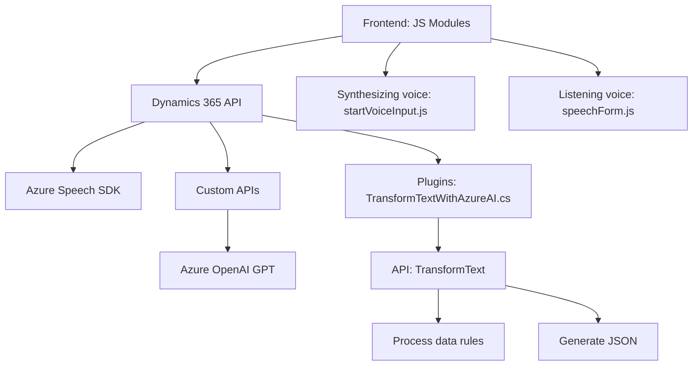

### Breve resumen técnico
El repositorio en conjunto sugiere una solución híbrida centrada principalmente en la integración entre Dynamics 365 CRM, Azure Speech SDK y otras APIs externas como Azure OpenAI. Los componentes trabajan como intermediarios entre datos de formularios interactivos y servicios de reconocimiento de voz/síntesis de texto, asegurando accesibilidad y procesamiento avanzado.

---

### Descripción de arquitectura
La solución adopta una **arquitectura orientada a servicios**:
- El frontend en JavaScript implementa funciones de síntesis y reconocimiento de voz delegando gran parte del procesamiento a APIs externas.
- Los plugins en C# para Dynamics 365 actúan como extensiones (eventos basados en datos) que realizan transformaciones avanzadas con modelos de Azure OpenAI.
- **Patrones clave utilizados:**
  - **Responsabilidad única (SRP):** Cada módulo/función tiene una tarea específica (ej. sintetizar texto a voz, transformar datos).
  - **Event-driven programming:** Basado en callbacks para cargar SDK y ejecutar procesos dependientes.
  - **Facade:** Abstracción del backend de Azure Speech y OpenAI SDK utilizando funciones específicas.
  - **Modularización:** Separación de responsabilidades según el propósito (voz → síntesis, texto → transformación).

**Arquitectura global:** Aunque no se presenta una arquitectura estrictamente de microservicios, sí emerge el uso de patrones organizados como un sistema **híbrido basado en n-capas/service-oriented** que combina cliente (JavaScript), middleware (APIs), y backend (plugins de Dynamics).

---

### Tecnologías usadas
1. **Lenguajes:**
   - **JavaScript**: Manejo de frontend (Dynamics 365 Forms) y integración del Azure Speech SDK.
   - **C#**: Complementación mediante plugins del CRM (Dynamics 365).
2. **Servicios externos:**
   - **Azure Speech SDK**: Síntesis y reconocimiento de voz en tiempo real.
   - **Azure OpenAI**: Transformaciones avanzadas de texto.
   - **Dynamics 365 SDK**: APIs nativas para manipular datos del CRM.
3. **Librerías:**
   - `Newtonsoft.Json`, `System.Net.Http`: Manejo de JSON y comunicación HTTP para integrar servicios.
4. **Ecosistema en la nube:**
   - **Azure Resources**: Desde Speech hasta OpenAI endpoints.
   - **Dynamics WebAPI**: Operaciones como manipulación de formularios y consumo de REST.

---

### Dependencias internas y externas
1. **Internas:**
   - Dinámicas del contexto del formulario de Dynamics 365 (`formContext`, `executionContext`).
   - Plugins de Dynamics que actúan como extensiones back-end.
2. **Externas:**
   - Azure Speech SDK (archivo: `https://aka.ms/csspeech/jsbrowserpackageraw`).
   - Azure OpenAI (API GPT-4).
   - APIs personalizadas en el ecosistema Dynamics para transformación de datos.

---

### Diagrama Mermaid compatible con GitHub Markdown

### Conclusión final
El proyecto está bien estructurado para ofrecer integración entre diferentes servicios de Azure y Dynamics 365 CRM. Por medio de una arquitectura modular y basada en eventos, cumple con requisitos como accesibilidad (voz) y procesamiento avanzado de datos (OpenAI). Aunque no es estrictamente de microservicios, la solución aprovecha patrones modernos funcionales y orientados a servicios que facilitan la integración y escalabilidad.