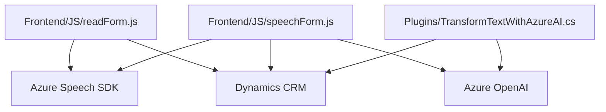

### Breve Resumen Técnico

El repositorio contiene tres componentes principales (`readForm.js`, `speechForm.js`, y `TransformTextWithAzureAI.cs`) diseñados para interactuar con formularios dinámicos, realizar procesamiento de voz y texto con Azure Speech SDK y Azure OpenAI, e integrarse con Microsoft Dynamics CRM. La solución está orientada al reconocimiento de voz, síntesis de texto a voz y transformación de datos utilizando IA.

---

### Descripción de Arquitectura

#### Tipo de solución:
Es una solución híbrida que incluye un frontend (JavaScript), procesamiento dinámico de voz con SDKs, y un backend extensible en forma de plugin para Dynamics CRM. Además, se integra con APIs externas como Azure Speech SDK y Azure OpenAI para procesamiento avanzado.

#### Arquitectura:
- **Frontend:** Modular con lógica de cliente-side en JavaScript. Utiliza un patrón estructurado basado en funciones con separación de responsabilidades.
- **Backend:** Plugin implementado para Dynamics CRM siguiendo una arquitectura tipo "Plugin Execution Context" específica de Microsoft Dynamics.
- **Modelo de interacción:** 
  - El frontend gestiona la experiencia del usuario en tiempo real.
  - El backend (plugin) complementa la funcionalidad al procesar texto con reglas específicas mediante IA.
- **Patrón Principal:** Arquitectura orientada a servicios (SOA) con interacciones cliente-servidor.

---

### Tecnologías y Frameworks Usados
1. **Frontend (JavaScript):**
   - **Vanilla JavaScript**: Para manipulación del DOM.
   - **Azure Speech SDK**: Para las funcionalidades de síntesis y reconocimiento de voz.
   - **Dynamics Form Context APIs**: Para gestionar datos de formularios dinámicos.

2. **Backend (C# Plugin):**
   - **Microsoft Dynamics Plugin API:** Manejo de eventos y lógica empresarial.
   - **Azure OpenAI:** Transformación dinámica de textos.
   - **JSON Utilities:** `Newtonsoft.Json` para manipulación JSON y `System.Text.Json` para serialización.

3. **General Frameworks:** 
   - **HTTP Client:** Para la comunicación con Azure OpenAI.
   - **Dynamics Xrm.WebApi.online:** Integración a nivel del frontend con CRM.

---

### Dependencias o Componentes Externos
1. **SDKs y APIs externas:**
   - **Azure Speech SDK**: Para reconocimiento de voz y síntesis de texto a voz.
   - **Azure OpenAI**: Procesamiento avanzado de texto.
   - **Dynamics Web API**: Uso extensivo para gestión de formularios y datos en Dynamics CRM.

2. **Plugins en Dynamics CRM:**
   - Operando con el contexto CRM (`IPluginExecutionContext`). 
   - Dependencias como HTTP y diversas bibliotecas de manipulación JSON.

---

### Diagrama Mermaid 100% compatible con GitHub

---

### Conclusión Final

La solución es una integración completa que combina reconocimiento de voz, procesamiento de texto mediante IA, interacción con formularios en aplicaciones Dynamics CRM, y uso de modernas herramientas como Azure Speech SDK y Azure OpenAI. La arquitectura modular asegura una separación clara entre las distintas capas de la solución: presentación, lógica de negocio y servicios externos.

Aunque está bien construido, se recomienda:
1. Mejorar la gestión de errores para escenarios de fallo de conexión en el lado de cliente o servidor.
2. Modularizar más los componentes de frontend para facilitar mantenimiento y apoyo de pruebas unitarias.

Este diseño está optimizado para entornos Dynamics CRM y soluciones que requieran operaciones de voz y AI en tiempo real.