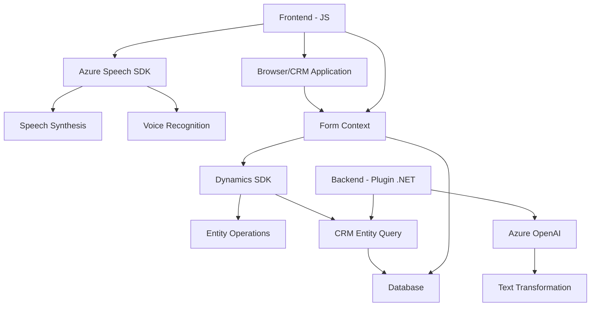

### Breve resumen técnico:
El repositorio analizado integra funcionalidades avanzadas de **Azure Speech SDK** y **Azure OpenAI** para proporcionar reconocimiento de voz, síntesis de texto a voz, e inteligencia artificial aplicada en el contexto de formularios CRM dinámicos. Se organiza en tres componentes principales: un frontend implementado en **JavaScript**, otro plugin escrito en **C# para Dynamics CRM**, y dependencias externas como APIs de Azure Cognitive Services.

---

### Descripción de arquitectura:
El diseño sigue una arquitectura **n-capas** adecuada para un entorno Dynamics CRM. Aunque no es un microservicio, dado que las partes dependen entre sí y su flujo sigue el modelo cliente-servidor, efectúa integración modular:
1. **Presentación (frontend):** Manejo del reconocimiento de voz y síntesis de texto en el entorno de ejecución del cliente (normalmente un navegador o aplicación interactiva).
2. **Lógica de negocio (backend/plugin):** Procesamiento de datos usando **Azure OpenAI** y manejo de reglas específicas dentro de Dynamics CRM.
3. **Integración:** APIs externas (SDK de Azure y endpoint de OpenAI) para procesamiento de voz y texto.
4. **Datos:** Almacenamiento y consulta directa mediante APIs de **Microsoft Dynamics SDK**.

---

### Tecnologías usadas:
1. **Lenguajes de programación:**  
   - **JavaScript:** Para el frontend y manejo de voz, interacción SDK, y asincronía.
   - **C#:** Implementación de la lógica del plugin para Dynamics CRM.
  
2. **FrameWorks/API:**  
   - **Azure Speech SDK:** Para síntesis de voz y reconocimiento de entrada.
   - **Azure OpenAI:** Procesamiento de texto avanzado con IA (GPT-4).  
   - **Microsoft Dynamics SDK:** Facilitación de operaciones CRM (entidades, consultas).  

3. **Patrones arquitectónicos:**  
   - **Modularización de funciones:** Uso de funciones especializadas con tareas específicas en el frontend.
   - **Asincronía:** Promesas y callbacks con Azure SDK.
   - **Plugin-based architecture:** Definición y ejecución de lógica en eventos de Dynamics CRM.
   - **Integración con servicios externos:** API Communication usando **HttpClient** y SDK.
   - **Service Factory Pattern:** En el backend para desacoplamiento.

---

### Diagrama Mermaid:

---

### Conclusión final:
La solución presenta un diseño modular y bien estructurado, enfocándose en la integración de servicios cognitivos de Microsoft Azure dentro de un entorno CRM como **Dynamics**. Sigue una arquitectura **n-capas** donde el frontend interactúa con dependencias externas (Azure Speech SDK) para manejo de formularios dinámicos al tiempo que el backend usa un diseño basado en plugins para integración de funcionalidades de IA (Azure OpenAI). Este enfoque garantiza adaptabilidad y escalabilidad, dado su capacidad para procesar datos en múltiples contextos (campos dinámicos, voz y texto).