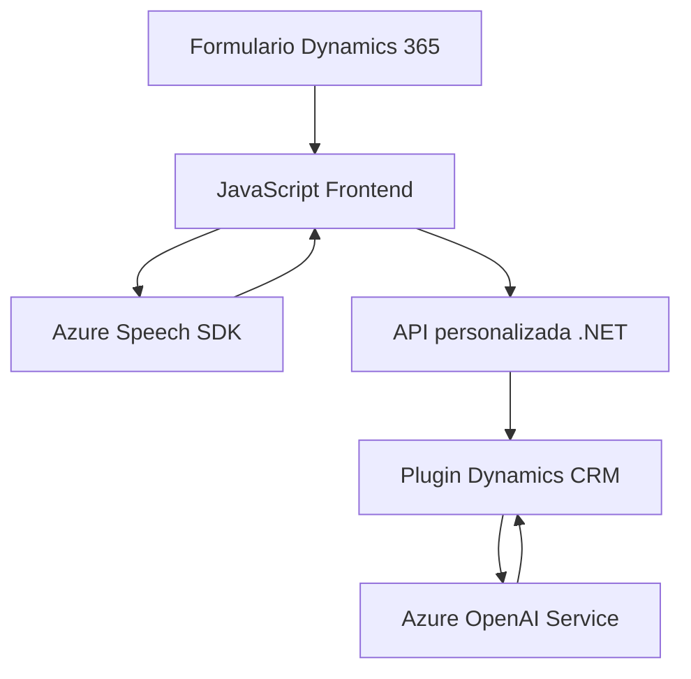

### Breve resumen técnico:
El repositorio expuesto contiene diversos archivos para integrar servicios de voz (reconocimiento y síntesis), procesamiento de formularios en Dynamics 365, e inteligencia artificial de Azure OpenAI. Las tres áreas clave son:
1. **Frontend/JavaScript**: Implementación de interacciones cliente para reconocimiento y síntesis de voz utilizando Azure Speech SDK.
2. **Plugins/C#**: Integración de Dynamics CRM con Azure OpenAI en el backend.
3. **API personalizada**: Para transformar texto o interactuar con formularios de Dynamics.

---

### Descripción de arquitectura:
1. **Arquitectura general:** Patrón de **n capas** con tres niveles principales:
   - **Frontend:** Manipulación de datos visibles en formularios y el reconocimiento/síntesis de voz con JavaScript.
   - **Backend/Plugins:** Integración de Dynamics CRM con Azure OpenAI.
   - **Servicios externos:** Dependencias como Azure Speech SDK y Azure OpenAI.

2. **Backend con microservicios**: El plugin en C# actúa como una integración modular basada en reglas para conectar Dynamics CRM con Azure OpenAI mediante una API REST.

3. **Patrones principales**:
   - **Evento Controlado (Event-Driven):** Las funciones JavaScript inician acciones (reconocimiento/síntesis) en función de eventos determinantes.
   - **Cliente-Servidor:** Es evidente en la interacción entre formularios del frontend y la API del backend.
   - **Single Responsibility Principle:** Cada función y clase en el código descrito se enfoca en tareas específicas e independientes.

4. **Integración dinámica de SDK:** Se carga el Azure Speech SDK en tiempo de ejecución para optimizar la interacción del usuario (reducción del peso inicial).

---

### Tecnologías usadas:
1. **Frontend:**
   - **JavaScript ES6**: Utilizado para lógica del cliente.
   - **Azure Speech SDK**: Cargado dinámicamente desde una URL para síntesis y reconocimiento de voz.
   - **Dynamics 365 Web API**: Interacciones específicas con los formularios y datos de CRM.

2. **Backend:**
   - **Microsoft Dynamics CRM SDK (`IPlugin`)**: Framework para desarrollo de extensiones del CRM.
   - **Azure OpenAI API**: Procesamiento avanzado de texto con inteligencia de GPT.
   - **C#/.NET Framework**: Implementación del plugin y el manejo de servicios API.
   - **Newtonsoft.Json & System.Text.Json**: Serialización y deserialización avanzada de datos JSON.

---

### Dependencias o componentes externos:
- **Azure Speech SDK:** Para reconocimiento y síntesis de voz.
- **Dynamics Web API (CRM):** Control del contexto de formularios en Dynamics 365.
- **Azure OpenAI:** Transformación avanzada de texto utilizando modelos GPT.
- **HttpClient:** Servicio para realizar peticiones HTTP al API de OpenAI.

---

### Diagrama Mermaid para GitHub:

---

### Conclusión final:
El repositorio aborda soluciones avanzadas en Dynamics 365 con integración de servicios de voz y OpenAI de Azure, utilizando una arquitectura de capas con patrones y principios bien definidos. La principal fortaleza es la modularidad: cada componente cumple funciones específicas y claras. El uso de SDKs externos como Azure Speech y OpenAI, junto con el consumo de APIs dinámicas, resalta la naturaleza orientada a microservicios en el backend. Sin embargo, en frontend existe una estructura basada en funciones que podría evolucionar hacia un diseño más modular como componentes de ES6 o frameworks como React/VueJS para mejorar la escalabilidad.