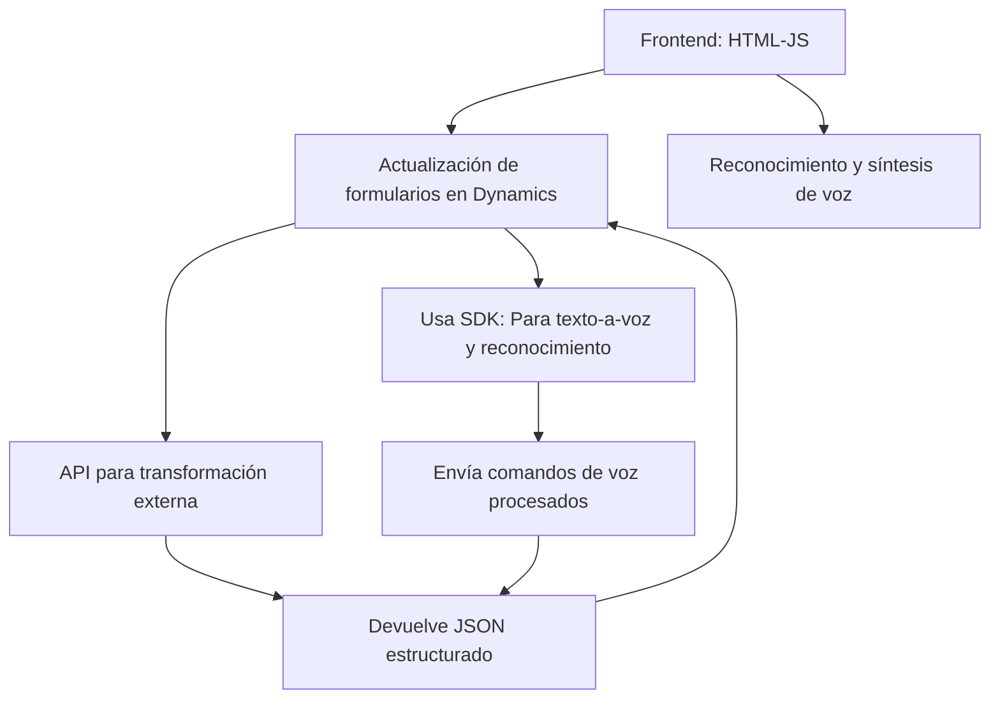

### Breve resumen técnico

El repositorio parece ser parte de una solución completa que gira en torno a la integración de servicios de voz y procesamiento de texto con formularios dinámicos en una plataforma CRM (Microsoft Dynamics 365). La principal funcionalidad involucra el uso del **Azure Speech SDK** para reconocimiento y síntesis de voz, junto con **Azure OpenAI** para la transformación de texto en JSON estructurado dentro de un plugin.

---

### Descripción de arquitectura

La arquitectura se puede clasificar como **modular** y posee características de **n capas**, donde cada nivel de la solución está dedicado a una tarea específica:

- **Capa de presentación o frontend**: Implementada en JavaScript (**readForm.js** y **speechForm.js**) para facilitar interacciones con el reconocimiento y síntesis de voz dentro del cliente web de Dynamics 365.
- **Capa de servicios**: Se utiliza el SDK de JavaScript de Azure Speech para capturar voz, y la API de Azure OpenAI para procesamiento de texto.
- **Capa de negocio o backend**: Implementada en **TransformTextWithAzureAI.cs**, utiliza un plugin en Dynamics CRM para delegar lógica de negocio específica, interactuar con servicios externos y devolver datos estructurados JSON.

Esta arquitectura fomenta la separación de responsabilidades: el frontend gestiona la UI, el plugin encapsula la lógica empresarial y las APIs externas realizan operaciones avanzadas (IA y voz).

---

### Tecnologías usadas

1. **Frontend**:
   - **JavaScript**: Lógica principal para la interacción con formularios de Dynamics 365.
   - **Azure Speech SDK (JS)**: Reconocimiento de voz y síntesis de texto a voz.
   - **Dependency Injection**: Implementado con funciones como `ensureSpeechSDKLoaded(callback)` para cargar dinámicamente el SDK en el navegador.

2. **Backend**:
   - **C# Plugin para Dynamics CRM**:
     - **Microsoft.Xrm.Sdk**: Para manipulación de formularios y entidades en Dynamics.
     - **Azure OpenAI API**: Para procesar texto y devolver JSON estructurado.
     - **Newtonsoft.Json.LINQ**: Para manejar JSON en C#.
     - **System.Net.Http**: Para enviar peticiones REST a servicios externos (Azure OpenAI).

3. **Servicios Externos**:
   - **Azure Speech SDK**: Funcionalidad de texto a voz y reconocimiento de voz.
   - **Azure OpenAI API**: Procesamiento de texto.

4. **Patrones de diseño y arquitectura**:
   - **Callback**: Para garantizar la ejecución de dependencias externas como el SDK de reconocimiento.
   - **Encapsulación modular**: Separación de lógica en métodos específicos, facilitando mantenimiento y tests.
   - **API Facade**: Aisla la lógica y detalles de los SDK y APIs externas mediante funciones específicas.
   - **N-Capas**: Separación entre capa de presentación, servicios, y lógica de negocio en el plugin.

---

### Diagrama Mermaid válido para GitHub

---

### Conclusión final

La solución descrita en el repositorio claramente es un **frontend acoplado con integración de servicios externos y una capa backend de lógica adicional**. Está diseñada para optimizar la interacción con formularios dinámicos de Dynamics 365 utilizando voz e inteligencia artificial, lo que agrega una capa de automatización avanzada.

La arquitectura **modular y orientada a servicios**, combinada con el uso de APIs como **Azure Speech SDK** y **OpenAI**, sugiere que el sistema se orienta a ser escalable y adaptable a nuevas funciones en el futuro. Además, el diseño basado en n capas con una transición clara entre frontend, servicios y backend garantiza una implementación organizada y mantenible.