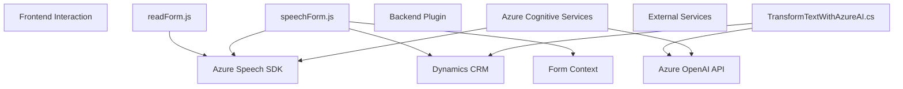

### **Breve resumen técnico**
El repositorio contiene múltiples archivos que interactúan entre sí para ofrecer funcionalidad de entrada/gestión de voz y transformación de texto mediante servicios de Azure Cognitive Services y Dynamics CRM. Estas funcionalidades se integran mediante componentes del frontend en JavaScript y un plugin en C# para Dynamics CRM.

---

### **Descripción de arquitectura**
1. **Tipo de solución:**
   - Esa solución integra múltiples tipos de componentes:
     - **Frontend:** Los archivos JavaScript (`readForm.js` y `speechForm.js`) se encargan de la interacción con formularios y la integración de entrada y salida de voz utilizando el Azure Speech SDK.
     - **Plugin para CRM:** El archivo C# implementa una función específica para procesar textos y transformarlos usando Azure OpenAI, operando como una extensión de Dynamics CRM.
   
2. **Arquitectura:**
   - **N-capas distribuida con microservicios:**
     Se trata de una arquitectura que mezcla aspectos de **n-capas** (frontend y backend separado por responsabilidades) y **microservicios**, debido al uso de servicios externos de Azure:
       - Capa de presentación: JavaScript archivos (`readForm.js`, `speechForm.js`) manejan la interacción entre el usuario y los formularios, y comunican datos con los servicios externos. También existen funciones de integración con el DOM.
       - Capa de servicios externos: Azure Speech SDK para **Text-to-Speech** y **Speech-to-Text**. Azure OpenAI API en el caso del plugin transforma texto.
       - Capa de negocio personalizada: El plugin en C# implementa lógica específica para manipular reglas de texto y retornar el resultado hacia el contexto de Dynamics CRM.

3. **Patrones:**
   - **Carga dinámica:** SDK del Speech es cargado dinámicamente desde el navegador solo cuando es necesario.
   - **Separation of Concerns:** Cada archivo tiene funciones organizadas por su contexto y responsabilidad (módulos reutilizables).
   - **Event-driven Architecture:** El frontend está centrado en eventos como el reconocimiento de voz y manejo de formularios.
   - **Plugin-based Architecture:** El plugin CRM actúa como componente extensible dentro del ecosistema Dynamics.
   - **API Integration:** Ambos componentes dependen altamente de servicios externos de APIs REST (Azure Speech SDK y OpenAI).
   - **Data Mapping:** Mapeo de datos entre diferentes contextos, como atributos visibles de formularios y cadenas transformadas a JSON.

---

### **Tecnologías usadas**
1. **Frontend:**
   - **JavaScript**: Lenguaje principal para gestionar la interacción del usuario.
   - **Azure Speech SDK**: Para habilitar reconocimiento y sintetización de voz.
   - **DOM API**: Gestión de elementos HTML y carga de scripts.
   
2. **Backend:**
   - **C#:** Implementación del plugin para Dynamics CRM.
   - **Microsoft Dynamics CRM SDK**: Acceso e interacción con los datos estructurados en Dynamics.
   - **Azure OpenAI GPT Integration:** Servicio para transformar textos mediante inteligencia artificial generativa (posiblemente GPT-4).
   - **HTTP Client y JSON Parsers:** Para la comunicación REST con Azure OpenAI.

3. **Otras dependencias:**
   - **Newtonsoft.Json:** Manipulación y consulta de JSON.

---

### **Diagrama Mermaid**
Aquí tienes una representación visual de la arquitectura del repositorio basada en su interacción entre componentes:

---

### **Conclusión Final**
El repositorio implementa una solución distribuida que integra interacción con el **frontend** (entrada y salida de voz en formularios web) y un plugin **backend** para transformar texto en **Dynamics CRM** aprovechando los servicios de **Azure Cognitive Services** y **Azure OpenAI**. La arquitectura combina elementos de n-capas con integración a servicios externos en un entorno CRM, lo cual es ideal para entornos empresariales y casos en los que la automatización e IA mejoran la productividad.

Para mejorar el manejo del código, se podría optimizar la seguridad (evitando valores estáticos como claves de API) y utilizar manejadores más robustos para errores en los servicios externos.