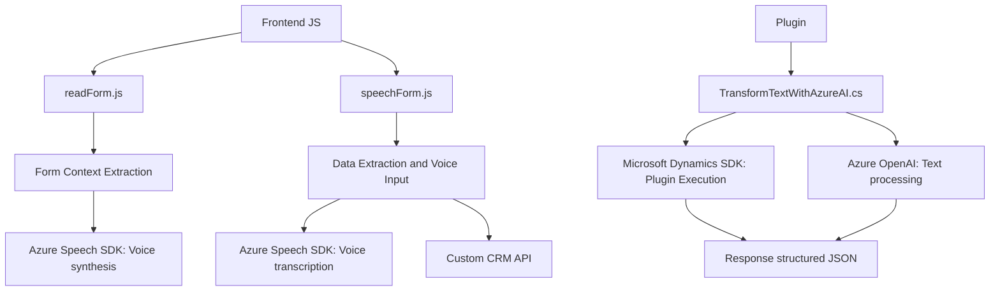

### Breve resumen técnico

El repositorio parece ser una solución orientada a trabajar con formularios en un sistema CRM integrado con capacidades de procesamiento de voz, transcripción, y transformación de texto estructurado. Esto incluye integración con servicios externos como Azure Speech SDK y Azure OpenAI.

---

### Descripción de arquitectura

La solución presenta componentes con funcionalidades específicas:
1. **Frontend**:
   - Maneja interacción entre usuarios y formularios CRM.
   - Utiliza funciones JavaScript para síntesis y transcripción de voz, con un enfoque modular para cargar dependencias de manera dinámica y procesar datos desde el formulario.
   - Procesa transcripciones y aplica cambios dinámicos en campos del formulario.

2. **Backend**:
   - Define un **plugin** basado en el SDK de Microsoft Dynamics CRM.
   - Interactúa con Azure OpenAI para transformar texto en JSON estructurado mediante procesamiento avanzado.

### **Tipo de arquitectura**: 
- **N capas**: Hay una separación clara entre las responsabilidades del frontend (recopilar datos, síntesis/transcripción de voz) y el backend (procesar texto con inteligencia artificial y actualizar campos en el sistema).
- Arquitectura orientada a servicios, dado el uso intensivo de APIs externas (Azure Speech y OpenAI).

---

### Tecnologías, frameworks y patrones usados

1. **Frontend (JavaScript)**
   - **Azure Speech SDK**: Para síntesis y reconocimiento de voz.
   - **DOM API**: Manipulación de formularios y datos dinámicos.
   - **Integración de APIs**: Comunicación con servicios externos como CRM y Azure Speech.

2. **Backend (.NET/C#)**
   - **Microsoft Dynamics CRM SDK**: Para implementar plugins y manejar eventos del sistema CRM.
   - **Azure OpenAI**: Integración de un servicio IA externo para transformar texto.
   - **Newtonsoft.Json**: Gestión de estructuras JSON.
   - **HTTP Client**: Para comunicación externa con servicios REST.

3. **Patrones de diseño**:
   - **Carga dinámica de dependencias**: Optimiza los recursos cargando el SDK solo cuando sea necesario.
   - **Integración de sistemas externos**: Interacción con APIs (Azure Speech y Azure OpenAI).
   - **Promesas y operaciones asincrónicas**: Uso de promesas para manipular eventos y cargar datos.
   - **Modularidad**: Tanto en los scripts como en el plugin, las funciones están delimitadas claramente para tareas específicas.

---

### Dependencias o componentes externos 
1. **Azure Speech SDK**: Es fundamental para funcionalidades de reconocimiento y síntesis de voz.
2. **Azure OpenAI**: Proporciona capacidades de inteligencia artificial avanzada para transformar texto en JSON estructurado.
3. **Microsoft Dynamics CRM SDK**: Base para la ejecución de plugins y manipulación de datos de formularios CRM.
4. **Newtonsoft.Json**: Librería para serialización y deserialización de JSON.
5. **Sistema de llamadas HTTP**:
   - Dinámicamente en los formularios para integración con SpeechSDK.
   - Backend para peticiones a Azure OpenAI.

---

### Diagrama Mermaid

---

### Conclusión final

El repositorio implementa una **solución híbrida frontend-backend** para expandir las capacidades del sistema CRM integrando funcionalidades de voz e inteligencia artificial mediante servicios de Azure. La arquitectura sigue un estilo **n capas**, con una separación clara entre la operación del cliente (sintetizar o transcribir voz y manejar formularios) y un backend que procesa texto usando IA. Su uso de dependencias externas (Azure Speech SDK y OpenAI) está bien modularizado, lo que facilita su mantenimiento y extensibilidad.