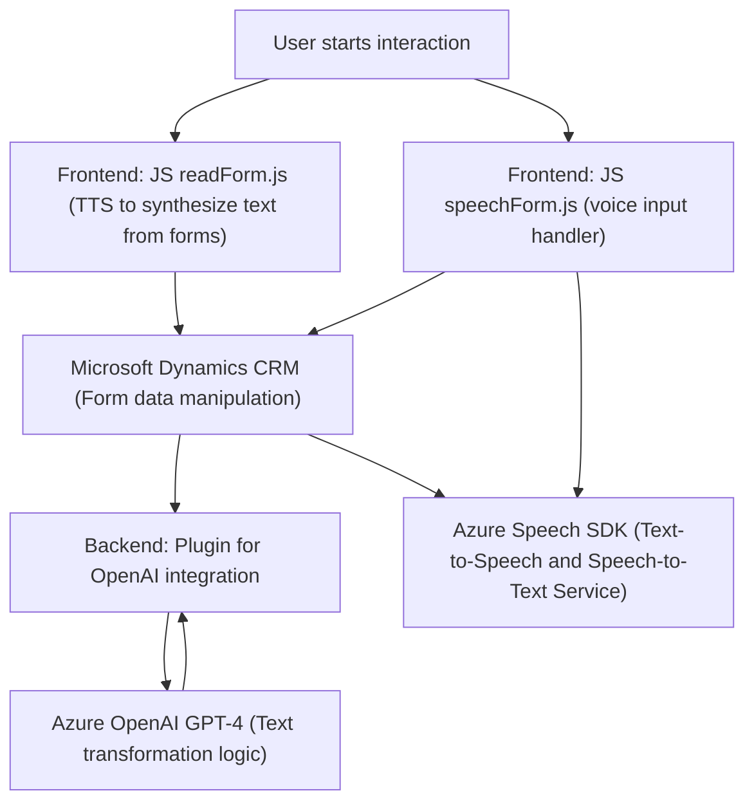

### Breve resumen técnico:
El repositorio contiene varios componentes para proporcionar funcionalidades relacionadas con el reconocimiento y síntesis de voz junto con integraciones avanzadas en Microsoft Dynamics CRM utilizando servicios de Azure. Los archivos trabajan en conjunto para ofrecer capacidades de interacción por voz y procesamiento inteligente de datos con Azure Speech SDK y OpenAI.

---

### Descripción de arquitectura:
La solución sigue una **arquitectura híbrida centrada en servicios cloud y lógica cliente-servidor**. Sus componentes incluyen:
1. **Frontend dinámico**: Implementado en JavaScript para interactuar con formularios en Dynamics CRM. Utiliza el navegador para cargar SDKs de reconocimiento/síntesis de voz (Azure Speech SDK) y ejecutar la lógica de negocio conectada al CRM.
2. **Backend extensible**: Un complemento (`Plugin`) específico en C# que expone integración directa con Azure OpenAI para aplicar reglas de transformación de texto. El plugin sigue el patrón `Plugin Pattern` utilizado para Dynamics CRM.
3. **Arquitectura Cloud/SaaS**: Integra servicios de Azure TTS (Text-to-Speech) y OpenAI para disposición de capacidades avanzadas en la nube, realizando procesamiento fuera de la infraestructura local del CRM.

En términos de diseño:
- **Front-End:** Modular, basado en eventos y servicios.
- **Back-End:** Extendido mediante `Plugin` y dependiente de servicios de integración SaaS.
- **Flujo de información**: Cliente envía datos a servicios externos, recibe respuestas procesadas y actúa sobre formularios del CRM.

---

### Tecnologías, frameworks y patrones relevantes:
1. **Tecnologías usadas:**
   - Frontend:
     - JavaScript (vanilla JS).
     - Azure Speech SDK (cargado dinámicamente).
     - Dynamics 365 CRM APIs (`executionContext` y `Xrm.WebApi`).
   - Backend:
     - C#, `Microsoft.Xrm.Sdk` (para integraciones en el ecosistema CRM).
     - Azure OpenAI GPT-4 (transformación avanzada de texto a JSON).
     - Newtonsoft.JSON para manejo de datos.

2. **Frameworks y patrones utilizados:**
   - **Plugin Pattern** (en `TransformTextWithAzureAI.cs`) para extensibilidad en Dynamics CRM.
   - **Proxies para servicios de terceros** (Azure Speech SDK y OpenAI API) para delegar funcionalidades como síntesis y procesamiento de voz.
   - **Modularización**: Separación por funciones en JavaScript y C# para facilitar reusabilidad y mantenimiento.
   - **Carga dinámica de dependencias** en el frontend (patrón de comprobación y carga del SDK de Azure).
   - **Cloud/SaaS Integration Pattern**: La solución depende fuertemente de Azure Speech y OpenAI para ejecutar lógica avanzada.

---

### Dependencias y componentes externos:
- **Azure Speech SDK**: Para reconocimiento y síntesis de voz.
- **Azure OpenAI GPT-4**: Para capacidades de inteligencia artificial en la transformación de texto estructurado.
- **Dynamics CRM APIs**: Para interactuar con formularios y objetos del sistema.
- **Newtonsoft.Json**: Para manejo de datos JSON en plugins.
- **System.Net.Http**: Para enviar solicitudes HTTP hacia Azure OpenAI.

---

### Diagrama Mermaid:

---

### Conclusión final:
Esta solución implementa funcionalidad de voz y procesamiento avanzada dentro de un ecosistema conectado a Dynamics CRM mediante servicios en la nube (Azure Speech SDK, OpenAI). Está organizada tanto para interactuar con usuarios en el frontend como para realizar transformaciones complejas en el backend, siguiendo principios de modularidad y SaaS integration. Su arquitectura híbrida permite escalabilidad, extensibilidad y aprovechamiento de tecnologías avanzadas en procesamiento de voz e inteligencia artificial.