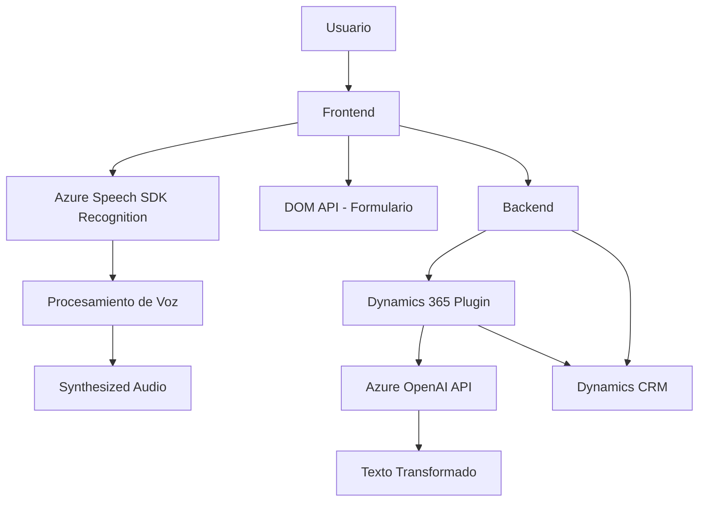

### Breve resumen técnico
Estos archivos representan una solución especializada para integrar funcionalidades avanzadas de procesamiento y síntesis de voz en **Dynamics 365 CRM**, utilizando servicios externos como **Azure Speech SDK** y **Azure OpenAI API**. La solución se enfoca en mejorar la interacción de los usuarios con formularios del CRM proporcionando entrada y salida por voz, enriquecimiento de texto mediante IA, y automatización de ciertas tareas basadas en reconocimiento de voz.

---

### Descripción de arquitectura
La arquitectura está basada en una combinación de **n-capas**, donde los archivos relacionados al **frontend** maneja la interacción de los usuarios mediante el navegador (Azure Speech SDK) y los archivos del **backend** extienden y procesan datos desde el ambiente Dynamics CRM (mediante plugins escritos en C#). Esta solución también combina elementos de **service-oriented architecture (SOA)**, donde los servicios externos (Speech SDK y OpenAI API) actúan como subsistemas especializados integrados en el flujo principal de la aplicación.

---

### Tecnologías usadas
1. **Frontend**:
   - **JavaScript**: Lenguaje base para la integración con Azure Speech SDK.
   - **Azure Speech SDK**: Provee capacidades de síntesis y reconocimiento de voz.
   - **DOM API**: Manipulación de elementos del formulario en tiempo real.
   - **Browser APIs**: Para cargar dinámicamente recursos como el SDK.

2. **Backend**:
   - **C# (.NET Framework)**: Utilizado para la implementación de plugins en Dynamics CRM.
   - **Microsoft.Xrm.Sdk**: SDK para interactuar con el modelo y servicios de Dynamics CRM.
   - **Azure OpenAI API**: Transformación de texto mediante inteligencia artificial.
   - **Newtonsoft.Json & System.Text.Json**: Manejo de objetos JSON para interoperabilidad con servicios externos.
   - **HttpClient**: Para realizar solicitudes HTTP al endpoint de Azure OpenAI.

3. **Servicios de nube**:
   - **Azure Speech SDK**: Componentes en frontend para procesar voz y sintetizar audio.
   - **Azure OpenAI API**: Procesamiento IA de texto en el plugin del servidor.

---

### Diagrama Mermaid válido para GitHub

---

### Conclusión final
Esta solución representa una arquitectura híbrida (n-capas y SOA) adecuada para entornos corporativos que integran CRM (Dynamics 365) con tecnologías modernas de procesamiento de voz y texto mediante servicios como **Azure Speech SDK** y **Azure OpenAI API**. La modularidad en la implementación favorece la separación de responsabilidades, mientras que el acoplamiento firme con Dynamics 365 implica que sería necesario realizar adaptaciones complejas si se quisiera portar esta funcionalidad a plataformas externas. En general, el diseño es funcional y eficiente para entornos que requieran interacción avanzada basada en voz e inteligencia artificial.