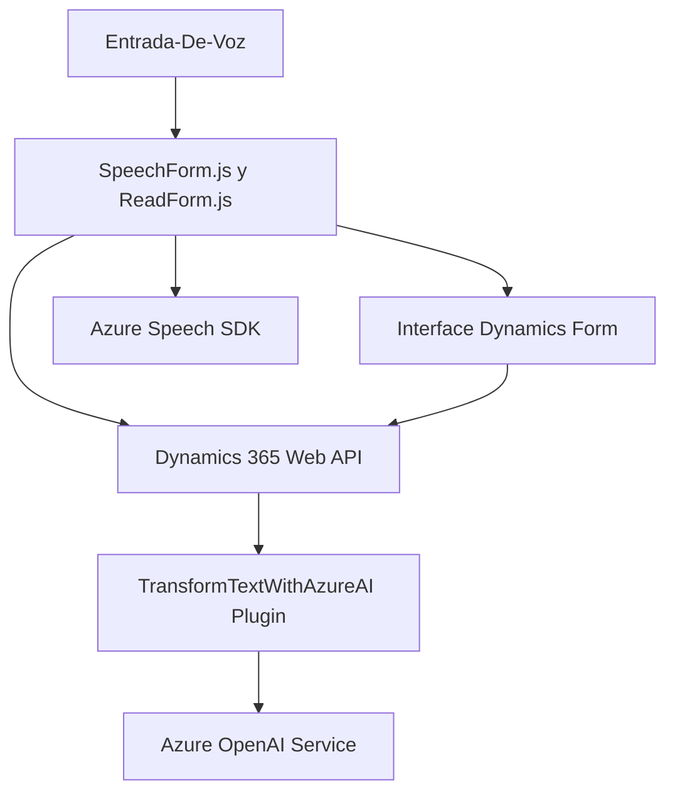

## Resumen técnico
Este repositorio combina tres componentes principales que interactúan entre sí para ofrecer funcionalidad avanzada en la transformación y procesamiento de datos de formularios mediante reconocimiento de voz, síntesis de texto a voz, y uso de inteligencia artificial. Es una solución que opera como parte de una integración más amplia (Dynamics CRM + Azure Cloud).

---

## Descripción de arquitectura
La arquitectura implementada combina los siguientes enfoques:
1. **N-capas**:
   - Se separan las responsabilidades en diferentes contextos: frontend (interfaz de usuario), backend (acciones en formularios y plugins) y servicios externos (Azure Speech SDK y Azure OpenAI).
2. **Servicios externos conectados**:
   - Integración de servicios cloud (Azure Speech SDK y APIs personalizadas de Dynamics CRM) permite realizar operaciones como reconocimiento de voz, síntesis de texto y transformación textual con IA.
3. **Orientada a eventos y modular**:
   - El repositorio implementa funciones modulares y callbacks. Esto facilita el adaptador entre interacción directa del usuario (voz/texto) y componentes dinámicos (formularios).

---

## Tecnologías usadas
1. **Frontend**:
   - JavaScript (para leer formularios y uso del Speech SDK).
   - Azure Speech SDK, CDN externo.
   - Dynamics CRM: Interacción con formularios a través de `executionContext`.
2. **Backend**:
   - Plugins de Dynamics CRM en C# (.NET Framework).
   - HTTP Client para integrarse con Azure OpenAI.
3. **Servicios externos**:
   - Microsoft Azure OpenAI: Procesamiento de IA.
   - Microsoft Azure Speech SDK: Traducción de voz a texto y viceversa.
4. **Patrones**:
   - Adapter Pattern (traducción entre voz/texto y datos del formulario).
   - Modularización: Lógica definida por componentes autónomos.
   - Event-Driven (uso de callbacks para SDK y APIs).

---

## Diagrama Mermaid

---

## Conclusión final
El repositorio está diseñado para integrarse con un sistema CRM (Dynamics 365) utilizando tecnologías avanzadas de Microsoft Azure (Speech SDK y OpenAI). La arquitectura presenta modularidad clara, patrones de integración y orientación hacia servicio en la nube. El enfoque facilita la creación de una solución moderna y escalable que puede mejorar la experiencia del usuario mediante interacción por voz y procesamiento con IA. Sin embargo, esta solución depende significativamente de servicios externos, lo que la hace ideal para despliegues en nubes de Microsoft.