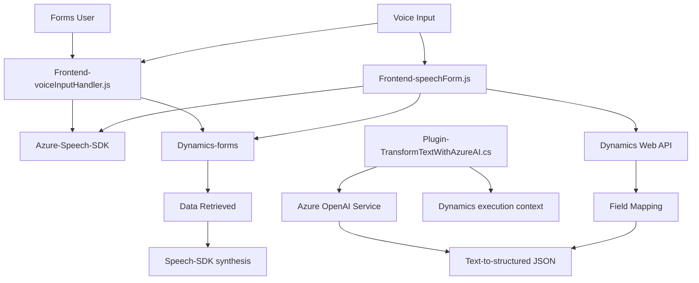

## Resumen técnico

Este repositorio contiene múltiples archivos de tres áreas principales: un frontend de entrada/salida de voz utilizando el SDK de **Azure Speech**, un módulo de procesamiento por voz para formularios en Dynamics CRM, y un plugin en C# para transformar texto con la API de **Azure OpenAI** en el entorno de Dynamics CRM. La solución se orienta a extender la funcionalidad de formularios en Dynamics CRM mediante interacción por voz y transformación de texto con inteligencia artificial.

---

## Descripción de arquitectura

La solución presenta características de una arquitectura **híbrida**:
1. **Frontend modular**: Manejo de JavaScript separado por responsabilidades. Utiliza una arquitectura basada en capas con integración de servicios externos (Azure Speech SDK) para lectura y entrada por voz en formularios HTML dentro de Dynamics CRM.
2. **Plugin en Dynamics CRM**: Implementa una arquitectura de **Componentes Funcionales** específicas para transformar texto vía IA, utilizando el patrón de plugin propio de Dynamics CRM.
3. **Patrón distribuido**: El sistema combina frontend, servicios externos (Azure Speech SDK y Azure OpenAI), y lógica empresarial dentro del entorno CRM (Dynamics).

---

## Tecnologías usadas

1. **Frontend**:
   - **JavaScript**: Base para la implementación de lógica de entrada/salida de voz.
   - **Azure Speech SDK**: Transformación de voz a texto y síntesis de audio.
   
2. **CRM Lógica Empresarial**:
   - **Microsoft Dynamics/Sdk**: Para implementar plugins dentro del CRM.
   - **C#**: Diseño de plugins que se integran al API interna de Dynamics.
   - **Azure OpenAI API**: Transformación de texto bajo reglas personalizadas usando IA.

3. **Dependencias generales**:
   - **HttpClient**: Interacción con APIs externas (Azure Speech y OpenAI).
   - **Newtonsoft.Json**: Deserialización de datos JSON dentro del plugin C#.

---

## Diagrama Mermaid compatible con GitHub Markdown

---

## Conclusión final

La solución está diseñada con un enfoque modular y distribuido, integrando:
- **Frontend**: Para entrada/salida de datos por voz interactuando con un SDK de Azure.
- **Backend en Dynamics CRM**: Plugins para transformación de datos y ejecución lógica avanzada con servicios AI.
- **Servicios externos**: Azure Speech SDK para manejo de voz y Azure OpenAI para interpretación avanzada de texto.

### Ventajas:
- **Escalabilidad**: Uso de Azure Speech/OpenAI permite aumentar capacidades fácilmente.
- **Modularidad**: Código bien segmentado en funciones, clases y plugins.

### Áreas de mejora:
- **Gestión de errores**: Mejorar robustez del manejo de excepciones en comunicación con servicios externos.
- **Optimización de rendimiento**: Minimizar dependencias o mejorar la caché, sobre todo en la carga del SDK de Azure.