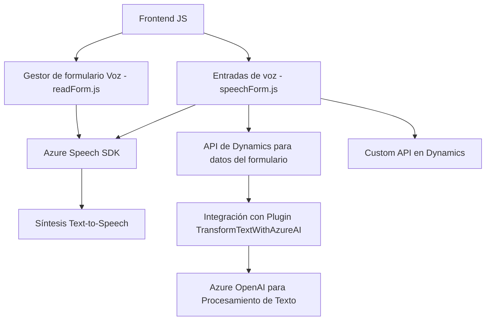

### Breve resumen técnico:
Los archivos analizados forman parte de una solución que combina un **frontend basado en JavaScript** para interacción de usuarios con formularios y un **backend basado en un plugin C#** para extender funcionalidad en Dynamics CRM. La solución integra servicios en la nube, como **Azure Speech SDK** y **Azure OpenAI**, para habilitar capacidades de accesibilidad (texto a voz y voz a texto) y lógica avanzada de procesamiento (IA para transformar texto).

---

### Descripción de arquitectura:
La solución implementa un modelo híbrido basado en:
1. **Frontend basado en formularios:** 
   - El frontend maneja la lógica de entradas y salidas de voz, además de actualizar los campos de los formularios de Dynamics CRM. Utiliza un diseño modular con funciones específicas para cargar la SDK, sintetizar texto en voz y procesar transcripciones.
   - Modela una arquitectura **n-capas** en el frontend donde cada capa cumple un propósito específico (UI, lógica y servicios).
   
2. **Backend mediante plugin:** 
   - Se integra directamente en Dynamics CRM mediante plugins en C#. Estos plugins operan como servicios bajo el patrón **SOA (Service-Oriented Architecture)** y permiten la transformación de datos con IA.

---

### Tecnologías usadas:
1. **Frontend (JavaScript):**
   - **Frameworks utilizados:** Ninguno declarado explícitamente (JS puro).
   - **SDK externo:** Azure Speech SDK para texto a voz y reconocimiento de voz.
   - **API de Dynamics CRM (Xrm.WebApi):** Para consultar y actualizar datos de formularios.
   
2. **Backend (C# Plugin):**
   - **Microsoft Dynamics SDK:** Integración mediante `Microsoft.Xrm.Sdk`.
   - **Azure OpenAI API:** Servicio de IA para transformar texto.
   - Librerías auxiliares:
     - `System.Text.Json` para procesar JSON.
     - `Newtonsoft.Json` para estructuras dinámicas.

3. **Servicios en la nube:**
   - **Azure Speech SDK**
   - **Azure OpenAI (GPT-4/3)**

---

### Diagrama **Mermaid**:

### Conclusión final:
La solución descrita consiste en una integración profunda entre Dynamics CRM, servicios en la nube proporcionados por Azure, y un frontend ligero para formularios dinamizados mediante JavaScript. La arquitectura combina **n-capas** en el frontend y patrones de extensibilidad como **plugins** en el backend. Su capacidad para transformar texto y sintetizar voz mejora la accesibilidad y personalización de plataformas CRM, alineándose con tendencias modernas de integraciones tecnológicas.