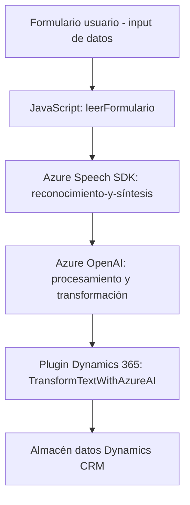

### Resumen técnico

El repositorio muestra una integración entre funcionalidades avanzadas en el frontend, como reconocimiento de voz y síntesis de texto, con un backend basado en Dynamics CRM. Las tecnologías utilizadas incluyen Azure Speech SDK para voz y OpenAI para procesamiento de lenguaje, integradas en una arquitectura modular y orientada a servicios.

---

### Descripción de arquitectura

1. **Tipo de solución:**
   - Es una solución **híbrida** que abarca tanto frontend (procesamiento de formularios mediante JavaScript) como backend (procesamiento de texto mediante plugins en Dynamics CRM).

2. **Arquitectura:**
   - La arquitectura utiliza un modelo **de n capas**:
     - **Frontend**: JavaScript asociado a formularios en Dynamics CRM.
     - **Backend**: Plugins integrados en Dynamics CRM que interactúan con servicios externos como Azure OpenAI.
   - Además, tiene elementos de **hexagonal**:
     - Comunicación con servicios externos (Azure Speech SDK y OpenAI) centralizados mediante API.
   - Elementos de **microservicio** presentes en la interacción con Azure Speech/OpenAI, ejecutando servicios especializados.

3. **Patrones utilizados**:
   - **Encapsulación modular** para cada funcionalidad (frontend y backend).
   - **Facade** en las integraciones de Azure Speech SDK.
   - **Plugin architecture** para el backend Dynamics CRM.
   - **Carga dinámica de dependencias** en el frontend con el Speech SDK.
   - **Service-oriented design** para interactuar con API externas como Speech SDK y OpenAI.

---

### Tecnologías usadas

1. **Frontend**:
   - JavaScript como lenguaje principal.
   - Azure Speech SDK para síntesis y reconocimiento de voz.
   - Interacciones DOM para manejo de formularios.
   - Dinámicas de filtrado y procesamiento de datos de formularios.

2. **Backend**:
   - Dynamics CRM:
     - SDK de Microsoft Dynamics para manipulación de entidades y eventos de plugins.
   - Azure OpenAI para procesamiento y transformación de texto.
   - Librerías internas como `Newtonsoft.Json` y `System.Net.Http`.
   - Lógica para reglas de negocio implementada como plugins en Dynamics CRM.

---

### Dependencias externas o componentes presentes

1. **Frontend:**
   - Azure Speech SDK (JavaScript).
   - Contextos del formulario (`executionContext`) del modelo Dynamics CRM.

2. **Backend:**
   - Dynamics CRM SDK, incluyendo servicios (`IOrganizationService`, `IPluginExecutionContext`).
   - Azure OpenAI para procesamiento de texto.
   - Dependencias de HTTP (`System.Net.Http`) y JSON (`Newtonsoft.Json`).

---

### Diagrama Mermaid

---

### Conclusión final

La solución constituye un sistema modular y extensible diseñado para integrar capacidades avanzadas de procesamiento de voz y texto en Dynamics CRM. El frontend se basa en una comunicación moderna (SDK dinámica) para reconocer voz y manejar formularios, mientras que el backend aprovecha Azure OpenAI y un patrón de plugins. La arquitectura predominante de n capas asegura separación de responsabilidades, mientras que los elementos hexagonales garantizan adaptabilidad y acoplamiento bajo entre los componentes.