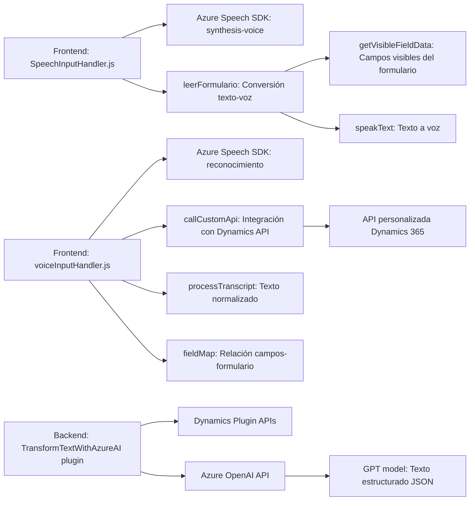

---

### Breve resumen técnico
El repositorio implementa un conjunto de soluciones descentralizadas que integran funcionalidades avanzadas como síntesis y reconocimiento de voz mediante **Azure Speech SDK**, junto con conversión de texto mediante **Azure OpenAI API**, en el contexto de formularios web y plugins de Dynamics CRM. Se apoya en arquitectura **n capas** para la interacción entre diferentes módulos y servicios externos.

---

### Descripción de arquitectura
La arquitectura principal es una solución orientada a capas con integración de componentes de acceso a APIs externas y procesamiento en formularios dinámicos. Los archivos corresponden a:
1. **Frontend**: Formularios web que interactúan con usuarios mediante comandos de voz y accesibilidad mejorada.
2. **Backend Dynamics CRM**: Plugins personalizados para extender funcionalidades del CRM con procesamiento de texto basado en AI.

#### Características arquitectónicas destacadas:
1. **Modo orientado a servicios (service-based architecture)**:
   - Elementos del frontend invocan servicios externos como Azure Speech y APIs personalizadas.
   
2. **Integración modular**:
   - Plugins en Dynamics CRM se comunican con Azure AI mediante HTTP para enviar/recibir datos estructurados.
   
3. **Capas por dominio**:
   - Separación lógica de responsabilidades entre el frontend (interacción usuario) y backend (procesamiento de texto).

4. **Patrones de diseño**:
   - **Facade pattern**: Uso de métodos simplificados (`startVoiceInput`) para ocultar complejidad técnica.
   - **Event-driven programming**: Arquitectura basada en eventos iniciados por el usuario en el frontend.
   - **Plugin-based architecture**: Extensiones específicas de Dynamics CRM.

---

### Tecnologías usadas
1. **Frontend**:
   - **JavaScript**: Lenguaje base para lógica de los formularios web.
   - **Azure Speech SDK**: Manejo de síntesis y reconocimiento de voz.
   - **DOM API**: Manipulación de elementos del formulario.

2. **Backend (Dynamics CRM)**:
   - **Microsoft.Xrm.Sdk**: Comunicación con la capa de datos y servicios de Dynamics CRM.
   - **Azure OpenAI API (GPT)**: Procesamiento de texto usando AI.
   - **REST API**: Colaboración del backend con servicios externos.
   - **C#**: Lenguaje empleado en la lógica del plugin.

---

### Diagrama **Mermaid** válido para GitHub

---

### Conclusión final
Este repositorio representa una solución con capacidades avanzadas de interacción por voz y procesamiento basado en AI, con fuerte orientación a mejorar la accesibilidad y automatización. La arquitectura **n capas**, que separa claramente el frontend, la lógica del negocio y el backend en Dynamics CRM, garantiza un diseño extensible y mantenible. Las dependencias externas (Azure Speech SDK, OpenAI API) son fundamentales para sus capacidades.

La implementación enfatiza la modularidad y el uso de patrones como **Facade**, event-driven, y **Plugin-Based Architecture**, lo que muestra un diseño bien estructurado orientado a la escalabilidad y reutilización tecnológica.