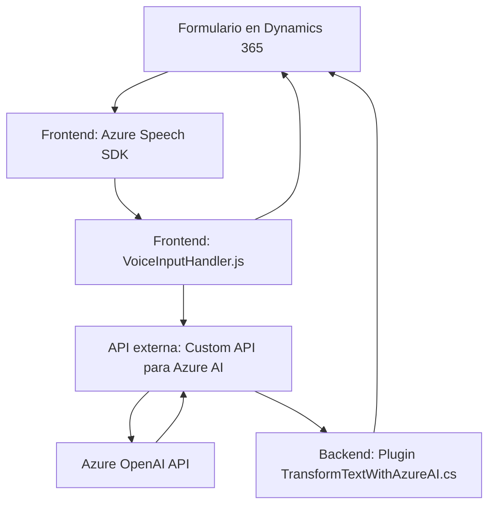

### Breve resumen técnico
El repositorio parece estar relacionado con un solución de software que utiliza procesamiento de voz y tecnología de inteligencia artificial para interactuar dinámicamente con formularios en una aplicación basada en Dynamics 365. Existen múltiples archivos detallando la integración entre un sistema frontend (JavaScript), servicios externos (Azure Speech SDK y OpenAI API), y un plugin de servidor para Dynamics 365.

### Descripción de arquitectura
La solución implementa una **arquitectura en capas** con los siguientes componentes principales:
1. **Frontend (JavaScript)**: Gestión de interacción con la interfaz de usuario (formularios).
    - Procesamiento de campos visibles.
    - Reconocimiento de voz y síntesis de texto a audio.
    - Llamadas a APIs externas para procesamiento avanzado (Azure OpenAI).
    - Implementación del patrón *adapter* para mapear campos del formulario y valores reconocidos por voz.
2. **API personalizada (con OpenAI)**: Procesa texto hablado y lo transforma en estructura JSON basada en normas.
3. **Plugin Backend (Dynamics CRM)**: Enfocado en el procesamiento del texto y generación de datos consumibles para los formularios o sistemas relacionados.

### Tecnologías utilizadas
- **Frontend**:
  - **Azure Speech SDK (JavaScript)**: Procesa reconocimiento de voz y síntesis de texto a voz.
  - **JavaScript**: Para manipulación de formularios y definición de lógica funcional.
  - **Dynamics 365 Web API (`Xrm.WebApi.online.execute()`)**: Interacción asíncrona con entidades del CRM.

- **Backend (Plugin en C#)**:
  - **Microsoft.Xrm.Sdk**: Para conectarse al contexto y servicios de Dynamics CRM.
  - **Azure OpenAI API**: Para realizar transformación de texto en JSON.
  - **System.Net.Http**: Solicitudes HTTP al servicio externo.
  - **Json libraries (Newtonsoft.Json.Linq y System.Text.Json)**: Para procesar y generar estructuras JSON.

### Diagrama Mermaid
A continuación, se presenta el diagrama de flujo utilizando [Mermaid](https://mermaid-js.github.io/mermaid/):

### Conclusión final
La solución presente es un sistema compuesto que combina elementos frontend y backend para gestionar y procesar datos en formularios usando reconocimiento de voz e inteligencia artificial. Utiliza una arquitectura **en capas**, con un frontend dinámico (JavaScript), una API externa personalizada para procesamiento de texto (Azure AI), y un plugin integrador en el backend de Dynamics 365.

Si bien la solución está diseñada para manejar formularios de manera auditiva (sintetizar texto y reconocimiento de voz) y estructurada (a través de transformación de texto preprocesado), aún podría mejorarse en áreas como control de errores en servicios externos y gestión dinámica de configuraciones.