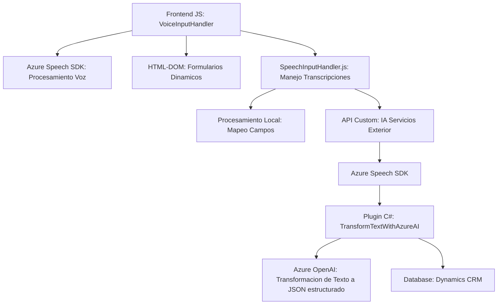

### Breve resumen técnico

El repositorio contiene tres componentes principales:
1. **`VoiceInputHandler.js`**: Permite la entrada/salida de voz mediante **Azure Speech SDK**, extrayendo y sintetizando datos del formulario visible.
2. **`SpeechInputHandler.js`**: Realiza el reconocimiento de voz, procesando transcripciones con lógica local o mediante APIs de backend con inteligencia artificial (IA). 
3. **`TransformTextWithAzureAI.cs`**: Un plugin de Dynamics CRM que utiliza **Azure OpenAI** para recibir y procesar datos textuales, transformarlos según reglas preestablecidas y devolver un JSON estructurado.

Desde un punto de vista general, estos componentes trabajan bajo un enfoque basado en front-end (JavaScript) para interacción en tiempo real y back-end (C#) como un servicio plugin en Dynamics CRM conectado a Azure.

---

### Descripción de arquitectura

La solución muestra características de una **arquitectura basada en un monolito** que combina dos capas:
- **Frontend**: Implementado en JavaScript, interactúa con formularios en la interfaz de Dynamics CRM y conecta con servicios externos como Azure Speech SDK mediante integración directa.
- **Backend**: Definido en forma de un plugin C# que interactúa directamente con la base de datos del sistema CRM, utilizando el modelo clásico de desarrollo de Microsoft Dynamics Plugins.

Aunque se integran servicios remotos (Azure OpenAI y Speech SDK), el núcleo del sistema sigue siendo el monolítico, porque todo el procesamiento se canaliza directamente desde el CRM sin segmentación modular.

---

### Tecnologías usadas

1. **Front-end**:
   - **JavaScript**: Lenguaje principal para manejar la lógica de entrada y salida desde el navegador.
   - **Azure Speech SDK**: Procesamiento de voz (synthesis y recognition) mediante servicios de Azure.
   - **HTML APIs del navegador**: Interacción con el DOM para cargar scripts y manejar datos dinámicamente.
   - **Asincronía (promesas, callbacks)**: Procesamiento en tiempo real con eventos condicionales.

2. **Backend**:
   - **C#**: Lenguaje de programación utilizado en el plugin.
   - **Microsoft Dynamics CRM SDK**: Framework para extender capacidades del sistema CRM.
   - **Azure OpenAI**: Servicio externo para procesamiento de texto avanzado con IA.
   - **HTTP Requests (System.Net.Http)**: Solicitudes REST para interactuar con Azure OpenAI.

3. **Patrones arquitectónicos**:
   - Modularización y separación lógica en funciones.
   - Uso de servicios externos para delegar tareas.
   - Adaptadores en funciones como `ensureSpeechSDKLoaded` y `callCustomApi`.

---

### Diagrama Mermaid válido para GitHub

---

### Conclusión final

Esta solución está diseñada para habilitar una funcionalidad de entrada y salida de voz integrada con un ecosistema CRM (Dynamics), que utiliza servicios avanzados como **Azure Speech SDK** y **Azure OpenAI**. Las principales ventajas del diseño radican en la integración ágil entre el frontend (procesamiento en tiempo real de datos de formularios) y el backend plugin (procesamiento avanzado mediante IA). Sin embargo, utiliza una arquitectura monolítica, lo que podría limitar su escalabilidad en términos de crecimiento y soporte para servicios adicionales en el futuro. Para una mejora futura, se podría considerar migrar hacia una arquitectura más modular como microservicios.