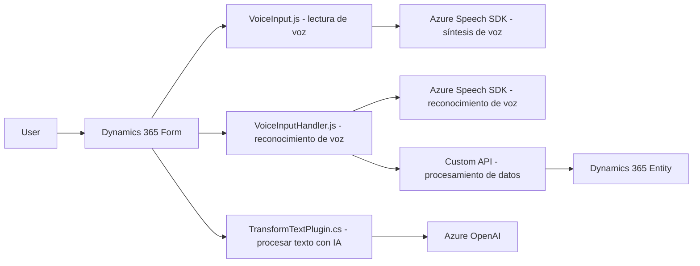

### Breve resumen técnico

El repositorio contiene un conjunto de archivos organizados en diferentes capas que interactúan con servicios cloud, un frontend basado en JavaScript y plugins para Dynamics CRM. Las principales funcionalidades giran en torno a integración con **Azure Speech SDK**, procesamiento avanzado con APIs de IA, y manipulación dinámica de formularios en aplicaciones empresariales.

---

### Descripción de arquitectura

La arquitectura parece ser **orientada a servicios (SOA)** con componentes distribuidos que interactúan con APIs externas como Azure Speech SDK y Azure OpenAI Service. Si bien de forma interna parece estar organizada en capas lógicas con una separación entre presentación (frontend), servicios de procesamiento (como plugins y APIs externas), y almacenamiento/interacción con Dynamics CRM, no se llega a implementar completamente una arquitectura hexagonal o algo más moderno.

Algunos patrones aplicados incluyen:
- **Pluggable Architecture** (para plugins CRM).
- **Modularización basada en funciones** en el frontend.
- **Builder Pattern** para construcción de solicitudes HTTP hacia servicios de IA.
- **Repository Pattern** visto en el manejo dinámico de atributos/entidades en Dynamics.
  
---

### Tecnologías usadas

1. **Frontend**:
   - **JavaScript** (lógica para interacción con formularios y servicios externos).
   - **Dynamics 365**: El entorno donde el software se ejecuta.
   - **Azure Speech SDK**: Para síntesis de voz, reconocimiento de voz y generación dinámica de audio.
   - **HTTP Requests**: Para establecer comunicación entre el frontend y servicios remotos.

2. **Plugin Backend**:
   - **Microsoft Dynamics CRM SDK**: Para expandir funcionalidades del sistema de CRM.
   - **Azure OpenAI Service**: Para transformación de texto usando modelos IA.
   - **Newtonsoft.Json** y **System.Text.Json**: Librerías para manejar datos en formato JSON.

3. **Arquitectura SOA**:
   - Todos los componentes interactúan con APIs externas o contextos delimitados, desacoplados del core funcional, pero se mantienen dependientes de un entorno centralizado (Dynamics).

---

### Diagrama **Mermaid**

---

### Conclusión final

El repositorio implementa una solución orientada al cliente con enfoque en mejorar la accesibilidad y funcionalidad de los formularios dentro de Dynamics 365 usando tecnologías modernas. Su arquitectura es modular, desacoplada por archivos con cada funcionalidad específica, y orientada a los servicios cloud (SOA), aunque depende de un sistema centralizado (Dynamics+Azure). Esta estructura es óptima para entornos empresariales, pero podría beneficiarse de mejoras como la abstracción de claves de API mediante soluciones de configuración segura.