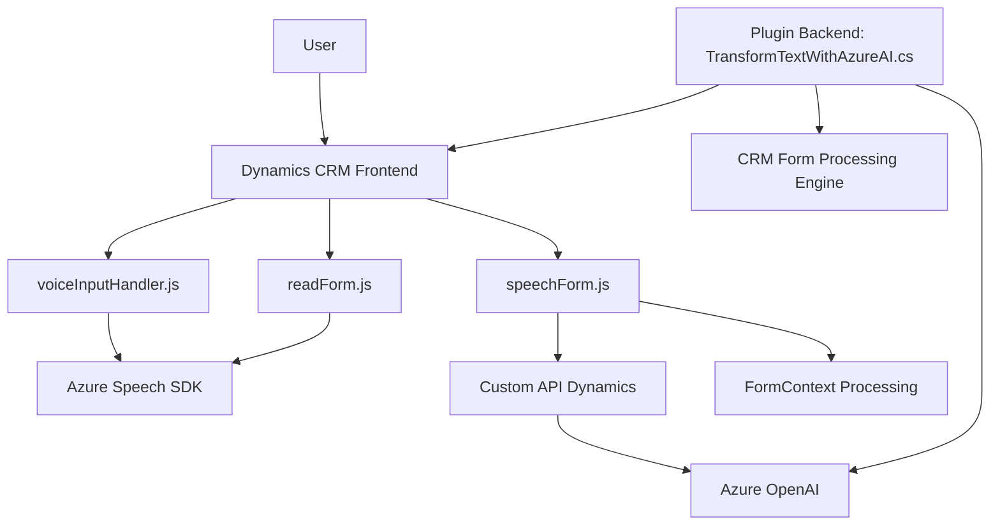

### Breve Resumen Técnico

El repositorio contiene tres archivos principales que implementan soluciones integradas para un sistema Dynamics CRM con integración de API externas. Los archivos corresponden a la gestión de voz y texto mediante Azure Speech SDK y Azure OpenAI. El primer archivo (`readForm.js`) permite leer y sintetizar el contenido visible de formularios dinámicos, mientras que el segundo (`speechForm.js`) permite transcribir voz en texto y aplicar lógica al contenido del formulario dinámico. Finalmente, el tercero (`TransformTextWithAzureAI.cs`) configura un plugin de Dynamics CRM para la transformación de texto siguiendo reglas predefinidas, utilizando Azure OpenAI.

---

### Descripción de Arquitectura

La arquitectura global de la solución está orientada a **modularidad** y **integración de servicios externos**:
1. **Frontend/JS Layers**: Implementan funcionalidades específicas para interactuar directamente con formularios CRM y servicios externos como el Azure Speech SDK y APIs personalizadas.
2. **Backend/Plugin Layer**: Utiliza el patrón **Plugin** para extender las capacidades del CRM, interactuando con el servicio Azure OpenAI.
3. **Service-Oriented Architecture (SOA)**: El uso de APIs externas (Azure Speech y OpenAI) evidencia una arquitectura basada en servicios desacoplados.
4. **N-Capas**: Combina n-capas (frontend y backend) pero aprovecha **principios de desacoplamiento** en la interacción entre módulos mediante servicios de terceros.

---

### Tecnologías Usadas
- **Frontend**:
  - **JavaScript**: Lenguaje base para las extensiones de Dynamics CRM.
  - **Azure Speech SDK**: Para síntesis y reconocimiento de voz.
  - **Dynamics CRM Context (`Xrm.WebApi`)**.
  - Modularización para separación lógica de funciones.

- **Backend**:
  - **C#**: Lenguaje para desarrollo del plugin.
  - **Dynamics CRM SDK (`IServiceProvider`, `IOrganizationService`)**: Para interactuar con el contexto de ejecución y datos del CRM.
  - **Azure OpenAI**: Para transformación de texto mediante una API externa.
  - **REST API Calls**: Configuración para gestionar solicitudes HTTP externas.

- **Otros frameworks/paquetes**:
  - `Newtonsoft.Json` (Manipulación de JSON).
  - `.NET Core System Libraries` (Expresiones, HTTP, JSON, etc.).

---

### Diagrama Mermaid

---

### Conclusión Final

La solución está diseñada para aplicaciones empresariales sobre Dynamics CRM, con integración de capacidades avanzadas de voz y procesamiento del lenguaje natural. Utiliza una arquitectura híbrida que combina **modularidad en frontend** con **SOA en backend** mediante servicios externos como Azure Speech SDK y Azure OpenAI. El repositorio muestra una implementación bien estructurada, con separación de responsabilidades y soporte para expandir funcionalidades basadas en APIs externas.