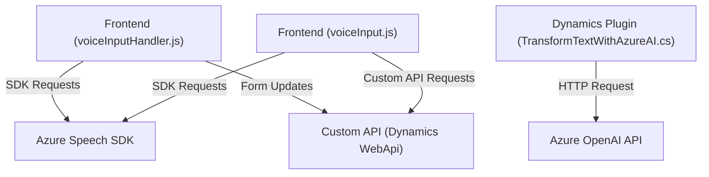

### Breve resumen técnico

El repositorio contiene una solución orientada a realizar procesamiento de texto y voz integrando Microsoft Dynamics CRM, Azure Speech SDK y Azure OpenAI. Se enfoca en enriquecer formularios (frontend) y manipular datos usando inteligencia artificial y reconocimiento de voz. La implementación incluye archivos JavaScript para el frontend y un plugin en .NET para integraciones con Dynamics CRM.

---

### Descripción de arquitectura

La solución sigue los principios de arquitectura modular con integración de servicios externos. Los archivos JavaScript (`voiceInputHandler.js` y `voiceInput.js`) están orientados al frontend, ejecutando tareas como lectura, síntesis, transcripción de voz, y transformación de texto procesado con AI en formularios Dynamics CRM. El archivo `TransformTextWithAzureAI.cs` implementa un plugin diseñado para extender la funcionalidad de Dynamics CRM mediante un modelo de **event-driven architecture**. Los puntos clave son:

- **Frontend modular**: Los archivos JavaScript se dividen por tareas específicas, categorizadas en funcionalidades de entrada y salida de voz, mapeo dinámico del formulario y procesamiento de transcripciones.
- **Servicios externos**: Azure Speech SDK y Azure OpenAI conectados al frontend y al plugin, usando la arquitectura de **API Gateway**.
- **Backend acoplado**: El plugin de Dynamics CRM está basado en el modelo **n-capas**, con movimiento de datos entre capa de servicio (`IServiceProvider`) y capa externa (Azure OpenAI).

---

### Tecnologías usadas

1. **Frontend**:
   - **JavaScript**: Principal lenguaje para manipulación de datos y lógica del cliente.
   - **Azure Speech SDK**: Reconocimiento de voz y síntesis de texto.
   - **Microsoft Dynamics CRM (modelo de formularios)**.

2. **Backend**:
   - **C# .NET**: Desarrollo del plugin con Dynamics CRM SDK.
   - **Azure OpenAI Service**: Para transformar texto con reglas específicas.

3. **Dependencias externas y API**:
   - `HttpClient`: Comunicación HTTP con Azure OpenAI desde el plugin.
   - **Newtonsoft.Json** / `System.Text.Json`: Manejo de datos en formato JSON.

---

### Diagrama Mermaid

---

### Conclusión Final

La solución está diseñada como un **modular architecture** para gestionar la interacción con formularios de Dynamics CRM mediante la combinación de tecnologías de inteligencia artificial (Azure OpenAI) y API basadas en reconocimiento de voz (Azure Speech SDK). 

1. **Fortalezas**:
   - Modularidad y separación de responsabilidades en frontend y backend.
   - Uso de servicios de Azure para funciones específicas (voz, AI).
   - Adaptación a entornos Dynamics CRM mediante plugins.

2. **Debilidades**:
   - Configuraciones sensibles (API keys, endpoints) codificadas en el código.
   - Sin observabilidad completa en manejo de errores; podría beneficiarse de una estrategia más robusta (logs, métricas).

Esta solución es adecuada para entornos profesionales como sistemas de CRM donde la interacción entre humanos y tecnología es clave para el flujo de trabajo. Implementar medidas adicionales de seguridad y manejo de datos sensibles podría optimizar la arquitectura y prevenir riesgos.