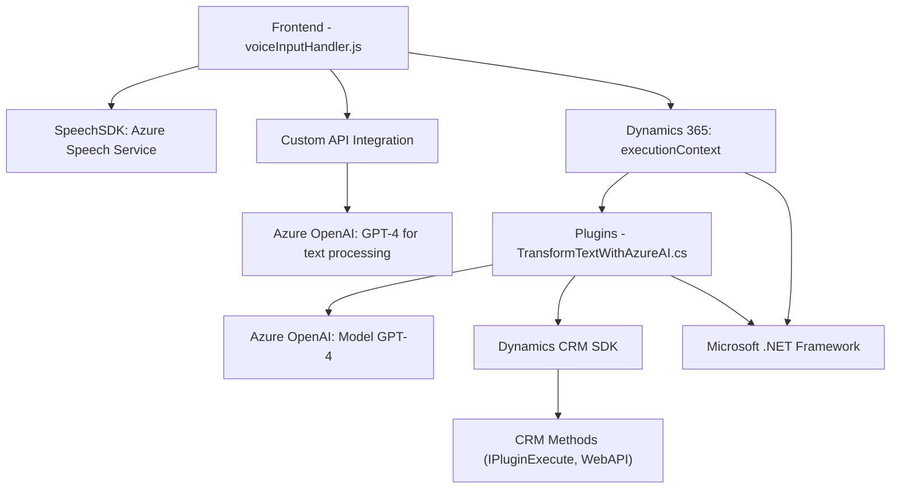

### Breve resumen técnico
El repositorio cuenta con una implementación para un **frontend** que interactúa con una plataforma Dynamics 365 y utiliza **Microsoft Azure Speech SDK**. Se incluye también un **plugin para Dynamics CRM** que utiliza **Azure OpenAI** (GPT-4) para transformar textos en JSON estructurado. Está diseñado para mejorar la experiencia de usuario al permitir entrada y salida de datos mediante reconocimiento de voz y síntesis avanzada.

---

### Descripción de arquitectura

La arquitectura del repositorio combina una aplicación de **n-capas** con una integración de **microservicios**:

1. **Frontend (JS):** Es una interfaz modular y rica en funcionalidad que utiliza un servicio externo (Azure Speech SDK) para procesamiento de voz. Actúa como cliente directo de Dynamics 365 y la API de Azure Speech.
2. **Plugins (C#):** Se crean extensiones para Dynamics 365. Estos son puntos de entrada que ejecutan lógica personalizada basada en eventos disparados en la plataforma y utilizan otro servicio externo (Azure OpenAI GPT-4) para agregar funciones avanzadas de IA.

Los patrones incluyen modularidad (funciones bien separadas por responsabilidad), integración con servicios en la nube (Speech SDK y Azure OpenAI) y arquitectura orientada al dominio (a través de Dynamics CRM plugins).

---

### Tecnologías usadas
1. **Frontend (JS):**
   - **Azure Speech SDK**: Para reconocimiento y síntesis de voz.
   - **Dynamics 365 JavaScript API**: Para interactuar con formularios en ejecución.
   - **Promises**: Uso de manejo asincrónico para operaciones como transcripción, búsqueda y actualizaciones de campos.

2. **Backend (Plugins en C#):**
   - **Azure OpenAI GPT-4**: Para procesamiento avanzado de texto.
   - **Dynamics CRM SDK**: Para extender la funcionalidad nativa.
   - **Newtonsoft.Json**: Para manejo de objetos y serialización JSON.
   - **.NET Core APIs**: Para soporte HTTP y procesamiento interno.

3. **Nube:** La solución depende de servicios alojados en **Microsoft Azure**, específicamente:
   - Azure Speech API.
   - Azure OpenAI.

---

### Diagrama Mermaid válido para GitHub

---

### Conclusión final

La solución presentada utiliza un **modelo de arquitectura híbrida**, donde combina un **frontend desacoplado** mediante un cliente rico en JavaScript (con integración de Azure Speech SDK y Dynamics) junto con un **componente backend tipo plugin** basado en C#. Esta solución está optimizada para integración con servicios en la nube, específicamente Microsoft Azure, y permite un flujo avanzado de procesamiento de información mediante **sistemas de inteligencia artificial** como GPT.

La elección de modularidad en la implementación y los usos de SDK, servicios externos y API personalizadas denotan que el diseño favorece la mantenibilidad y extensibilidad, a la vez que aprovecha la potencia de servicios avanzados.