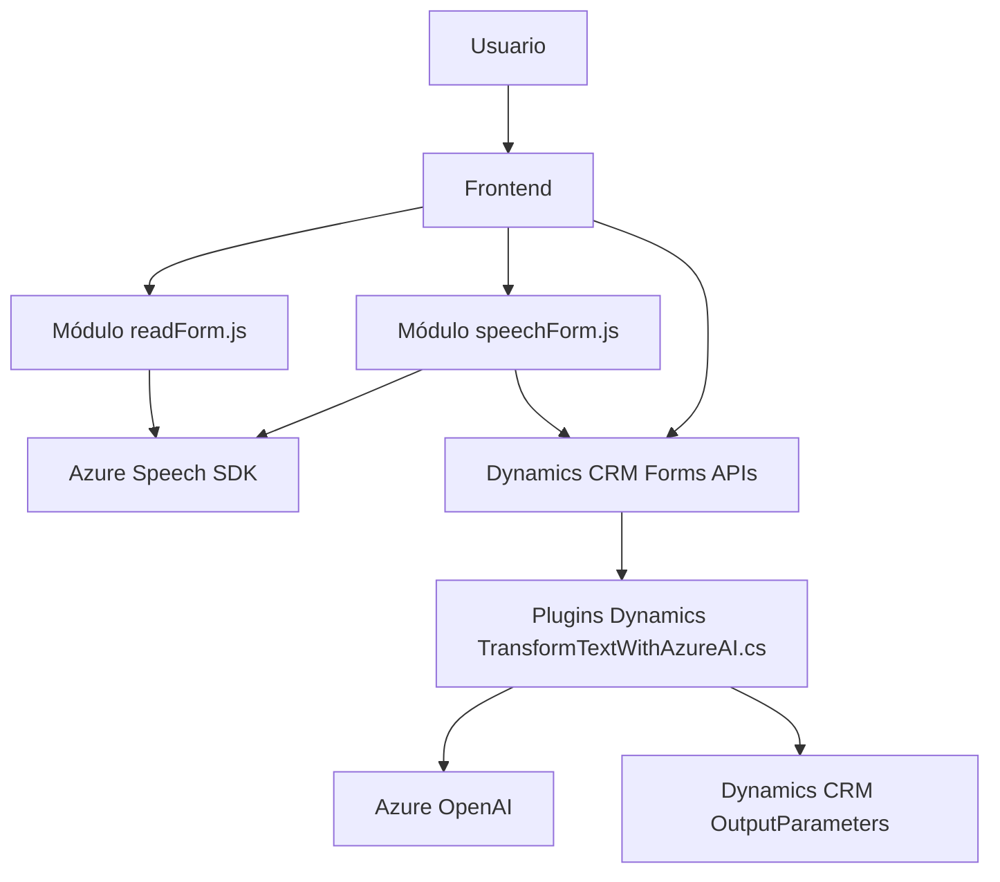

## Resumen técnico

El repositorio está enfocado en la integración entre un sistema de formularios Dynamics CRM, reconocimiento de voz y transformación de texto mediante IA de Azure. La solución combina un módulo frontend en Javascript que utiliza Azure Speech SDK para interactuar vía voz con formularios, y plugins de Dynamics CRM en C# que integran datos transformados mediante Azure OpenAI.

---

## Descripción de arquitectura

La arquitectura combina elementos de *event-driven architecture* para manejar eventos de usuario (voz, formularios) en el frontend, con lógica en capas y extensiones basadas en plugins en el backend usando Dynamics CRM. La interactuación con Azure Speech SDK y Azure OpenAI forma un modelo híbrido (cliente-servidor) en el que el frontend gestiona la interfaz y el backend centraliza la transformación de datos.

### Elementos clave:
1. **Frontend modular**:
   - Implementado en JavaScript, contiene módulos independientes (`readForm.js` y `speechForm.js`) para lectura y reconocimiento de voz, aplicación de comandos en formularios, y trabajo con datos procesados por IA.
   - Utiliza el patrón funcional y modular para mantener el código limpio y legible.
   - Se integra directamente con Dynamics CRM y Azure Speech SDK.

2. **Backend basado en plugins**:
   - Implementado en C# con Dynamics CRM SDK.
   - Diseñado para transformar datos utilizando Azure OpenAI con un enfoque basado en eventos (triggers en CRM).

3. **Interacción con servicios externos**:
   - Dependencia de servicios de Azure como Speech SDK y OpenAI para reconocimiento y transformación de datos.

4. **Patrón de carga dinámica**:
   - El frontend incluye carga condicional para el SDK de Azure, mejorando la eficiencia operativa.

---

## Tecnologías usadas

### **Frontend**
- **Lenguaje**: JavaScript (ES6+).
- **Integración externa**:
  - **Azure Speech SDK**: Reconocimiento de voz y generación de audio.
  - **Dynamics Form APIs (Xrm.WebApi)**: Manipulación de formularios en Dynamics CRM.
  
### **Backend**
- **Lenguaje**: C# (.NET Framework).
- **Integración externa**:
  - **Azure OpenAI**: Consumo del servicio GPT para transformación de texto.
- **Framework**: Dynamics CRM SDK (IPlugin para extensión).
- **Dependencias**:
  - JSON Manipulation: `Newtonsoft.Json` y `System.Text.Json`.
  - HTTP Communication: `System.Net.Http`.

### Patrones arquitectónicos:
1. **Event-driven Architecture**: Usado en frontend para manejar eventos relacionados con formularios.
2. **Lógica en capas**: En el backend, separación entre procesamiento del contexto CRM y comunicación con Azure OpenAI.
3. **Microservicios ligeros**: Los módulos interactúan con Azure servicios mediante APIs, actuando como componentes independientes.
4. **Carga dinámica de dependencias**: Especialmente en el frontend para el SDK.

---

## Diagrama Mermaid válido para GitHub

---

## Conclusión final

La solución combina **usuario-en-voz** y **transformación IA** para facilitar la interacción con formularios en Dynamics CRM. Su arquitectura híbrida y modular combina un frontend basado en eventos y un backend extensible usando plugins, mientras aprovecha los servicios avanzados de Azure (Speech SDK y OpenAI).

### Ventajas:
1. **Modularidad** en el frontend y backend para extensibilidad y reusabilidad.
2. **Integración dinámica** con servicios de Azure: reconocimiento y transformación de texto mediante IA.

### Mejoras potenciales:
- **Seguridad**: Las claves de API están como placeholders; deberían manejarse mediante configuraciones seguras (ej. Azure Key Vault).
- **Documentación centralizada:** Crear una guía de configuración para aclarar el uso de claves y dependencias externas.
