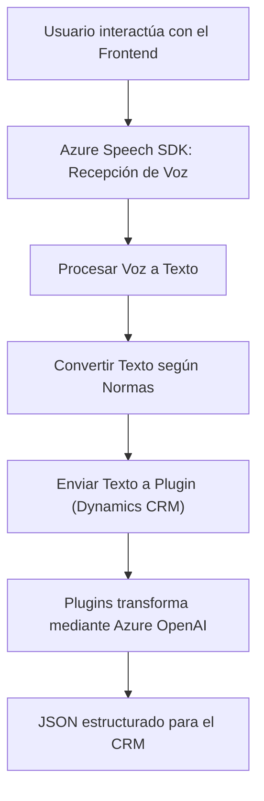

### Breve resumen técnico

El repositorio analiza una solución orientada al procesado de texto y voz, integrada con Microsoft Dynamics CRM. Utiliza el Azure Speech SDK para procesamiento de audio (speak-to-text y text-to-speech) y servicios de Azure OpenAI para transformar y estructurar textos según normas específicas. Los distintos componentes abarcan interacción con formularios en un CRM, procesamiento de atributos dinámicos, y uso de plugins para extensibilidad de las operaciones.

---

### Descripción de arquitectura

La arquitectura del sistema es híbrida y sigue un enfoque **Eventos + Modular**. Hay tres capas principales: el frontend implementado en JavaScript integrado con un CRM; un plugin extendido de Dynamics CRM para transformar textos con Azure AI; y un API externo de procesamiento mediante Azure OpenAI. La solución aplica patrones de diseño como **de adaptador**, **service layer** (para conexión entre CRM y componentes externos), y **event-driven architecture**, que combina la interacción del usuario con servicios asíncronos externos.

---

### Tecnologías usadas

1. **Frontend (JavaScript)**:
   - Manipulación del DOM y atributos del CRM utilizando `formContext`.
   - Integración con Azure Speech SDK (`window.SpeechSDK`).

2. **Plugins (C#)**:
   - Desarrollo e integración con Microsoft Dynamics CRM mediante el Framework SDK (`IPlugin`, `IOrganizationService`).
   - Llamadas HTTP con `System.Net.Http` para consumir Azure OpenAI API.
   - Deserialización y manejo de JSON con `Newtonsoft.Json`.

3. **API externa**:
   - Azure Speech SDK para procesamiento de voz.
   - Azure OpenAI para interacciones y transformaciones de texto.

4. **Principales patrones de diseño empleados**:
   - **Adapter Pattern**: Traducción entre datos visibles del formulario y formato CRM/estructura interna.
   - **Event-driven Architecture**: Uso de eventos y callbacks para cargar la SDK de Speech o manipular formularios.
   - **Service Layer**: Gestión de datos del CRM y llamadas al API de Azure OpenAI.

---

### Diagrama Mermaid válido para GitHub

---

### Conclusión final

Este repositorio implementa una solución orientada a la interacción por voz y la transformación de datos en tiempo real dentro del contexto de un sistema CRM como Microsoft Dynamics. Usa tecnologías de Azure (Speech SDK y OpenAI), lo que permite una mayor personalización y procesamiento automatizado de datos estructurados. La arquitectura híbrida demuestra un diseño modular e integrador de servicios externos y componentes internos del CRM. Es ideal para mejorar la interacción del usuario mediante voz e inteligencia artificial en plataformas empresariales.