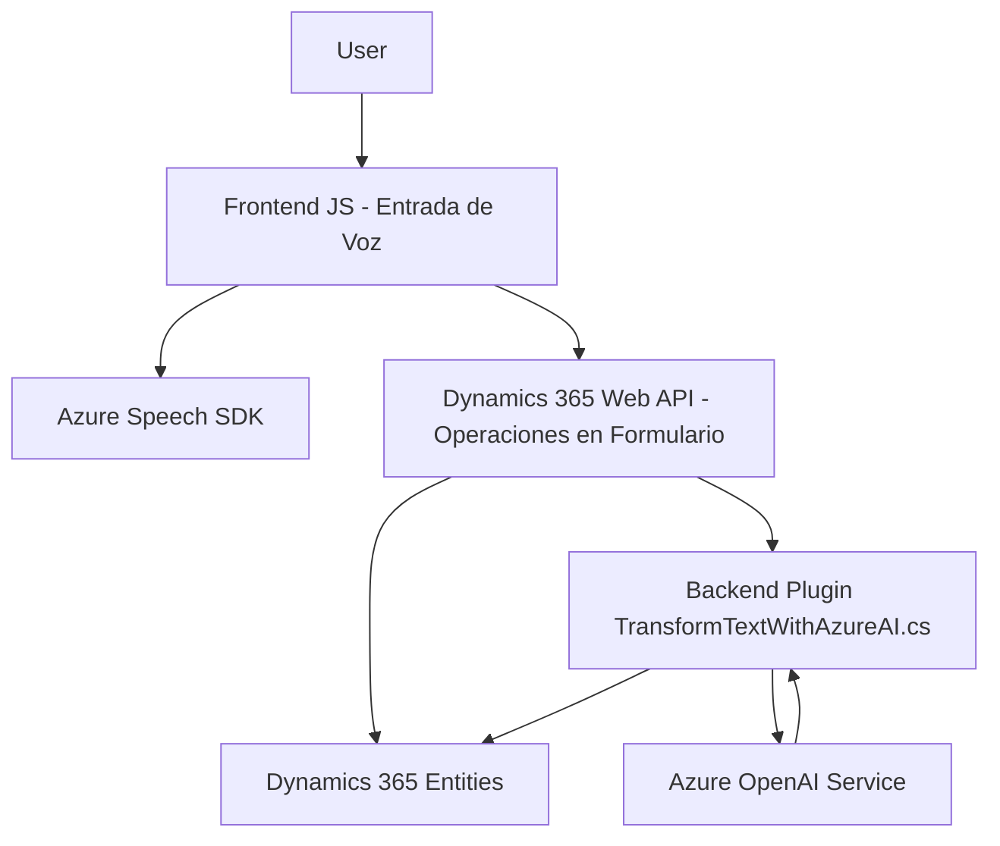

### Breve resumen técnico:

El repositorio planteado integra funcionalidades que conectan Microsoft Dynamics 365 con capacidades de procesamiento de voz y texto ofrecidas por Azure. Tiene tres componentes principales:

1. **Frontend JavaScript**: Maneja entrada de voz (captura, procesamiento y síntesis) y convierte datos de formularios.
2. **Plugin C# para Dynamics 365**: Realiza transformaciones de texto dinámicas usando Azure OpenAI.
3. **Servicios externos**: Usa Azure Speech SDK y Azure OpenAI Service para capacidades de voz y comprensión de texto.

---

### Descripción de arquitectura:

La solución se organiza en tres capas:

1. **Capa de presentación**:
   - Se define en los archivos JavaScript, donde se interactúan los formularios de Dynamics 365 y se captura/transforma entrada de voz del usuario.
2. **Capa de negocio**:
   - Representada por el plugin en C# que maneja la lógica avanzada de transformación de datos utilizando Azure OpenAI. Actúa como intermediario entre Dynamics 365 y el servicio de OpenAI.
3. **Capa de integración externa**:
   - Se basa en Azure Speech SDK para reconocimiento y síntesis de voz y Azure OpenAI para transformación avanzada de texto.

Por estructura y aplicaciones, utiliza una arquitectura **n-capas** con integración de servicios externos en el backend, sin operar como microservicios. La modularización de lógica facilita el mantenimiento y escalabilidad.

---

### Tecnologías usadas:

1. **Frontend**: 
   - **JavaScript**: Para la lógica cliente, implementación de control de voz y manejo de formularios.
   - **Azure Speech SDK**: Reconocimiento de voz y síntesis de texto.
   - **Dynamics 365 Web API (client-side)**: Comunicación nativa con la plataforma CRM.

2. **Backend**:
   - **C# (.NET)**: Para el plugin.
   - **Microsoft Dynamics 365 SDK**: Para creación de plugins y manipulación de datos en CRM.
   - **Azure OpenAI Service**: Para generación de texto mediante IA.

3. **Integración**:
   - Uso de APIs externas como Azure Speech SDK y Azure OpenAI.

4. **Patterns**:
    - **Single Responsibility Principle**: Cada función y clase tiene una única responsabilidad bien delimitada.
    - **Integration patterns**: API calls for external services like Azure Speech SDK and OpenAI.
    - **Modular architecture**: Clear separation of concerns through independent modules.

---

### Diagrama Mermaid válido para GitHub:

---

### Conclusión final:

Este repositorio representa una solución **orientada a la integración inteligente** con Microsoft Dynamics 365 y herramientas de Azure. Con una base en una arquitectura ***n-capas***, organiza la funcionalidad en tres niveles (presentación, negocio e integración). Los archivos JavaScript gestionan la lógica del cliente, trabajando en colaboración con servicios de voz (Azure Speech SDK) y llamando APIs del backend (Dynamics 365 y Azure OpenAI Service). El plugin en C# realiza transformaciones inteligentes, basándose en el modelo GPT de Azure. La adopción de patrones como modularización y callbacks refuerza la practicidad y mantenibilidad del sistema.