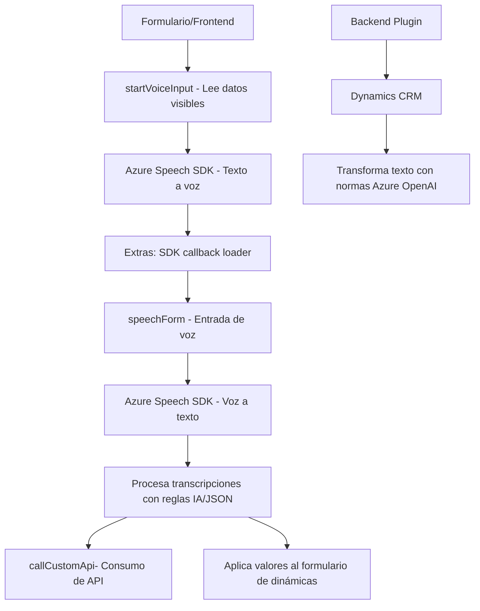

### Breve resumen técnico

La estructura del repositorio presentado parece indicar que es parte de una solución integrada para interacción con formularios dentro de un sistema empresarial (como un CRM). Incluye funcionalidades como síntesis de voz, reconocimiento de voz, y procesamiento de texto con IA externa. Está enfocado principalmente en la interacción dinámica entre usuarios y formularios, usando servicios externos (Azure Speech SDK y OpenAI).

### Descripción de arquitectura

1. **Tipo de solución**: La solución implementada tiene características de una combinación entre arquitectura basada en **microservicios** y **plugins/modularidad**. La funcionalidad presentada es complementaria de un frontend y utiliza tanto APIs externas como plugins especializados en Dynamics CRM.
   
2. **Arquitectura**:
   - **Microservicios híbridos**: Existen diferentes módulos que trabajan de manera independiente pero colaborativa (ej. procesamiento de texto, síntesis de voz, plugins).
   - **Integración con terceros**: Usa servicios externos como Azure Speech SDK y Azure OpenAI para extender capacidades que de otra forma serían difíciles de implementar.
   - **Patrones de plugin**: El plugin `.cs` se enlaza con Dynamics CRM para expandir su capacidad nativa.

3. **Capas identificadas**:
   - Lógica de negocio: El procesamiento de textos y transcripción dinámica se encuentra bien definido en funciones y métodos específicos.
   - Integración con API: Consume múltiples APIs externas y realiza validaciones localmente.

### Tecnologías usadas

1. **Frontend (JavaScript):** Usado para manejar funcionalidad en el navegador (procesamiento de formularios, interacción dinámica, manejo del SDK).
   - Frameworks: Ninguno explícitamente mencionado, pero parece ser JavaScript plano.
   - Dependencias externas: Azure Speech SDK, possiblemente un framework CRM web como Dynamics.
   
2. **Backend (C#):** Usado para implementar plugins para Dynamics CRM, procesamiento de texto y datos JSON.
   - Framework del backend: Microsoft Dynamics SDK.
   - Integración con servicio externo: Azure OpenAI para procesamiento de texto avanzado.
   - Librerías utilizadas: Newtonsoft.Json para manejo de datos JSON.

### Dependencias o componentes externos

- **Azure Speech SDK**: Para funcionalidades de síntesis y reconocimiento de voz.
- **Azure OpenAI Services**: Usado para procesar y transformar datos en un formato inteligente y estructurado.
- **Dynamics CRM (enlace con Xrm plugin)**: Usado como principal sistema para estructurar y aplicar valores dinámicos en campos.
- **Newtonsoft.Json** y **System.Net.Http**: Para procesar solicitudes y estructurar datos en plugins.

### Diagrama Mermaid

### Conclusión final

La solución presentada contribuye a la dinámica de interacción de usuarios con formularios empresariales de manera inteligente y ampliada. Usa tecnologías de la nube (Azure) y extensiones en CRM (Microsoft Dynamics) para implementar una arquitectura modular y orientada a servicios externos. Es una buena aproximación para garantizar la escalabilidad y mantener la complejidad dividida en módulos funcionales reutilizables.