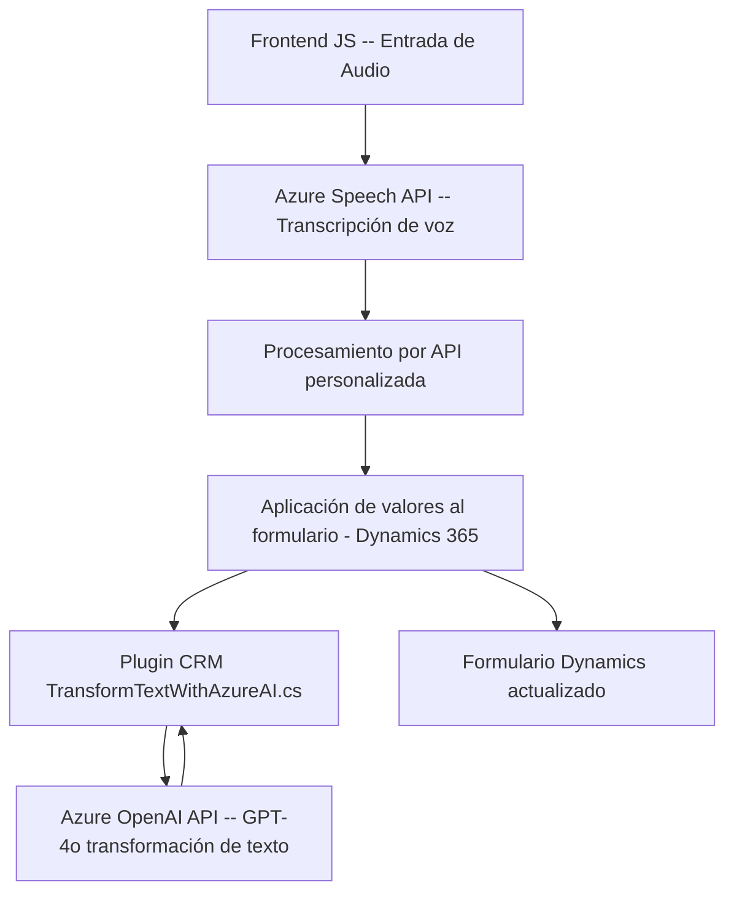

### Breve resumen técnico

Los archivos proporcionados describen una solución para interactuar con formularios en Dynamics 365 mediante reconocimiento de voz y síntesis de voz. La funcionalidad hace uso de Azure Speech SDK y Azure OpenAI API para realizar entrada y salida de voz, además de transformar texto reconocido en estructuras JSON para ser integradas en la plataforma.

---

### **Descripción de arquitectura**

#### 1. Tipo de solución:
Este es un sistema híbrido con características de **frontend extendido con reconocimiento/entrada por voz** y una **lógica de negocio en plugins de Dynamics CRM**. Se usa principalmente para gestionar **formularios de Dynamics 365** y mejorar la interacción con ellos mediante voz y transformaciones de texto con IA.

#### 2. Arquitectura:
- **Client-side (Frontend)**:
  Estructura **n capas** (presentación, servicios, y datos) para manejo de formulario por voz, utilizando SDKs y APIs externas en un flujo modular.
- **Server-side (Plugin)**:
  La arquitectura sigue el **plugin-based architecture** de Dynamics CRM, donde la transformación del texto se realiza como parte de la lógica de negocio en el servidor.
- **Integración APIs externas**:
  Uso intensivo de Azure Speech SDK y Azure OpenAI con enfoque desacoplado y modular.

### **Características principales:**
- Modularidad: Separación clara de responsabilidades entre reconocimiento de voz (entrada) y síntesis de voz (salida).
- Asincronía: Uso de promesas y callbacks para SDKs y servicios externos, garantizando solicitudes/respuestas no bloqueantes.
- Integración AI: El plugin de Dynamics utiliza modelos de IA (GPT-4) para transformar datos de texto en JSON estructurado, reforzando la automatización.

---

### **Tecnologías usadas**

1. **Frontend**:
   - JavaScript ES6.
   - SDK de Azure Speech.
   - APIs HTTP dinámicas para integrarse con formulación y reconocimiento/captura por voz.

2. **Backend Plugin (Dynamics CRM)**:
   - C#.
   - Dynamics CRM SDK (Microsoft.Xrm.Sdk).
   - Azure OpenAI Service.
   - JSON (Newtonsoft y System.Text.Json para serialización).

3. **APIs externas**:
   - Azure Speech API.
   - Azure OpenAI API.

4. **Patrones aplicados**:
   - Modularización de componentes (funciones específicas para cada responsabilidad).
   - Patrón observable/concurrente para manejar síntesis y transcripción de voz.
   - Service Locator para manejo del contexto CRM en el backend.
   - External API Integration para desacoplar servicios secundarios.

---

### **Diagrama Mermaid**

---

### Conclusión final

El proyecto combina tecnologías de voz e inteligencia artificial para mejorar la interacción con formularios de Dynamics 365. Su diseño modular, basado en capas en el lado cliente y plugin en el lado servidor, es efectivo para mantener la integridad y la extensibilidad del sistema. La elección de tecnologías como Azure Speech SDK y Azure OpenAI API agrega capacidades enriquecidas para el manejo de voz y los datos procesados. Aunque el diseño es robusto, el uso de callbacks en el frontend podría evolucionar hacia `async/await` para mejorar la legibilidad y manejo de errores. La solución es ideal para entornos empresariales enfocados en experiencias de usuario basadas en interacción por voz.