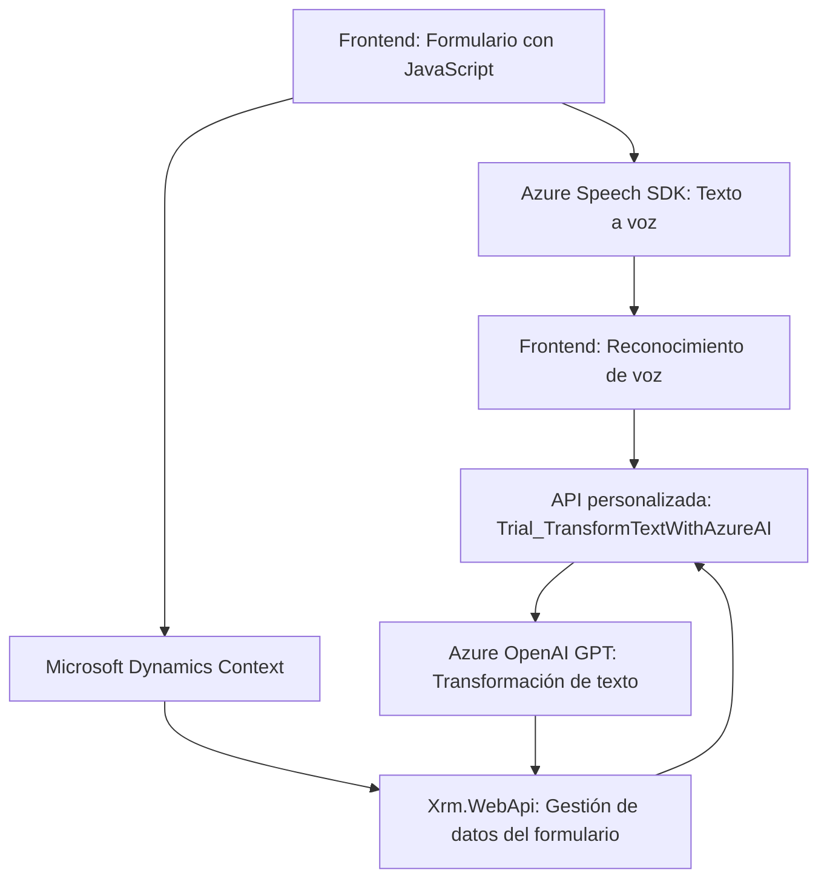

### Breve Resumen Técnico:
Este repositorio implementa una solución que integra distintas tecnologías para permitir la interacción entre formularios de Microsoft Dynamics CRM y el servicio **Azure Speech SDK**. Utiliza reconocimiento de voz, síntesis de texto, procesamiento de datos y servicios de IA en la nube (OpenAI en Azure) para manipulación avanzada de texto y datos del formulario.

---

### Descripción de la Arquitectura:
La arquitectura general se puede clasificar como **n capas/microservicios distribuidos**. Cada componente está diseñado con modularidad y una separación clara de responsabilidades:

- **Frontend:** Responsabilidad de capturar datos en formularios relacionados con Dynamics, generar voz, y realizar interacción entre servicios mediante funciones bien segmentadas. Se emplea el cliente del **Azure Speech SDK** para la síntesis y reconocimiento.
- **Backend (Plugin):** Exposición de un servicio especializado como plugin en Dynamics CRM. Este plugin utiliza Azure OpenAI para manipulación del contenido textual, ajustándose a parámetros requeridos por el sistema.
- **Integración:** Conectividad entre el cliente y Azure. Las APIs de Dynamics (XRM) y otras APIs personalizadas permiten acceder y modificar datos en el servidor.
  
---

### Tecnologías Usadas:
1. **Frontend:**
   - **JavaScript** para lógica del cliente.
   - **Azure Speech SDK** para texto a voz y reconocimiento de voz.
   - Manipulación de DOM y XRM.Context para acceso al contexto de Dynamics CRM.
   
2. **Backend:**
   - **Microsoft Dynamics CRM SDK** para el desarrollo de plugins.
   - **Azure OpenAI GPT** para transformación de datos semánticos y estructurados.
   - **C#/.NET** para lógica backend.
   - **HTTP Communication**: Uso de `HttpClient` para interactuar con el servicio REST de OpenAI.
   
3. **Integración:**
   - **External REST APIs**: Comunicación entre el plugin y el servicio OpenAI.
   - XRM.WebApi: Servicios internos para gestionar datos contextuales de Dynamics CRM.

---

### Componentes y Dependencias Externas Posibles:
- **Frontend:**
  - Dependencia directa del Azure Speech SDK.
  - Uso dinámico del CDN de Speech SDK (`https://aka.ms/csspeech/jsbrowserpackageraw`).
  
- **Backend:**
  - Servicios RESTful (Azure OpenAI).
  - Dependencias del SDK de Dynamics CRM (`Microsoft.Xrm.Sdk`, `Microsoft.Xrm.Sdk.Query`).
  - Json parsing libraries como Newtonsoft.Json o System.Text.Json.

- **Hosting:**
  - Código del plugin alojado en el servidor Dynamics CRM para ejecución automática en el contexto del sistema.

---

### Diagrama Mermaid (Válido para GitHub Markdown):

---

### Conclusión Final:
Esta solución utiliza una arquitectura distribuida basada en modelos de integración entre cliente y API externas, lo que permite funcionalidad avanzada como interacción por voz y manipulación semántica de texto. Es óptima para entornos empresariales donde la automatización y los servicios basados en IA proporcionan mayor eficiencia en la gestión de interacción con los usuarios y procesamiento de datos. El diseño modular y la separación de responsabilidades facilitan el mantenimiento y escalabilidad.