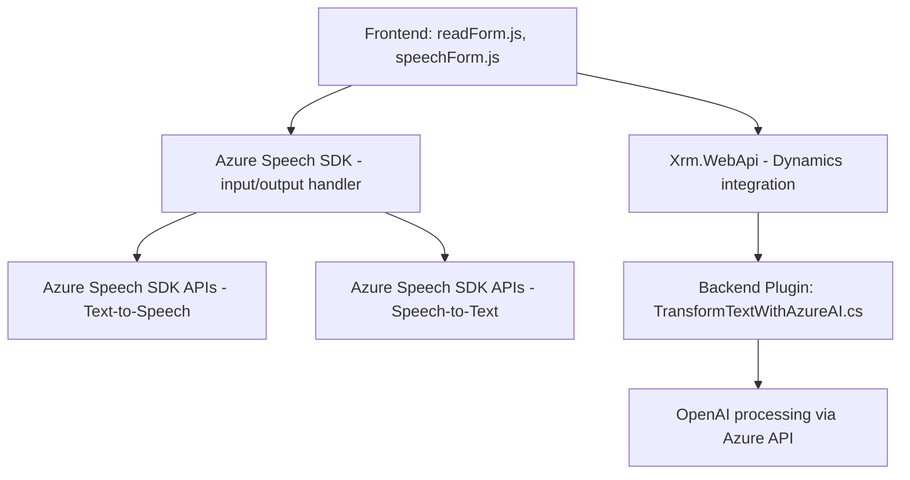

### Breve Resumen Técnico

El repositorio contiene componentes de una solución que integra reconocimiento y síntesis de voz con un entorno de Gestión de Relaciones con el Cliente (CRM), en este caso, Dynamics CRM. Utiliza tecnologías emergentes, como el **Azure Speech SDK** para análisis y generación de voz, y **Azure OpenAI** para procesamiento avanzado de textos. Consta de módulos dedicados al frontend y backend, con especial foco en la interacción entre formularios (frontend) y servicios externos (backend).

---

### Descripción de Arquitectura

La arquitectura aquí es una combinación de **n-capas** y **composición**. Se divide en tres niveles:
1. **Frontend**:
   - Scripts con funcionalidades específicas (e.g., voz a texto, texto a voz, extracción de campos visibles).
   - Interacciones directas con el usuario final.
2. **Backend**:
   - Plugins basados en API que amplifican capacidades del CRM integrándose con servicios externos (OpenAI, Speech SDK).
3. **Servicios Externos**:
   - Comunicación con APIs de Azure (Speech SDK y OpenAI), además de APIs características del ecosistema CRM (`Xrm.WebApi`).

Se percibe una **estructura modular** centrada en una separación detallada del frontend (alta interacción con el usuario y datos) y el backend (procesamiento y transformación).

---

### Tecnologías Usadas

#### Tecnologías de Frontend:
- **JavaScript**: Implementación de lógica dinámica y modular.
- **Azure Speech SDK**: Comunicación con el servicio Azure para generación y reconocimiento de voz.
- **Dynamics CRM APIs**:
  - `Xrm.WebApi`: Realización de tareas CRUD y personalizadas con entidades del CRM.

#### Tecnologías del Backend y Plugin:
- **C#/.NET**: Backend para el Plugin de Dynamics CRM.
- **Azure OpenAI Service**: Procesamiento avanzado y transformación de texto.
- **Microsoft Dynamics SDK**: Para integrar extensiones al ecosistema CRM.
- **Newtonsoft.Json**: Manejo y generación de JSON estructurado.
- **System.Net.Http**: Envío y recepción de solicitudes HTTP hacia servicios como OpenAI.

#### Patrones de Diseño:
1. **Arquitectura de Plugin (Microsoft Dynamics)**: Extensibilidad mediante `IPlugin`.
2. **Callback/Observable**: Implementado particularmente en el frontend para manejar eventos, como la carga del Speech SDK.
3. **Encapsulamiento Modular**: Métodos separados para lograr segmentación y potenciar la mantenibilidad.
4. **API Gateway**: El backend actúa como un acceso unificado a servicios externos (Azure APIs).

---

### Diagrama **Mermaid**

---

### Conclusión Final

La solución presentada integra un enfoque de procesamiento inteligente de voz y entendimiento de texto mediante servicios de Azure, acoplados a un entorno de Dynamics CRM. Destaca por su utilización de tecnologías modernas y patrones de diseño sencillos pero efectivos, que facilitan la escalabilidad y mantenibilidad de la solución. Adicionalmente, la dependencia de APIs certificadas como Azure y Dynamics, junto con una arquitectura n-capas modular, asegura un desarrollo robusto y adaptable.