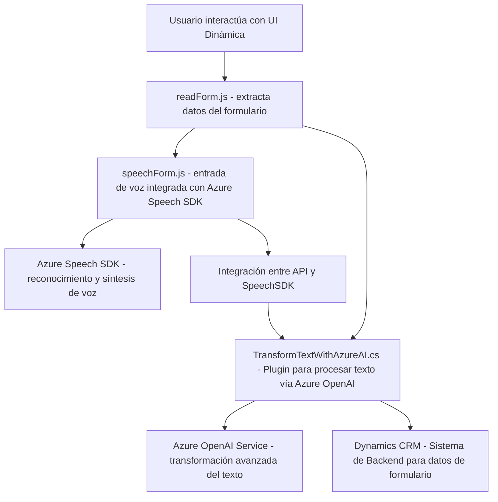

### Breve resumen técnico:
Los archivos descritos forman parte de una solución que integra capacidades de conversación y síntesis de voz mediante el Azure Speech SDK y procesamiento de texto avanzado con Azure OpenAI Service. Están orientados a mejorar la interacción con formularios en un entorno corporativo como **Dynamics CRM**, facilitando entrada dinámica y conversacional a través de voz y proporcionando respuestas en formato JSON estructurado.  

### Descripción de arquitectura:
La solución sigue una arquitectura de **n capas**, evidentemente fragmentada entre frontend (interfaz de usuario) e integración/servicios backend (plugin en Dynamics CRM). Posee elementos de diseño desacoplados, utilizando servicios externos como Azure OpenAI y Speech SDK para manejos específicos, además de extensiones propietarias en Dynamics CRM. Podría evolucionar hacia **arquitectura hexagonal**, dado el desacoplamiento entre las capas y servicios integrados.

#### Componentes importantes:
1. **Frontend Layer** (archivo `readForm.js`, `speechForm.js`): Se encarga de la interacción directa del usuario, entrada y salida de voz, y asociación de campos del formulario a los valores transcritos.
2. **Backend Plugin** (archivo `TransformTextWithAzureAI.cs`): Tiene la lógica de negocio más avanzada, como realizar transformaciones de texto con Azure OpenAI conforme a normas predefinidas y devolver datos en un formato JSON consumible.
3. **External Services**:
   - **Azure Speech SDK**: Manejo de entrada y salida de voz.
   - **Azure OpenAI Service**: Procesamiento de texto avanzado basado en inteligencia artificial.
   - **Custom API en Dynamics CRM**: Manejo de lógica adicional y operaciones asociadas al sistema.

### Tecnologías usadas:
1. **Tecnologías principales:**
   - **Azure Speech SDK:** Para reconocimiento y síntesis de voz.
   - **Azure OpenAI Service:** Procesamiento de texto y manejo de IA.
   - **Microsoft Dynamics CRM Framework:** Extensiones y manipulación de datos contextuales en formularios.
2. **Lenguaje backend:** C# con uso de SDK `Microsoft.Xrm.Sdk`.
3. **Lenguaje frontend:** JavaScript interactuando con Dynamics CRM API y cargando dinámicamente scripts de Azure Speech SDK.
4. **ORM y manipulación JSON:** `System.Text.Json`, posiblemente `Newtonsoft.Json`.
5. **Patrones usados:**
   - Modularización: Funciones segmentadas y específicas para cada tarea como carga dinámica de SDK, síntesis de voz, asignación a campos, etc.
   - Event-driven: Lógica basada en eventos y callbacks (principalmente desde y hacia SDKs externos).
   - Microservicios: Delegación de tareas específicas a servicios externos desacoplados.

### Diagrama Mermaid:

### Conclusión final:
La solución descrita implementa una arquitectura de **n capas**, que a su vez aprovecha microservicios externos para el reconocimiento de voz y el procesamiento de texto. Esto facilita gestión eficiente de entrada y salida mediante voz, además de permitir transformaciones avanzadas que agregan valor en un entorno corporativo como Dynamics CRM. La implementación sigue principios modernos como modularización y desacoplamiento, lo que permite escalar la solución para nuevos requerimientos sin modificar la base existente. Una evolución potencial hacia una arquitectura más característica de **puerto y adaptador (hexagonal)** puede ser viable con más abstracciones de los servicios externos usados.