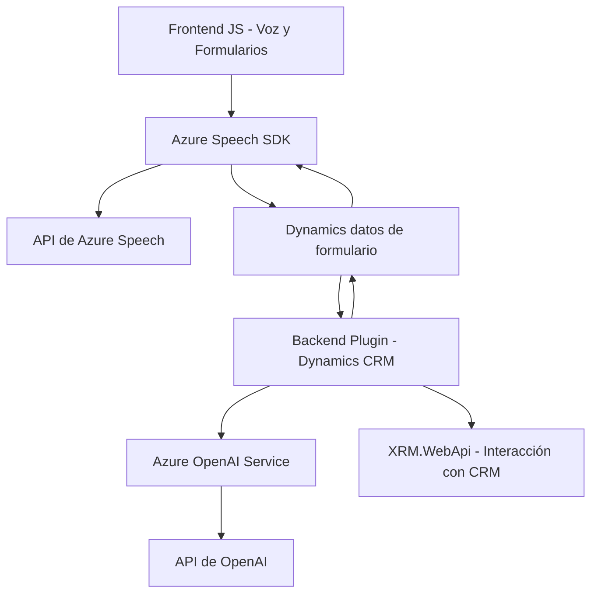

### Breve resumen técnico:

El repositorio dado tiene una solución orientada a la interacción entre usuarios y plataformas empresariales mediante tecnologías de reconocimiento de voz y transformación de texto. Es un sistema especializado para integrar y mejorar la funcionalidad de formularios en Dynamics CRM, utilizando **Azure Speech SDK** y **Azure OpenAI** para habilitar capacidades de voz y procesamiento de lenguaje avanzado.

---

### Descripción de arquitectura:

1. **Arquitectura**:  
   - **Dominio principal**: La solución está construida en torno a la **integración dinámica basada en eventos** con un enfoque modular.  
   - **Multicapa**:  
     - El frontend (JavaScript) implementa reglas para la interfaz del usuario y la integración directa con Azure Speech.  
     - El backend (plugin .NET) maneja la lógica compleja a nivel de servidor, con interacción directa con la API de OpenAI.  

   - La arquitectura se puede clasificar como **n capas** combinada con **orientación a eventos**, ya que separa funciones: interfaz/entrada de usuario (JavaScript), lógica de negocio (plugin C#) y servicio externo (Azure APIs).  
   - **Integración externa**: Los servicios en la nube (Azure Speech y OpenAI) son fundamentales en la arquitectura para manejar procesamiento de voz y lenguaje natural.

---

### Tecnologías usadas:

1. **Frontend (JavaScript)**:  
   - **SDK externo**: Azure Speech SDK para síntesis de voz y reconocimiento de comandos hablados.  
   - Framework empresarial: `Xrm.WebApi` para formularios y CRM.  

2. **Backend (C#)**:  
   - **SDK empresarial**: Microsoft Dynamics CRM (Microsoft.Xrm.Sdk) integrado con plugins.  
   - **API HTTP**: Cliente para invocar servicios HTTP de Azure OpenAI.  

3. **Servicios en la nube**:  
   - **Azure Speech SDK**: Reconocimiento de voz y síntesis.  
   - **Azure OpenAI**: Procesamiento avanzado de texto.

4. **Patrones de diseño**:  
   - **Modularidad**: Implementación clara de funciones organizadas por responsabilidad en frontend y backend.  
   - **Facade Pattern**: En punto único de entrada para la interacción (`startVoiceInput`, `Execute`).  
   - **External Service Invocation**: Uso extensivo de servicios externos (Azure Speech/OpenAI).  

---

### Diagrama Mermaid válido para GitHub:

---

### Conclusión final:

La solución es una integración avanzada entre Dynamics CRM, Azure Speech SDK y Azure OpenAI, con funcionalidades orientadas a mejorar la usabilidad y accesibilidad mediante interacción por voz y procesamiento de texto. 

- **Estructura:** Modular y optimizada para servicios cloud, la arquitectura utiliza patrones como Facade y eventos asincrónicos, asegurando separación de responsabilidades.  
- **Potencial:** Con estos servicios, se facilita la interacción natural (voz) y la simplificación de trabajo con datos estructurados. Es adecuada para entornos empresariales que requieran interfaces accesibles y enriquecidas con IA.