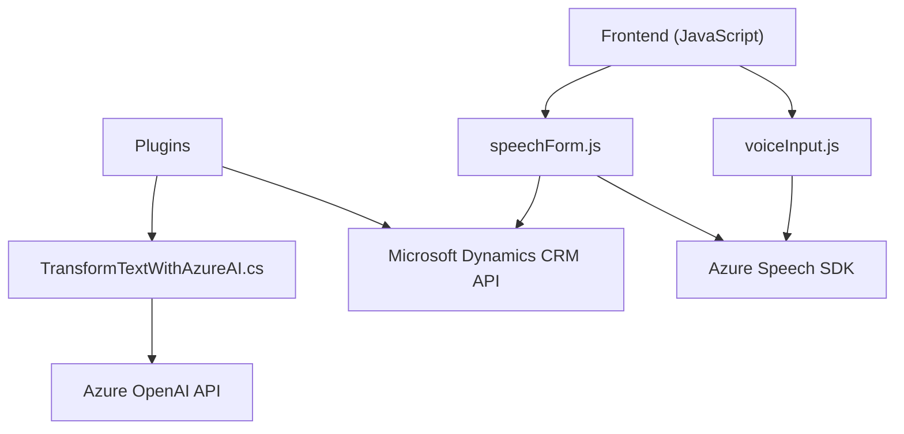

### Breve resumen técnico
El repositorio parece ser una solución híbrida diseñada para interactuar con Microsoft Dynamics 365. Consta de:
1. Un **frontend** basado en JavaScript, utilizando Azure Speech SDK para realizar funciones de entrada y síntesis de texto/voz interactivas mediante formularios en el sistema.
2. Un **plugin backend** en C#, que utiliza Azure OpenAI API para transformar texto en información estructurada, conectado a Dynamics CRM.

### Descripción de arquitectura
La arquitectura general propuesta es **modular y orientada a servicios**. Utiliza diferentes componentes colaborativos:
1. **Frontend:** Interfaz modular en JavaScript integrada con Dynamics 365, utilizando Azure Speech SDK para el reconocimiento y síntesis de voz. Implementa el modelo de arquitectura **de presentación frontend-backend** con patrones orientados a eventos.
2. **Plugin backend:** Este componente sigue un patrón **orientado a servicios** (Plugin Architecture y Client-Server Communication), implementando un plugin de Dynamics CRM para interactuar con Azure OpenAI.
3. La solución se construye sobre una **arquitectura n-capas**:
   - **Capa de presentación:** Interfaz de usuario (JavaScript/HTML/Frontend).
   - **Capa lógica:** Dinámica en el backend del plugin y lógica del Azure Speech SDK.
   - **Capa de persistencia:** Interacción directa con Dynamics CRM.
   - Además de interacciones con servicios externos: Azure Speech SDK y Azure OpenAI.

### Tecnologías usadas
1. **Frontend**
   - **JavaScript:** Lenguaje de programación del frontend.
   - **Azure Speech SDK:** Servicio de reconocimiento y síntesis de voz.
   - **Dynamics 365 Web API:** Integración con datos y formularios en Dynamics 365.

2. **Backend Plugin**
   - **C# (Microsoft Dynamics CRM SDK):** Para la creación de plugins y su integración con Dynamics 365.
   - **Azure OpenAI API:** Para realizar llamadas a modelos de procesamiento de lenguaje natural como GPT.
   - **Newtonsoft.Json** y **System.Text.Json:** Libreras para manejar JSON.
   - **HTTP Client:** Para comunicación con la API de Azure OpenAI.

### Dependencias o componentes externos
1. **Externos:**
   - **Azure Speech SDK:** Realiza síntesis y entrada de voz, siendo crucial para la funcionalidad de los archivos de JavaScript en el frontend.
   - **Azure OpenAI:** Servicio de modelos como GPT-4, utilizado en el plugin backend para procesar texto y devolverlo como JSON.
   - **Dynamics Web API:** Utilizada para actualizaciones de formulario dinámicas desde el frontend.
   
2. **Internos:**
   - Dependencia directa del modelo de datos de Microsoft Dynamics (atributos del formulario, API de la organización, etc.).
   - Relaciones entre frontend y backend por medio de la API de Dynamics.

---

### Diagrama Mermaid válido para GitHub

### Conclusión final
La solución es una integración entre Microsoft Dynamics CRM y servicios de Azure, ofreciendo entrada, procesamiento y síntesis de texto/voz en sistemas empresariales. La aplicación adopta una arquitectura modular de **n-capas** para separar las responsabilidades entre la capa de presentación, lógica, y persistencia. Los patrones incluyen el uso de **plugins**, eventos asincrónicos y comunicación con APIs de terceros. La funcionalidad está bien implementada, aunque sería recomendable mejorar la gestión de las credenciales para garantizar la seguridad.