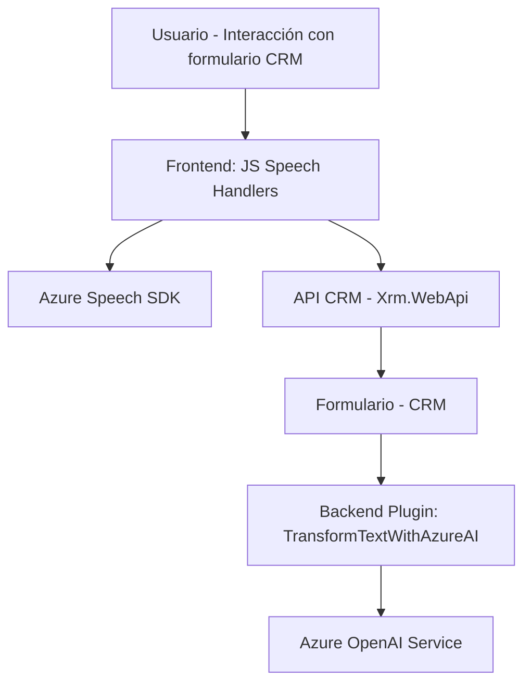

### Breve resumen técnico
El repositorio contiene archivos para la interacción de voz con formularios de un CRM y transformación de texto a través de un servicio de inteligencia artificial. Se compone de:
1. **Frontend/JS**: Scripts en JavaScript que gestionan el reconocimiento y síntesis de voz con **Azure Speech SDK**, además de manipular datos en formularios.
2. **Plugins/TransformTextWithAzureAI.cs**: Plugin C# para Dynamics CRM que utiliza **Azure OpenAI** para estructurar texto en JSON basado en normas.

### Descripción de arquitectura
La solución está distribuida en dos principales capas:
- **Frontend**: Incluye la experiencia de usuario (reconocimiento y síntesis de voz).
- **Backend**: Maneja la integración con Dynamics CRM y llamadas a servicios externos como Azure AI.
  
Patrones identificados:
1. **Modularidad**: Se implementan funciones independientes para cada responsabilidad (e.g., cargar dependencias, interactuar con Azure Speech SDK).
2. **API Wrapper**: Las funciones en el frontend y backend encapsulan las llamadas al SDK de Azure Speech y Azure OpenAI respectivamente.
3. **Integración cliente-servidor**: Comunicación fluida entre frontend, backend y servicios externos.
4. **Plugin Architecture**: El plugin en C# extiende la funcionalidad del CRM con lógica personalizada.

### Tecnologías y frameworks usados
1. **JavaScript (Frontend)**:
   - **Azure Speech SDK**: Para reconocimiento de voz y síntesis de texto.
   - **Fetch API**: Para realizar solicitudes HTTP.
2. **C# (Backend)**:
   - **Dynamics CRM Plugins**: Extensiones para la interacción con el CRM.
   - **Azure OpenAI**: Servicio IA para procesamiento de lenguaje natural.
   - **System.Text.Json**, **Newtonsoft.Json.Linq**: Para manejo de datos JSON.
   - **System.Net.Http**: Para llamadas HTTP a APIs externas.

### Dependencias y componentes externos
- **Azure Speech SDK**: Utilizado para la extracción de texto hablado y síntesis a voz.
- **Azure OpenAI Service**: Integrado en el plugin Dynamics CRM para el procesamiento avanzado de texto.
- **Dynamics CRM API**: Enlace entre los procesos frontend/backend y el sistema CRM.
- **Custom API CRM**: Para personalización de lógica en contextos de uso específicos.

---

### Diagrama Mermaid válido para GitHub

### Conclusión final
La solución implementa una arquitectura de **n capas**, combinando un frontend con reconocimiento/síntesis de voz y un backend basado en **plugins para Dynamics CRM** con integración a Azure AI. Las dependencias como `Azure Speech SDK` y `Azure OpenAI` están dinamizadas para optimizar recursos en tiempo de ejecución. La modularidad permite escalar cada funcionalidad y adaptarla a diferentes contextos.