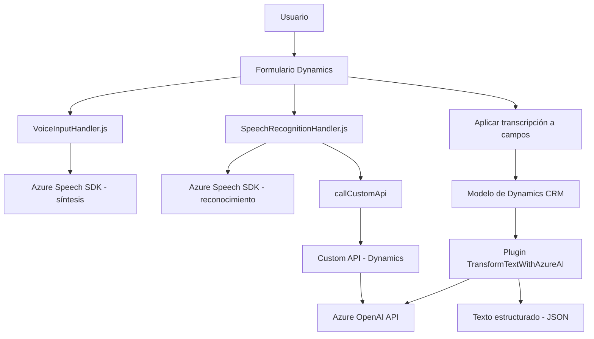

### Breve Resumen Técnico:
El repositorio descrito parece ser parte de una solución orientada a formularios interactivos integrados en aplicaciones basadas en Dynamics CRM, con funcionalidades de síntesis y reconocimiento de voz utilizando el **Azure Speech SDK**. Además, incluye un plugin para transformar texto mediante **Azure OpenAI**, ofreciendo capacidades de IA generativa para personalizar el procesamiento de información. 

Las funcionalidades están distribuidas en componentes frontend y backend que interactúan con APIs externas (Azure Speech, Dynamics 365 y OpenAI) y servicios internos (Custom APIs).

---

### Descripción de Arquitectura:
La solución presenta una arquitectura **n-capas**, donde las funciones de frontend gestionan interacciones con el usuario (datos en formularios y reconocimiento/síntesis de voz), mientras que los servicios backend (como el plugin en C#) procesan y estructuran estas entradas usando Inteligencia Artificial (IA). El sistema utiliza una mezcla de patrones de integración con APIs externas y modularización de código en el frontend. Aunque las descripciones del repositorio no indican un enfoque estrictamente orientado a microservicios, la presencia de plugins y APIs backend en Dynamics CRM sugiere base en un entorno distribuido.

---

### Tecnologías Usadas:
1. **Frontend**:
   - **JavaScript**: Para la gestión del cliente y lógica de formularios.
   - **Azure Speech SDK**: Integración de síntesis y reconocimiento de voz.
   
2. **Backend**:
   - **C#**, **.NET Framework**: Plugin de Dynamics CRM implementado con la interfaz `IPlugin`.
   - **Azure OpenAI API**: Procesamiento de texto mediante IA generativa.
   - **Microsoft Dynamics CRM SDK**: Interacciones con el CRM.
   - **HTTP client** y **JSON serializers**: Se utiliza para las interacciones HTTP con servicios externos.

---

### Dependencias o Componentes Externos:
1. **Azure Speech SDK**: Para reconocimiento y síntesis de voz.
2. **Azure OpenAI API**: Potencia las capacidades de IA generativa.
3. **Dynamics CRM SDK**: Gestión de datos y comportamiento dinámico de formularios.
4. **Custom APIs en Dynamics**: Implementadas internamente para extender las capacidades del CRM.
5. **Newtonsoft.Json** y **System.Text.Json**: Manejo de contenido JSON.

---

### Diagrama Mermaid:
El siguiente diagrama muestra las interacciones principales entre los objetos del frontend, backend y APIs externas.

---

### Conclusión Final:
La solución está diseñada para trabajar como una capa interactiva sobre formularios de Microsoft Dynamics CRM, extendiendo la funcionalidad tradicional mediante el uso de la experiencia de voz (síntesis y reconocimiento) y capacidades de IA generativa. Esto facilita a los usuarios la entrada y el procesamiento de datos en un entorno altamente dinámico y conectado. La arquitectura modular, dependencias externas y uso de APIs inteligentes refuerzan un diseño flexible y extensible apto para integraciones futuras.