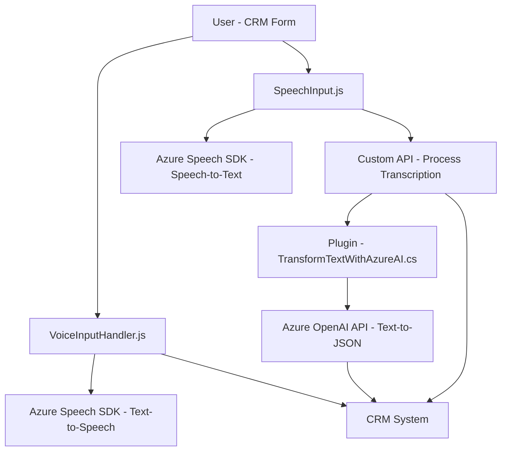

### Breve Resumen Técnico
El repositorio contiene principalmente dos módulos frontend basados en JavaScript y un plugin backend basado en C#. La solución integra el SDK de Azure Speech para operaciones de síntesis y reconocimiento de voz, y la API de Azure OpenAI para transformación avanzada de texto. Su objetivo es mejorar la experiencia del usuario en entornos CRM mediante entrada y salida de voz, transcripciones, manipulación de datos de formularios, y procesamiento de texto.

---

### Descripción de Arquitectura
Esta solución combina una arquitectura cliente-servidor donde:
1. **Frontend (JavaScript):** Implementa una **arquitectura modular** basada en funciones para interactuar con el SDK de Azure Speech y Dynamics CRM. Utiliza servicios externos, como Azure Speech SDK, de manera dinámica.
2. **Backend (C#):** Sigue el estándar **plugin architecture** de Dynamics CRM, extendiendo su funcionalidad con llamadas a la API de Azure OpenAI.
3. **Interacción:** Hay comunicación entre el frontend (navegador) y el backend (servidor CRM): 
   - El **frontend** interactúa directamente con formularios y realiza llamadas a una Custom API. 
   - El **backend** transforma texto con Azure OpenAI y retorna datos estructurados al sistema.

Globalmente, el sistema refleja una **arquitectura orientada a eventos** en el frontend y un **orientado a servicios** (SOA) en el backend. La integración con APIs externas (Azure Speech y OpenAI) bajo demanda introduce principios de **micro-servicios**.

---

### Tecnologías Usadas
#### Frontend:
- **Lenguajes/Frameworks:** JavaScript, Dynamics CRM API (`executionContext`).
- **Servicio externo:** Azure Speech SDK (cargado dinámicamente).
- **Dependencias:** `Xrm.WebApi` para comunicación con el sistema CRM.
  
#### Backend:
- **Lenguajes/Frameworks:** C#, .NET Framework.
- **Servicio externo:** Azure OpenAI API.
- **Dependencias:** `Microsoft.Xrm.Sdk`, `Newtonsoft.Json`.

#### Patrones:
- **Modularidad:** Funciones encapsuladas con claras responsabilidades.
- **Capa de integración externa:** SDK y APIs de Azure utilizados tanto en el frontend como backend.
- **Plugin Architecture:** En el backend, se sigue la arquitectura estándar de Dynamics CRM.

---

### Diagrama Mermaid

---

### Conclusión Final
La solución integra eficazmente tecnologías modernas como Azure Speech SDK y Azure OpenAI en un entorno CRM para mejorar la experiencia del usuario. Las tareas de reconocimiento de voz, síntesis de texto, transformación de datos y manipulación de formularios están modularizadas, proporcionando un diseño flexible y escalable. Además, la carga dinámica del SDK y el uso de APIs personalizadas reflejan buenas prácticas de integración con servicios externos.

La arquitectura multifacética combina **n capas** en el frontend y backend, complementada con patrones de **event-driven programming** y **service-oriented integration**.