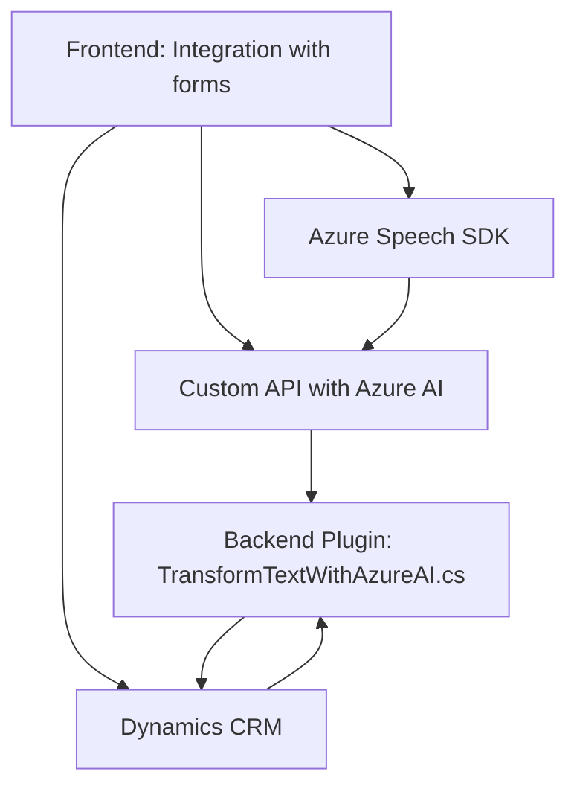

### Breve resumen técnico:
El repositorio contiene tres elementos principales:

1. **Frontend:** Funcionalidad de integración con Azure Speech SDK para síntesis de voz y reconocimiento de datos extraídos de formularios dinámicos. Además, existe integración con una Custom API y el framework Dynamics CRM para manejo de datos del formulario.
2. **Backend/Plugin:** Implementa un plugin para Dynamics CRM que utiliza Azure OpenAI para transformar texto a JSON estructurado, integrándose de forma natural en el entorno CRM.
3. **Dependencias externas:** Uso extensivo de servicios de Azure (Speech SDK y OpenAI) para síntesis y transformación de datos.

---

### Descripción de arquitectura:
La solución sigue una **arquitectura híbrida basada en servicios**:
- El **Frontend** es modular y utiliza patrones de **integración API** para utilizar Azure Speech SDK y una Custom API para análisis de IA. La manipulación de formularios es independiente pero estrechamente vinculada al contexto de Dynamics CRM.
- El **Backend/Plugin** implementa una **arquitectura orientada a servicios (SOA)**, actuando como un **adaptador** entre Dynamics CRM y el servicio Azure OpenAI mediante solicitudes HTTP y transformación de datos en formato JSON.

---

### Tecnologías usadas:
1. **Frontend:**
   - JavaScript + Browser APIs
   - Azure Speech SDK
   - Dynamics CRM APIs (Xrm.WebApi)
   - Custom APIs (Azure AI endpoint)
2. **Backend:**
   - Lenguaje C# (.NET Framework)
   - Dynamics CRM Plugin framework (`IPlugin`, `IOrganizationService`)
   - Azure OpenAI Service (para procesamiento de texto)
   - Newtonsoft.Json para manipulación JSON
   - System.Net.Http para realizar solicitudes HTTP

---

### Diagrama Mermaid válido para GitHub:

---

### Conclusión final:
1. La solución describe una **hybrid architecture** que combina frontend modularidad, servicios externos (Azure Speech SDK y Azure OpenAI) y un backend basado en Dynamics CRM plugins.
2. Los patrones usados incluyen **adaptadores** entre diferentes sistemas API, integración dinámica basada en eventos, y modularidad para desacoplar lógica entre frontend y backend.
3. Las dependencias externas están bien identificadas (Azure Speech SDK, Azure OpenAI Service, Custom API) y se usan para ampliar la funcionalidad de la solución.
4. La arquitectura es eficiente para escenarios de CRM avanzado, formularios dinámicos y procesamiento de lenguaje natural. Sin embargo, se podría reforzar la seguridad y manejo de claves API en la integración de servicios en el plugin backend.