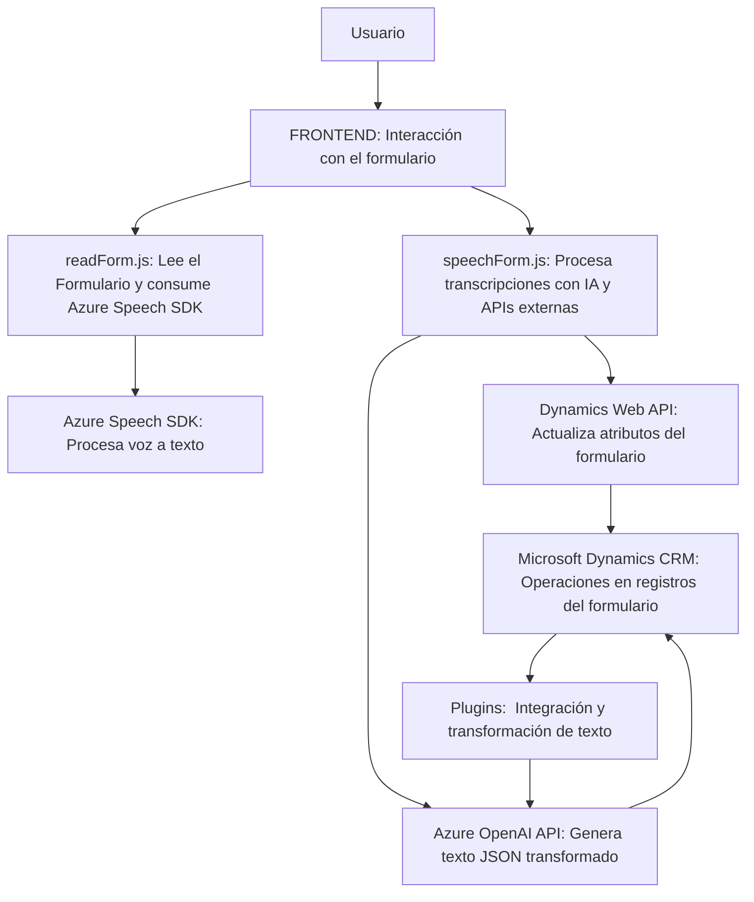

### Breve resumen técnico:
Se trata de una solución híbrida que cuenta con un **front-end basado en JavaScript** y **plugins desarrollados en C#** para integrarse con **Microsoft Dynamics CRM**. La solución incluye dos módulos principales:
1. **FRONTEND/JS/readForm.js** y **FRONTEND/JS/speechForm.js**: Scripts que manejan la integración entre formularios web interactivos y servicios de voz y texto usando Azure Speech SDK.
2. **Plugins/TransformTextWithAzureAI.cs**: Un plugin para Dynamics CRM que usa Azure OpenAI para transformar textos basados en reglas definidas.

---

### Descripción de arquitectura:
Esta solución está diseñada como una arquitectura **híbrida basada en capas**, compuesta de:
1. **Presentación (Frontend)**: Scripts en JavaScript que establecen la comunicación entre el usuario y servicios externos.
   - Manejo de interacción del usuario con el formulario.
   - Funciones para procesar voz y texto en tiempo real.
   
2. **Lógica de negocio (Plugin)**: Plugins en C# para extender la funcionalidad de Dynamics CRM mediante:
   - Integración con la **API de Azure OpenAI** para procesar texto y transformarlo en JSON estructurado con lógica de negocio.
   - Manejo de eventos y validación en el contexto CRM.

3. **Integración con Servicios Externos**: 
   - **Azure Speech SDK**: Activar síntesis de voz y reconocimiento de voz para formularios web.
   - **Azure OpenAI API**: Realizar transformaciones inteligentes en el texto para aplicaciones CRM específicas.

Este enfoque de capas busca mantener una separación clara de la presentación (frontend) y la lógica (CRM), permitiendo integrar servicios externos como el SDK y el API de Azure.

---

### Tecnologías usadas:
1. **Frontend**
   - **JavaScript**: Implementación modular y funcional.
   - **Azure Speech SDK**: SDK externo para la manipulación de servicios de síntesis y reconocimiento de voz.

2. **Backend**
   - **C#**: Implementación de plugins mediante la API de Microsoft Dynamics CRM.
   - **Microsoft Dynamics SDK**: Extensión del contexto del CRM utilizando interfaces específicas como `IPluginExecutionContext` y `IOrganizationService`.
   - **Azure OpenAI API**: Servicios de IA generativos externos.
   - **JSON Manipulation Libraries**: Uso de `System.Text.Json` y `Newtonsoft.Json`.

3. **APIs**
   - **Azure Speech SDK**: Para sintetizar y reconocer voz a texto.
   - **Azure OpenAI API**: Para transformar texto según un conjunto específico de normas.
   - **Microsoft Dynamics Web API**: Para buscar, establecer y actualizar registros en el sistema interno del CRM.

---

### Diagrama Mermaid válido para GitHub:
**Diagrama Mermaid explicado:**  
El diagrama detalla cómo las piezas del sistema interactúan entre sí: los scripts frontend activan funcionalidades basadas en el formulario y los servicios de voz, enviando inputs al plugin y llamando a la API de Dynamics. Por otra parte, el plugin en C# es responsable de procesar los inputs usando Azure OpenAI.

---

### Conclusión final:
La solución implementada es principalmente una extensión del ecosistema de **Microsoft Dynamics CRM** con integración de **Azure AI/ML services**. La arquitectura sigue un modelo híbrido por capas:
- **Frontend:** Proporciona una interfaz interactiva de voz y texto que puede integrarse con formularios web.
- **Backend:** Extiende funcionalidad de Dynamics CRM utilizando plugins en C# y APIs externas.

Los principales patrones identificados incluyen **lazy loading** en el frontend, integración de APIs externas en el backend, y modularización para separar tareas específicas. Estas elecciones tecnológicas permiten una solución escalable y adaptable a entornos empresariales robustos. 

Para mejorar, se podría considerar la implementación de pruebas automatizadas y migrar hacia un diseño más estandarizado como **Arquitectura Hexagonal**, facilitando una integración más ágil con los servicios externos.