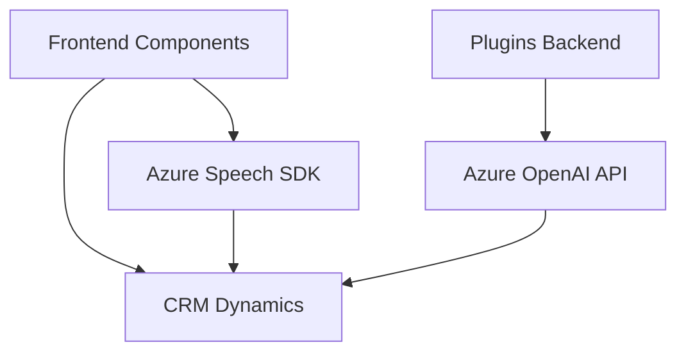

### **Análisis Técnico del Repositorio**

---

#### **Breve Resumen Técnico**
El repositorio contiene múltiples archivos enfocados en la síntesis y reconocimiento de voz mediante **Azure Speech SDK**, la integración con formularios web en CRM (Dynamics), y la transformación de texto usando la API de **Azure OpenAI**. Está diseñado para aplicaciones empresariales que integran automatización mediante voz y procesamiento de datos usando inteligencia artificial.

---

#### **Descripción de Arquitectura**
1. **Tipo de Solución**:  
   La solución se clasifica como una **aplicación híbrida** entre frontend y backend. Integra lógica empresarial para CRM (Dynamics Plugins), interacción de usuario con formularios frontend, y servicios externos en la nube (Azure Speech SDK y Azure OpenAI).

2. **Arquitectura**:  
   La arquitectura general puede clasificarse como **n capas** combinada con componentes de microservicios ad hoc. Se identifican tres capas principales:  
   - **Frontend (Javascript)**: Gestión de formularios y entrada/salida por voz.  
   - **Backend (Plugins)**: Procesamiento contextual y transformación de texto en el CRM.  
   - **Servicios externos**: Conexión a APIs como Speech SDK y OpenAI.  

   Aunque los plugins tienen características independientes, están integrados con el monolito del CRM, creando una relación **plugin-monolito** con partes microservicio-like.

3. **Patrones Utilizados**:  
   - **Modularidad**: Separación de funcionalidad en métodos reutilizables (en frontend y backend).  
   - **SDK externos**: Dinámico uso de dependencias como Azure Speech SDK y OpenAI.  
   - **Event-driven**: Uso de módulos asincrónicos para manejar reconocimiento de voz.  
   - **Microservicio**: Interacción con API OpenAI como servicio focalizado independiente.  
   - **Plugin architecture para Dynamics**: Ampliación basada en `IPlugin`.

---

#### **Tecnologías, Frameworks y Librerías**
1. **Frontend**:
   - **Azure Speech SDK**: Para síntesis y reconocimiento de voz en formularios web.  
   - **JavaScript**: Funciones asincrónicas y dinámicas manipuladas en el navegador para carga de SDK y procesamiento de transcripciones.  

2. **Backend**:
   - **Dynamics CRM (Plugins)**: Ampliación del monolito CRM para lógica empresarial avanzada.  
   - **Azure OpenAI**: Transformación de texto usando inteligencia artificial, conectada al CRM.

3. **Librerías Externas**:
   - `.NET Framework`: Manejo de servicios HTTP y JSON (en backend).  
   - `System.Net.Http` y `Newtonsoft.Json.Linq` para serialización/deserialización.  

---

#### **Dependencias y Componentes Externos**
- **Azure Speech SDK**: Reconocimiento y síntesis de voz.  
- **Azure OpenAI API**: Transformación de texto mediante GPT.  
- **Dynamics CRM SDK**: Contexto interno del CRM para extensiones.  
- **Librerías de manejo HTTP y JSON**: En backend para procesamiento seguro de requests y respuestas.  

---

### **Diagrama Mermaid (Estructura General de Funcionalidad)**

---

### **Conclusión Final**
El repositorio refleja una solución focalizada en integrar interacción por voz y procesamiento AI con formularios empresariales presentes en plataformas CRM (Dynamics). La arquitectura está orientada hacia un enfoque **n capas** que conecta módulos frontend, lógica backend basada en plugins, y servicios externos (Azure Speech y OpenAI). Es un diseño optimizado para la automatización de tareas empresariales impulsadas por inteligencia artificial y tecnología de voz, además de seguir patrones modernos en modularidad y servicios externos.