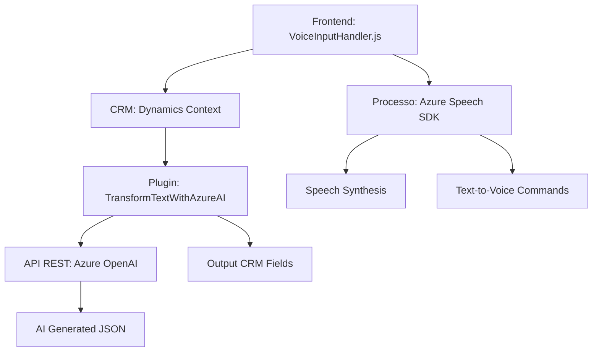

## Breve resumen técnico
El repositorio describe múltiples módulos que interactúan con formularios de entrada en un entorno CRM (presumiblemente Dynamics 365), utilizando reconocimiento de voz, texto hablado y servicios externos. La solución emplea Azure Speech SDK y Azure OpenAI para realizar síntesis de voz, reconocimiento de comandos hablados, y generación de texto inteligentemente procesado. 

Se adapta bien a sistemas basados en plataformas como Dynamics 365 mediante plugins, mientras que la integración con Azure facilita su orientación hacia soluciones basadas en inteligencia artificial y datos procesados.

---

## Descripción de arquitectura
La arquitectura está diseñada bajo un paradigma modular y basado en eventos. Cada archivo y componente define funciones específicas con computación y procesamiento repartidos entre distintas capas del sistema. 

El sistema usa los siguientes enfoques arquitectónicos:
1. **N capas**: Arquitectura distribuida con módulos separados por responsabilidad (Frontend para entrada/salida, Plugins para lógica CRM, y APIs externas para servicios de terceros).
2. **Hexagonal**: Integra servicios externos como SDKs y APIs (Azure Speech, Azure OpenAI) mediante abstracción de lógica principal.
3. **Event-driven**: Usa detonadores como el `startVoiceInput` y ejecución de plugins para coordinar tareas entre los módulos.

---

## Tecnologías usadas
1. **Frontend**
   - JavaScript para interacción dinámico con formularios.
   - Azure Speech SDK para síntesis/reconocimiento de voz.
   - Loaders dinámicos de bibliotecas externas.

2. **Backend**
   - **C#** en plugins para Dynamics CRM.
   - **Microsoft Dynamics SDK** para gestión de formularios y contexto CRM.
   - **Azure OpenAI API** para procesamiento inteligente de texto.

3. **API externas**
   - Utilización de servicios como Azure Speech y OpenAI.

4. **Patrones**
   - Modularidad (separación de funciones según propósito).
   - Plugin extensible (implementación dinámica en contextos CRM).
   - Builder de REST clientes (para integración con Azure OpenAI).
   - Facade abstraído en interacciones con formulación y SDK/servicios.

---

## Diagrama **Mermaid**
A continuación el diagrama **Mermaid** que visualiza la interacción entre módulos y servicios externos:

---

## Conclusión final
La solución describe un sistema sofisticado que une interacción usuario-formulario mediante reconocimiento de voz y servicios de procesamiento de texto habilitados con inteligencia artificial. Cumple con las expectativas típicas de entornos modernos como Dynamics 365 y servicios de Azure, promoviendo modularidad, extensibilidad y facilidad de integración.