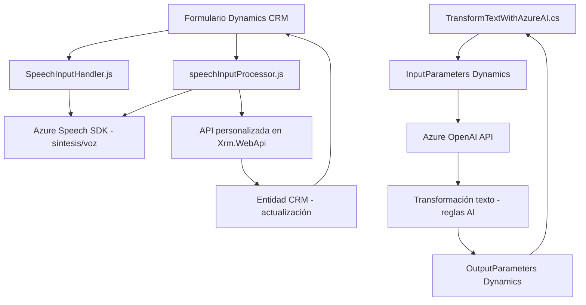

### Breve Resumen Técnico
El repositorio presenta componentes que integran funcionalidades avanzadas como reconocimiento y síntesis de voz mediante **Azure Speech SDK**, y un plugin para **Dynamics CRM** que interactúa con APIs de **Azure OpenAI AI**. La solución parece diseñada para aplicaciones centradas en la gestión de información y la automatización en entornos de negocio como sistemas CRM de Microsoft Dynamics.

---

### Descripción de Arquitectura
La arquitectura del repositorio tiene características particulares:
1. **Multicapa**: Combinación de capas de front-end y back-end, donde cada capa tiene una orientación modular y funcional específica. El **frontend** incluye JavaScript para las operaciones de síntesis y reconocimiento de voz. En el **backend**, el plugin en C# efectúa transformaciones mediante un servicio de IA externo.
2. **Integración de Microservicios**: Aunque los componentes no están implementados como microservicios en sí mismos, hay una dependencia clara de servicios externos (Azure Speech SDK, OpenAI API) que sugiere una arquitectura basada en integración con APIs externas.
3. **Event-Driven Architecture**: Las operaciones del código están diseñadas para responder a eventos del usuario, como el inicio de la grabación de voz, la extracción de datos de formularios y el procesamiento basado en servicios externos.
4. **SOA (Arquitectura Orientada a Servicios)**: En el plugin de Dynamics CRM, la solicitud de transformación de texto se delega completamente a un servicio externo (Azure OpenAI API), que asume la responsabilidad de procesamiento y transformación.

---

### Tecnologías Usadas
- **Frontend (JavaScript)**:
  - **Azure Speech SDK**: Para reconocimiento y síntesis de voz.
  - **HTML DOM API**: Para cargar scripts externos y manipular objetos contextuales.
- **Backend (C#)**:
  - **Dynamics CRM SDK**: Plugins orientados a la personalización de Dynamics CRM.
  - **Azure OpenAI API**: Para procesamiento de texto con modelos de lenguaje.
  - **Newtonsoft.Json.LINQ**: Para la gestión avanzada de datos JSON en C#.
  - **.NET Framework**.
- **Comunicación de APIs**:
  - Integración mediante llamadas HTTP y uso de `HttpClient` para interactuar con servicios externos (Azure Speech y OpenAI).

---

### Diagrama Mermaid (100 % compatible con GitHub Markdown)

---

### Conclusión Final
Este repositorio es una solución integrada para trabajar con sistemas CRM, como Dynamics, en entornos orientados al negocio. Utiliza tecnologías avanzadas (Azure AI, Speech SDK, Dynamics SDK) para ofrecer capacidades como síntesis de voz, reconocimiento de voz e integración con IA para transformar datos. La arquitectura es híbrida, combinando elementos de **SOA**, **event-driven** y **multicapa modular**. Además, la dependencia de servicios como **Azure Speech** y **OpenAI** significa que la solución también apoya patrones de microservicios.